# Backend Architecture

The backend is built with **composability** and **performance** as core principles. Every module works independently or together, following consistent patterns and interfaces.

## Module Organization

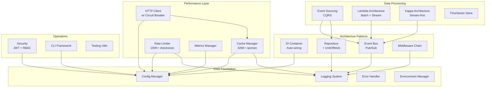

## Core Foundation

### Configuration System

The configuration system provides centralized, type-safe configuration management.

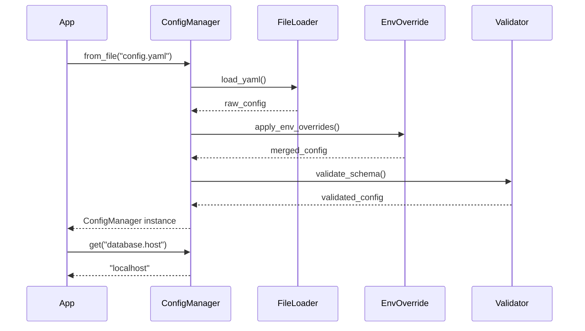

**Key Features**:
- YAML-based configuration with environment overrides
- Type validation with Pydantic
- Nested key access with dot notation
- Hot-reload support for configuration changes
- Environment-specific profiles (dev, staging, prod)

**Example**:
```python
from toolkit.config import ConfigManager

# Load with environment overrides
config = ConfigManager.from_file(
    "config.yaml",
    env_prefix="APP_",  # APP_DATABASE_HOST overrides database.host
)

# Type-safe access
db_config = config.get("database", default={})
host = config.get("database.host", default="localhost")

# Watch for changes
config.watch(lambda changes: reload_services(changes))
```

### Logging System

Structured logging with multiple handlers and context propagation.

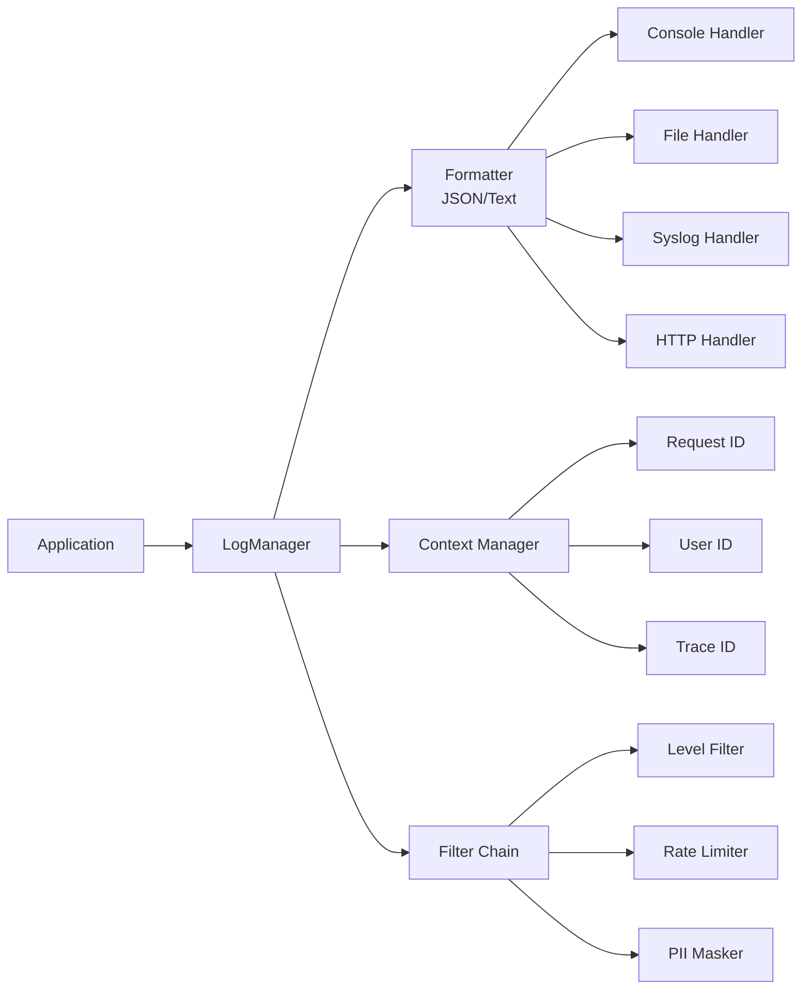

**Key Features**:
- Structured JSON logging for machine parsing
- Context propagation (request_id, user_id, trace_id)
- Multiple handlers (console, file, syslog, HTTP)
- Performance timers and metrics
- PII masking for sensitive data
- Log sampling for high-traffic endpoints

**Example**:
```python
from toolkit.logging import LogManager

logger = LogManager.get_logger(__name__)

# Contextual logging
with logger.context(user_id="123", request_id="abc"):
    logger.info("Processing request")
    # Output: {"level": "INFO", "user_id": "123", "request_id": "abc", ...}

# Performance timing
with logger.timer("database_query"):
    results = db.execute(query)
# Output: {"message": "database_query completed", "duration_ms": 45.2}

# Exception logging with context
try:
    process_payment()
except Exception as e:
    logger.error("Payment failed", exc_info=True, extra={
        "payment_id": payment_id,
        "amount": amount,
    })
```

### Error Handling

Comprehensive error hierarchy with context and recovery strategies.

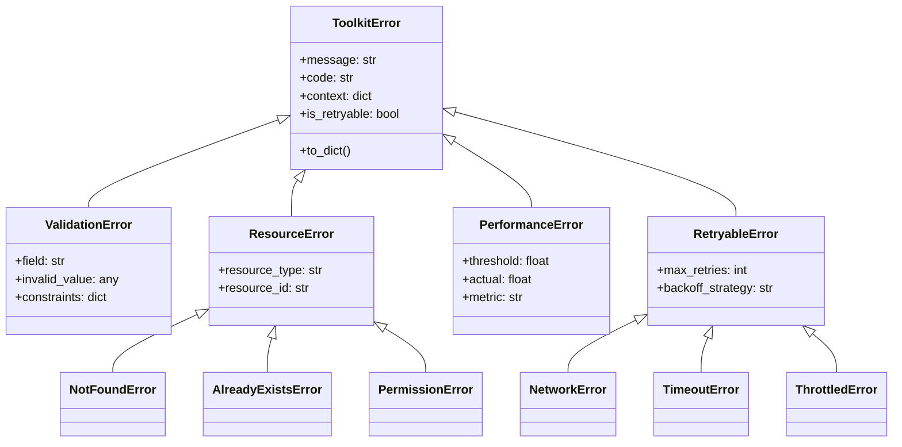

**Key Features**:
- Hierarchical error types with semantic meaning
- Error context for debugging
- Retryability indicators for automatic retry logic
- Error serialization for API responses
- Error aggregation and metrics

## Performance Layer

### Cache Manager

High-performance caching with multiple backends.

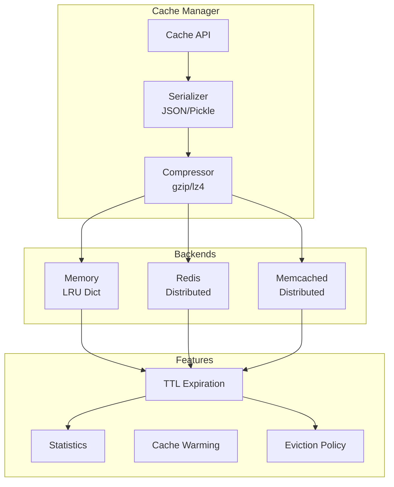

**Performance Characteristics**:
- **Memory Backend**: 326K+ ops/sec, < 10μs latency
- **Redis Backend**: 100K+ ops/sec (network dependent)
- **Memory Overhead**: < 100 bytes per entry

**Example**:
```python
from toolkit.cache import CacheManager

# High-performance memory cache
cache = CacheManager(
    backend="memory",
    max_size=10000,
    eviction_policy="lru",
)

# Distributed Redis cache
cache = CacheManager(
    backend="redis",
    host="localhost",
    serializer="pickle",  # For Python objects
    compress=True,  # Enable compression for large values
)

# Decorator for function memoization
@cache.memoize(ttl=3600, key_prefix="user_stats")
def get_user_statistics(user_id: str):
    # Expensive computation
    return compute_statistics(user_id)
```

### Rate Limiter

Token bucket algorithm with high throughput.

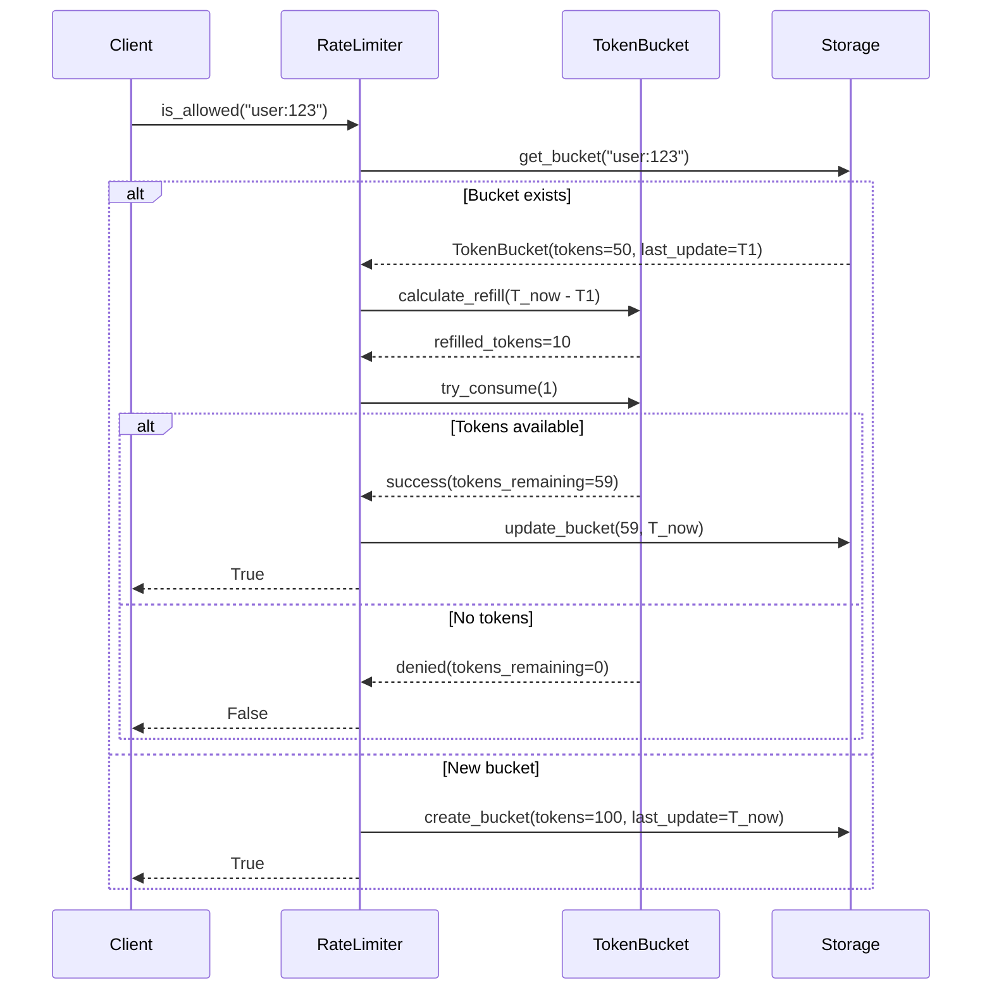

**Performance Characteristics**:
- **Check Speed**: < 10μs per check
- **Throughput**: 100K+ checks/sec
- **Memory**: < 500 bytes per bucket
- **Scalability**: 10K+ concurrent limiters

**Example**:
```python
from toolkit.ratelimit import RateLimiter

# API rate limiting: 100 req/min per user
api_limiter = RateLimiter(rate=100, period=60)

# DDoS protection: 10 req/sec per IP
ddos_limiter = RateLimiter(rate=10, period=1)

# Decorator for route protection
@api_limiter.limit(key=lambda request: f"user:{request.user.id}")
async def api_endpoint(request):
    return {"data": "response"}

# Manual checking
if api_limiter.is_allowed(f"user:{user_id}"):
    process_request()
else:
    raise RateLimitExceeded()
```

### HTTP Client

Resilient HTTP client with retries and circuit breaker.

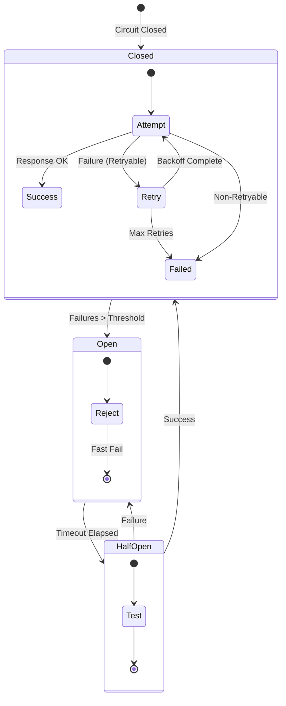

**Key Features**:
- Exponential backoff with jitter
- Circuit breaker pattern
- Connection pooling
- Request/response caching
- Automatic retries for transient failures

**Example**:
```python
from toolkit.http import HTTPClient

client = HTTPClient(
    base_url="https://api.example.com",
    timeout=5.0,
    max_retries=3,
    backoff_factor=0.5,
    circuit_breaker={
        "failure_threshold": 5,
        "recovery_timeout": 60,
    },
)

# Automatic retries and circuit breaker
response = await client.get("/users/123")

# With caching
response = await client.get(
    "/users/123",
    cache_ttl=300,  # Cache for 5 minutes
)
```

## Architecture Patterns

### Dependency Injection

Auto-wiring container with lifetime management.

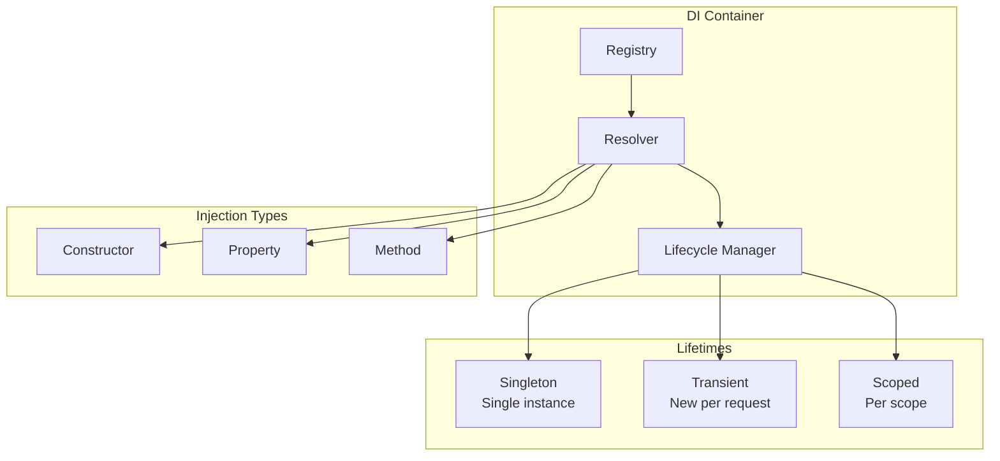

**Example**:
```python
from toolkit.di import Container, inject

container = Container()

# Register services
container.register(CacheManager, lifetime="singleton")
container.register(RateLimiter, lifetime="scoped")
container.register(UserRepository, lifetime="transient")

# Auto-wiring
@inject
class UserService:
    def __init__(
        self,
        cache: CacheManager,  # Injected
        limiter: RateLimiter,  # Injected
        repo: UserRepository,  # Injected
    ):
        self.cache = cache
        self.limiter = limiter
        self.repo = repo

# Resolve with dependencies
service = container.resolve(UserService)
```

### Event Bus

Pub/sub with async support and event sourcing.

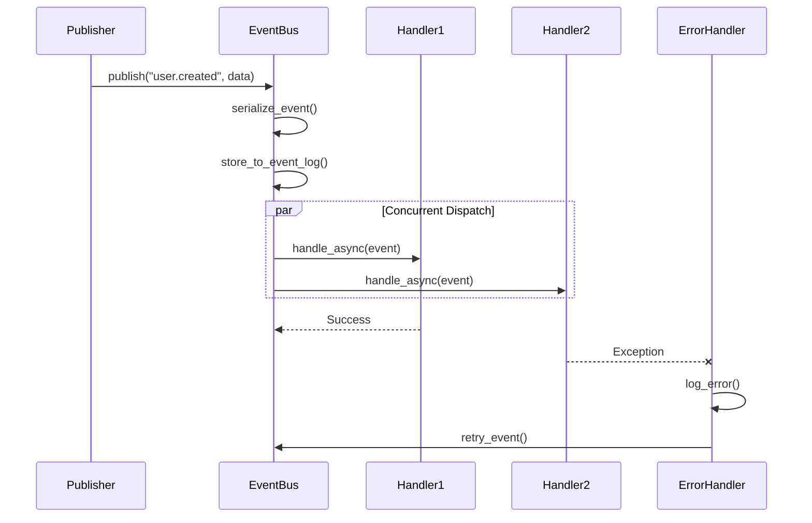

**Example**:
```python
from toolkit.event import EventBus

bus = EventBus()

# Subscribe to events
@bus.subscribe("user.created")
async def send_welcome_email(event):
    user = event.data
    await email_service.send(user.email, "Welcome!")

@bus.subscribe("user.created")
async def create_user_profile(event):
    user = event.data
    await profile_service.create(user.id)

# Publish event (both handlers called concurrently)
await bus.publish("user.created", data={"id": "123", "email": "user@example.com"})
```

### Repository Pattern

Generic repository with Unit of Work.

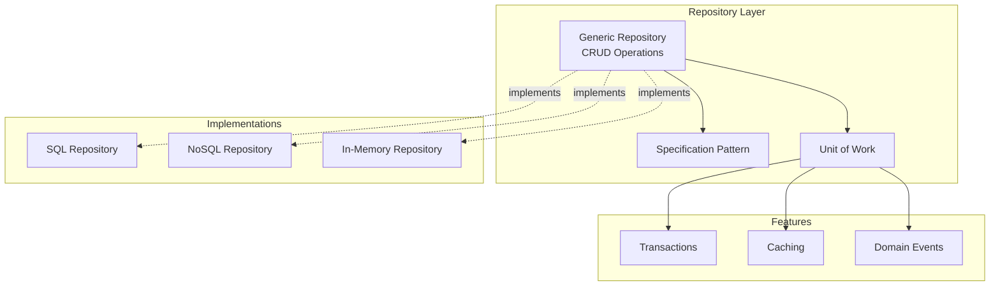

**Example**:
```python
from toolkit.repository import Repository, UnitOfWork

# Generic repository
class UserRepository(Repository[User]):
    pass

# Unit of Work for transactions
async with UnitOfWork() as uow:
    user_repo = uow.get_repository(UserRepository)
    order_repo = uow.get_repository(OrderRepository)

    # Multiple operations in transaction
    user = await user_repo.get(user_id)
    user.credit -= order.total

    order = await order_repo.create(order_data)

    # Commit all or rollback
    await uow.commit()
```

## Data Processing

### Event Sourcing

CQRS pattern with event store.

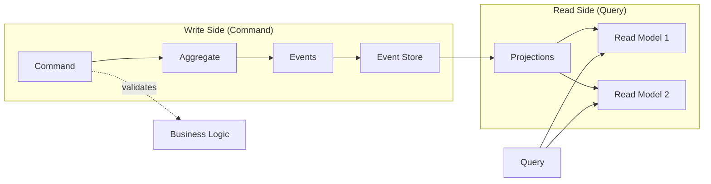

**Example**:
```python
from toolkit.eventsourcing import Aggregate, Event

class UserAggregate(Aggregate):
    def create_user(self, name: str, email: str):
        self.apply(UserCreatedEvent(name=name, email=email))

    def update_email(self, new_email: str):
        self.apply(EmailUpdatedEvent(email=new_email))

    # Event handlers
    def on_user_created(self, event: UserCreatedEvent):
        self.name = event.name
        self.email = event.email

    def on_email_updated(self, event: EmailUpdatedEvent):
        self.email = event.email

# Usage
user = UserAggregate.create(user_id)
user.create_user("Alice", "alice@example.com")
user.update_email("newemail@example.com")

# Persist events
event_store.save(user.uncommitted_events)

# Rebuild from events
user = UserAggregate.rebuild(user_id, event_store.get_events(user_id))
```

## Performance Optimization

### Profiling and Benchmarking

```python
from toolkit.metrics import MetricsManager

metrics = MetricsManager(backend="prometheus")

# Automatic profiling decorator
@metrics.profile()
def expensive_operation():
    # Code is profiled automatically
    pass

# Custom metrics
with metrics.timer("database_query"):
    results = db.execute(query)

# Counter metrics
metrics.increment("api.requests", tags={"endpoint": "/users", "method": "GET"})

# Gauge metrics
metrics.gauge("queue.size", len(queue))
```

## Testing Strategy

All backend modules have:
- **Unit Tests**: 80% of test suite
- **Integration Tests**: 15% of test suite
- **Performance Tests**: 3% of test suite
- **Property Tests**: 2% of test suite

See [Testing Guide](/guide/testing) for details.

---

Next: [Frontend Architecture](/architecture/frontend) | [Pattern Library](/patterns/overview)
