# Frontend Architecture

The frontend is built with **React 18** and **TypeScript**, following **Atomic Design** principles for maximum composability and reusability.

## Package Organization

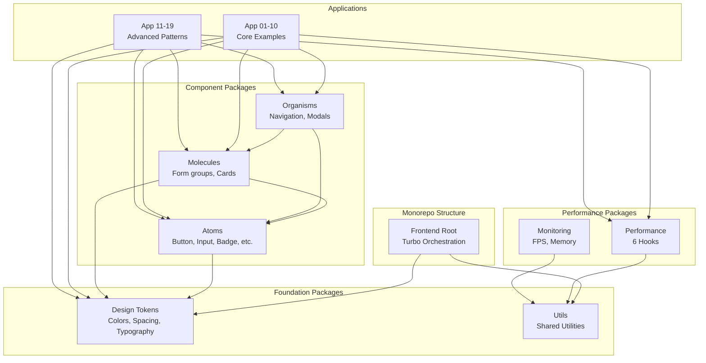

## Atomic Design System

Following Brad Frost's Atomic Design methodology:

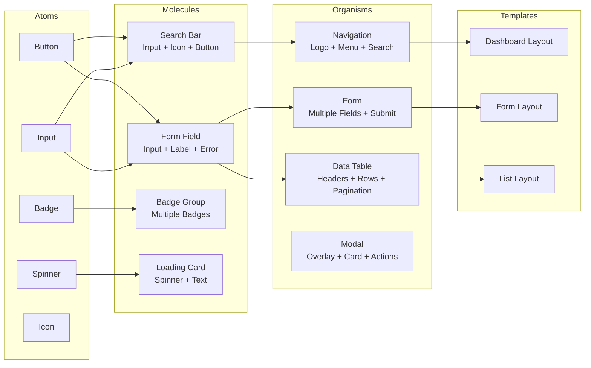

### Atoms

Smallest building blocks - cannot be broken down further.

**Button Component Architecture**:

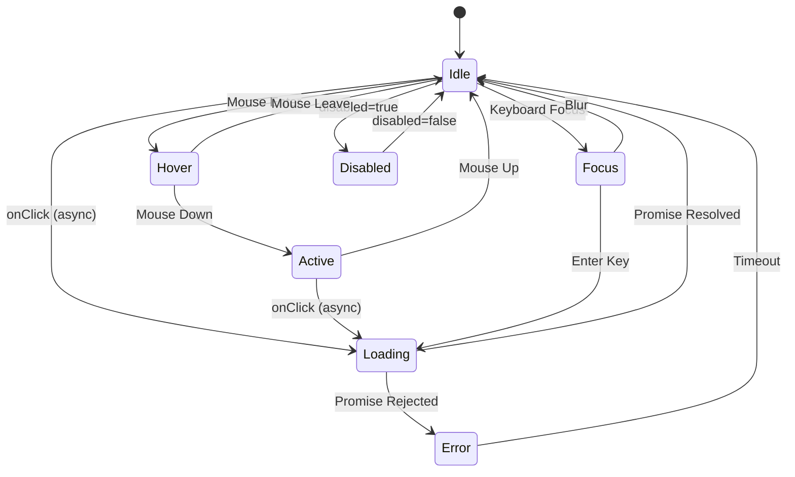

**Example Button Component**:
```tsx
import { memo, forwardRef } from 'react'
import type { ButtonHTMLAttributes, ReactNode } from 'react'
import { Spinner } from '../Spinner'

type ButtonVariant = 'primary' | 'secondary' | 'success' | 'danger' | 'ghost'
type ButtonSize = 'xs' | 'sm' | 'md' | 'lg' | 'xl'

interface ButtonProps extends ButtonHTMLAttributes<HTMLButtonElement> {
  variant?: ButtonVariant
  size?: ButtonSize
  loading?: boolean
  leftIcon?: ReactNode
  rightIcon?: ReactNode
}

export const Button = memo(forwardRef<HTMLButtonElement, ButtonProps>(
  function Button(
    {
      variant = 'primary',
      size = 'md',
      loading = false,
      disabled,
      leftIcon,
      rightIcon,
      children,
      className = '',
      ...props
    },
    ref
  ) {
    const baseClasses = 'inline-flex items-center justify-center font-medium rounded-md transition-colors focus:outline-none focus:ring-2 focus:ring-offset-2'

    const variantClasses = {
      primary: 'bg-primary-500 text-white hover:bg-primary-600 focus:ring-primary-500',
      secondary: 'bg-secondary-500 text-white hover:bg-secondary-600 focus:ring-secondary-500',
      // ... other variants
    }

    const sizeClasses = {
      xs: 'px-2 py-1 text-xs',
      sm: 'px-3 py-1.5 text-sm',
      md: 'px-4 py-2 text-base',
      lg: 'px-6 py-3 text-lg',
      xl: 'px-8 py-4 text-xl',
    }

    return (
      <button
        ref={ref}
        disabled={disabled || loading}
        className={`${baseClasses} ${variantClasses[variant]} ${sizeClasses[size]} ${className}`}
        {...props}
      >
        {loading && <Spinner size="sm" className="mr-2" />}
        {leftIcon && <span className="mr-2">{leftIcon}</span>}
        {children}
        {rightIcon && <span className="ml-2">{rightIcon}</span>}
      </button>
    )
  }
))
```

**Performance**: Button renders in < 1ms (memoized, optimized reconciliation)

### Design Tokens

Centralized design system with semantic tokens.

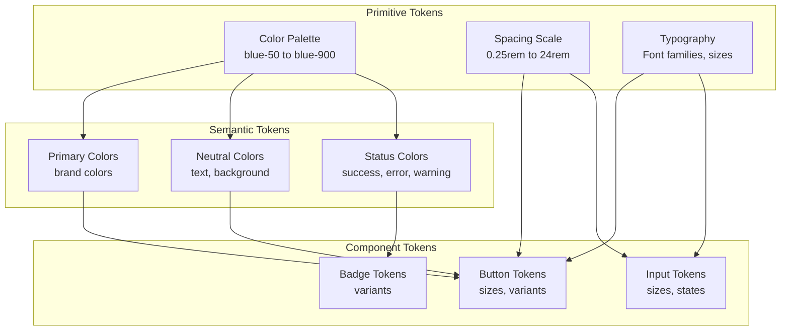

**Example Token Structure**:
```typescript
// packages/design-tokens/src/colors.ts
export const colors = {
  // Primitive colors
  blue: {
    50: '#eff6ff',
    100: '#dbeafe',
    // ... 200-800
    900: '#1e3a8a',
  },

  // Semantic tokens
  primary: {
    50: 'var(--color-blue-50)',
    500: 'var(--color-blue-500)',
    900: 'var(--color-blue-900)',
  },

  // Status tokens
  success: {
    light: 'var(--color-green-100)',
    default: 'var(--color-green-500)',
    dark: 'var(--color-green-700)',
  },
}

// packages/design-tokens/src/spacing.ts
export const spacing = {
  0: '0',
  1: '0.25rem',  // 4px
  2: '0.5rem',   // 8px
  3: '0.75rem',  // 12px
  4: '1rem',     // 16px
  // ... up to 96
}
```

## Performance Architecture

### Performance Hooks

Six specialized hooks for common performance patterns:

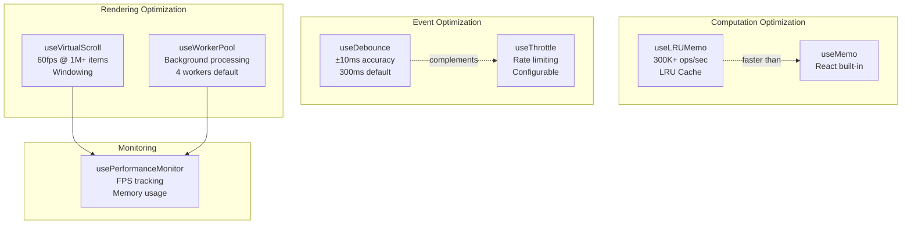

### useLRUMemo Implementation

High-performance LRU memoization hook:

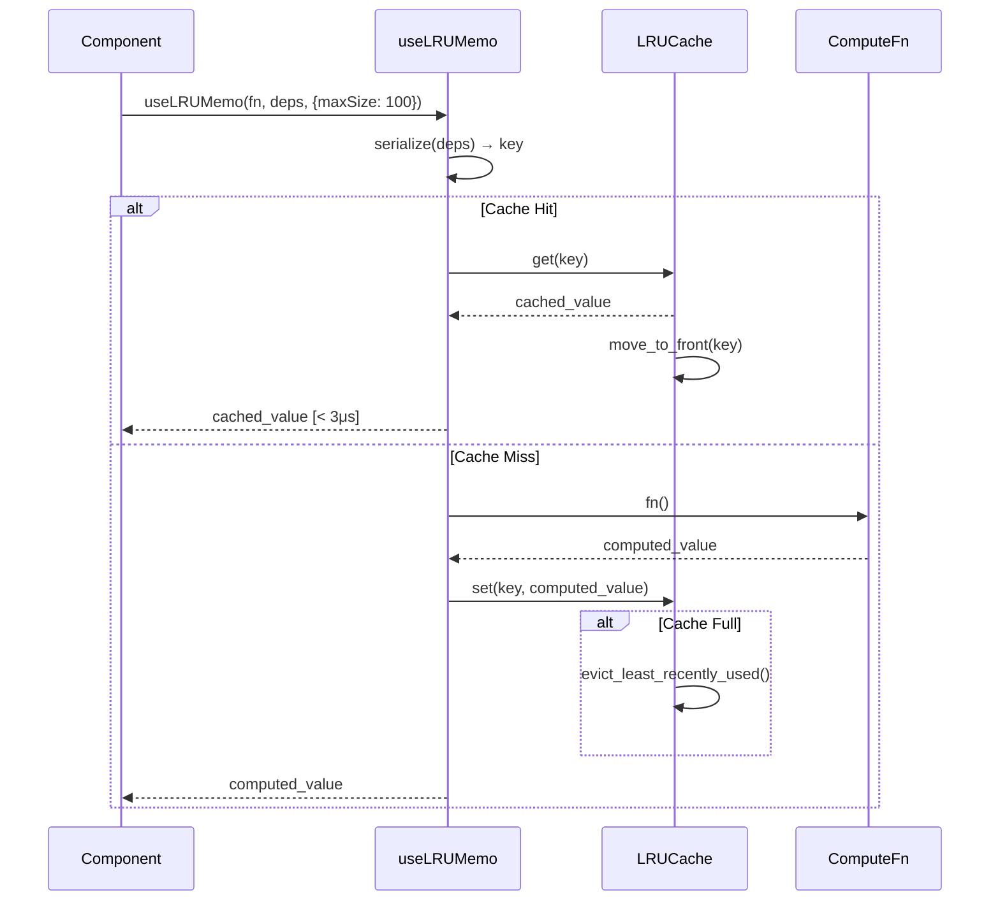

**Performance**: 300K+ cache lookups/sec, < 3μs per hit

**Example**:
```typescript
import { useLRUMemo } from '@composable/performance'

function DataVisualization({ data, filters }) {
  // Cache last 100 computation results
  const processedData = useLRUMemo(
    () => {
      // Expensive data processing
      return data
        .filter(applyFilters(filters))
        .map(transform)
        .sort(customSort)
    },
    [data, filters],
    { maxSize: 100 }
  )

  return <Chart data={processedData} />
}
```

### useVirtualScroll Implementation

Efficient rendering of large lists:

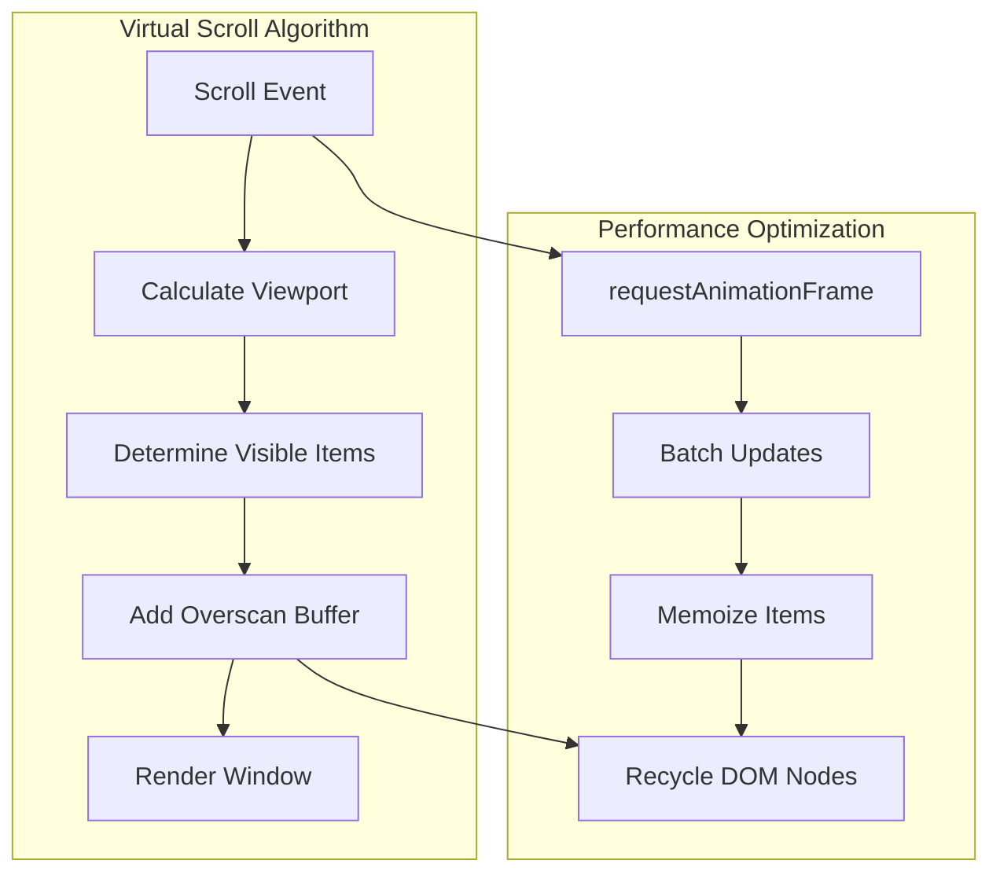

**Performance**: 60fps with 1M+ items

**Example**:
```typescript
import { useVirtualScroll } from '@composable/performance'

function LargeList({ items }) {
  const {
    virtualItems,      // Only items in viewport + overscan
    totalHeight,       // Total scrollable height
    containerRef,      // Attach to scroll container
  } = useVirtualScroll({
    items,
    itemHeight: 50,    // Fixed or dynamic
    overscan: 5,       // Buffer items above/below
    estimateSize: (item) => item.height,  // For dynamic heights
  })

  return (
    <div
      ref={containerRef}
      style={{ height: '500px', overflow: 'auto' }}
    >
      <div style={{ height: totalHeight, position: 'relative' }}>
        {virtualItems.map(({ item, index, style }) => (
          <div key={item.id} style={style}>
            <ItemComponent item={item} />
          </div>
        ))}
      </div>
    </div>
  )
}
```

### useDebounce Implementation

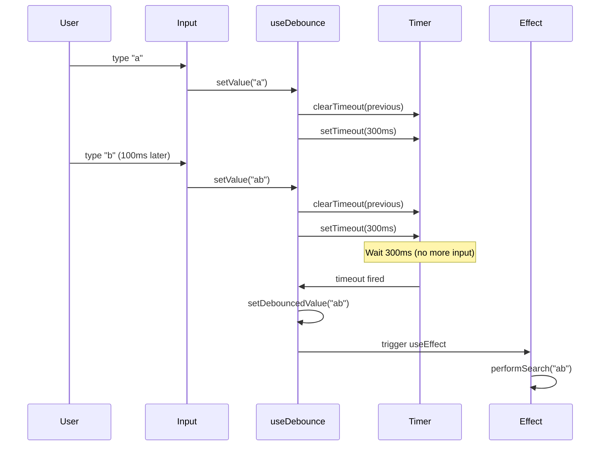

**Performance**: ±10ms accuracy

**Example**:
```typescript
import { useDebounce } from '@composable/performance'
import { useState, useEffect } from 'react'

function SearchComponent() {
  const [search, setSearch] = useState('')
  const debouncedSearch = useDebounce(search, 300)

  useEffect(() => {
    if (debouncedSearch) {
      // Only called 300ms after user stops typing
      performSearch(debouncedSearch)
    }
  }, [debouncedSearch])

  return (
    <input
      value={search}
      onChange={(e) => setSearch(e.target.value)}
      placeholder="Search..."
    />
  )
}
```

### useWorkerPool Implementation

Background processing without blocking UI:

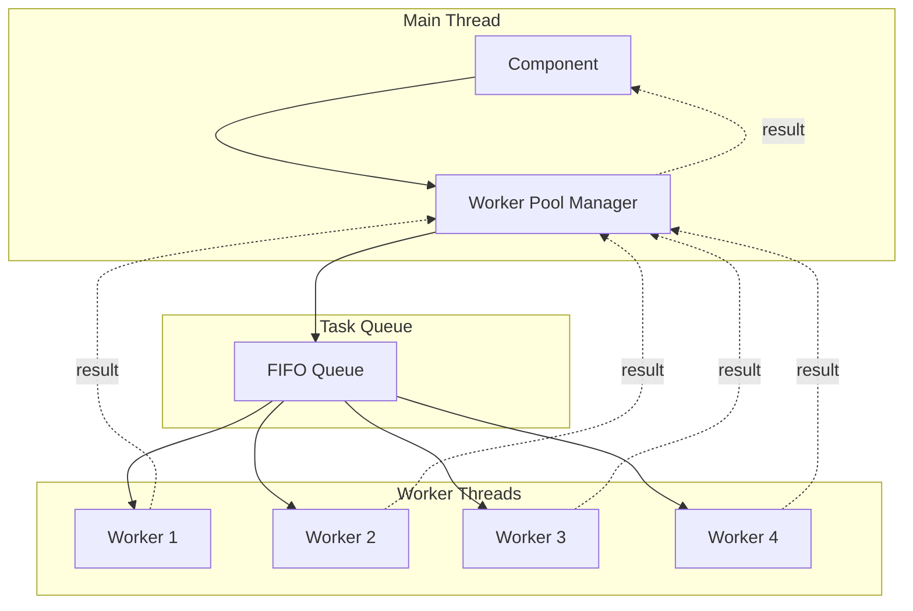

**Example**:
```typescript
import { useWorkerPool } from '@composable/performance'

function ImageProcessor({ images }) {
  const { execute, isProcessing } = useWorkerPool({
    workerCount: 4,
    workerScript: '/workers/image-processor.js',
  })

  const processImages = async () => {
    // Distribute work across 4 workers
    const results = await execute({
      type: 'processImages',
      images: images,
    })

    setProcessedImages(results)
  }

  return (
    <button onClick={processImages} disabled={isProcessing}>
      {isProcessing ? 'Processing...' : 'Process Images'}
    </button>
  )
}
```

## State Management

### Component State Architecture

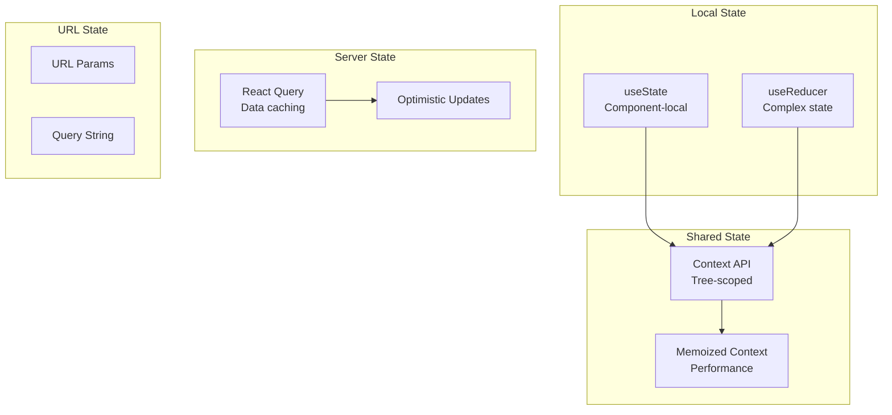

**Example Architecture**:
```typescript
// Local state
const [count, setCount] = useState(0)

// Complex state with reducer
const [state, dispatch] = useReducer(reducer, initialState)

// Shared state with context
const ThemeContext = createContext()

// Server state with caching
const { data, isLoading } = useQuery('users', fetchUsers)

// URL state
const [searchParams, setSearchParams] = useSearchParams()
```

## Build and Bundle Optimization

### Build Pipeline

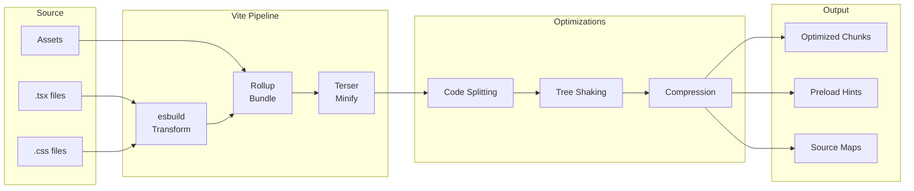

### Code Splitting Strategy

```typescript
// Route-based splitting
import { lazy, Suspense } from 'react'

const Dashboard = lazy(() => import('./pages/Dashboard'))
const Settings = lazy(() => import('./pages/Settings'))

function App() {
  return (
    <Suspense fallback={<Spinner />}>
      <Routes>
        <Route path="/dashboard" element={<Dashboard />} />
        <Route path="/settings" element={<Settings />} />
      </Routes>
    </Suspense>
  )
}

// Component-based splitting
const HeavyChart = lazy(() => import('./components/HeavyChart'))

// Vendor splitting (vite.config.ts)
export default {
  build: {
    rollupOptions: {
      output: {
        manualChunks: {
          'react-vendor': ['react', 'react-dom'],
          'ui-vendor': ['@composable/atoms'],
        },
      },
    },
  },
}
```

## Testing Strategy

### Component Testing Pyramid

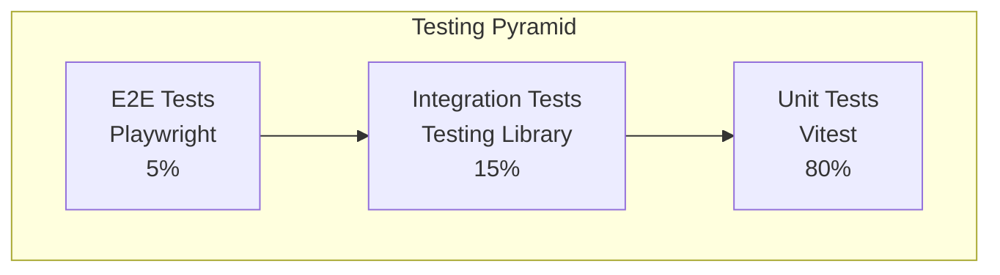

### Test Structure

```typescript
// Button.test.tsx
import { render, screen } from '@testing-library/react'
import { userEvent } from '@testing-library/user-event'
import { Button } from './Button'

describe('Button', () => {
  describe('Rendering', () => {
    it('should render with children', () => {
      render(<Button>Click me</Button>)
      expect(screen.getByRole('button')).toHaveTextContent('Click me')
    })

    it('should render all variants', () => {
      const { rerender } = render(<Button variant="primary">Primary</Button>)
      expect(screen.getByRole('button')).toHaveClass('bg-primary-500')

      rerender(<Button variant="secondary">Secondary</Button>)
      expect(screen.getByRole('button')).toHaveClass('bg-secondary-500')
    })
  })

  describe('Interactions', () => {
    it('should call onClick when clicked', async () => {
      const handleClick = vi.fn()
      const user = userEvent.setup()

      render(<Button onClick={handleClick}>Click</Button>)
      await user.click(screen.getByRole('button'))

      expect(handleClick).toHaveBeenCalledTimes(1)
    })
  })

  describe('Performance', () => {
    it('should render quickly (< 5ms)', () => {
      const start = performance.now()
      render(<Button>Performance Test</Button>)
      const end = performance.now()

      expect(end - start).toBeLessThan(5)
    })
  })
})
```

## Deployment

### Production Build Checklist

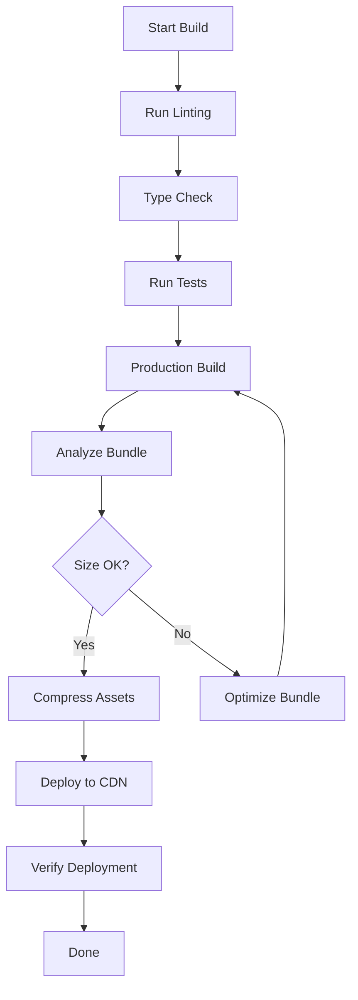

**Build Command**:
```bash
# Full production build
npm run build

# Build with analysis
npm run build -- --mode production --analyze

# Expected output:
# dist/
#   assets/
#     index-a1b2c3d4.js       # 45 KB
#     vendor-e5f6g7h8.js      # 120 KB (React, etc)
#     ui-i9j0k1l2.js          # 30 KB (Components)
```

---

Next: [Pattern Library](/patterns/overview) | [API Reference](/api/overview)
