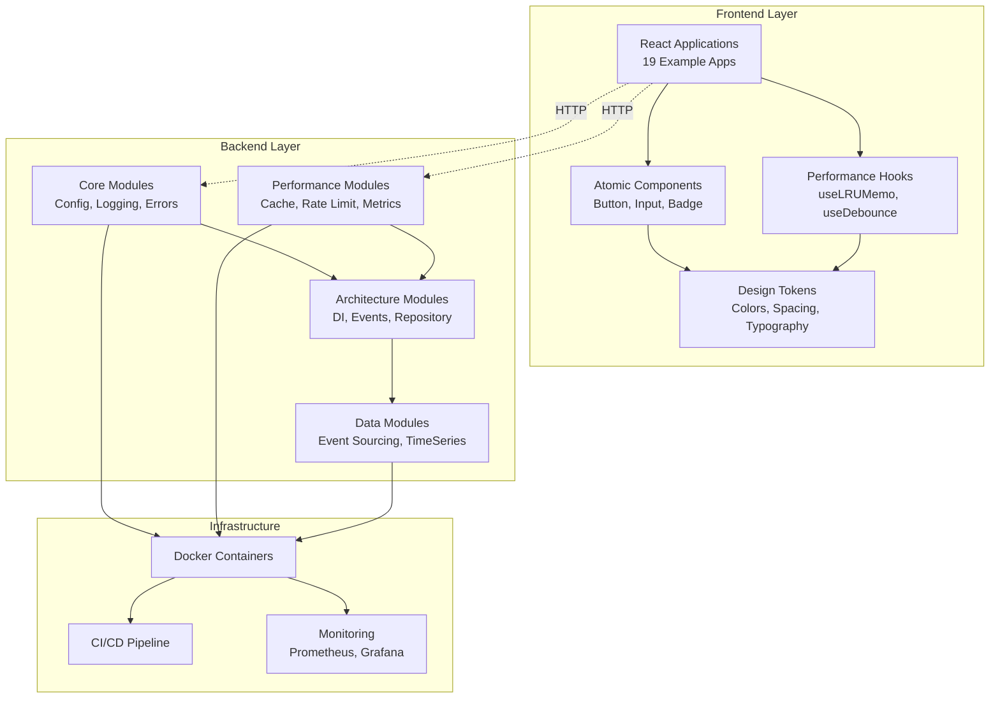
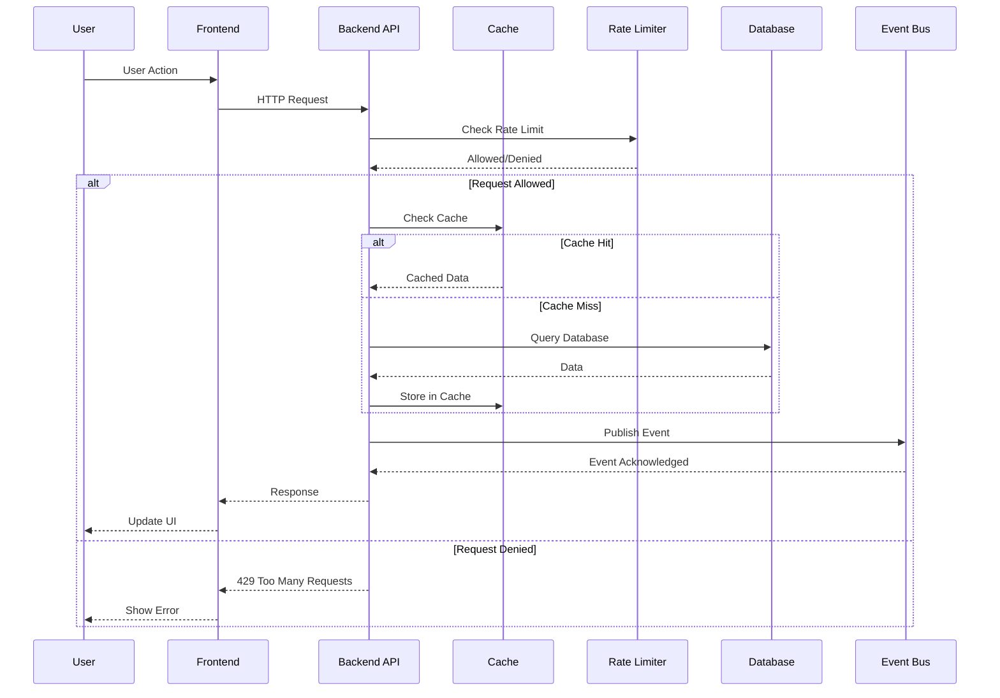
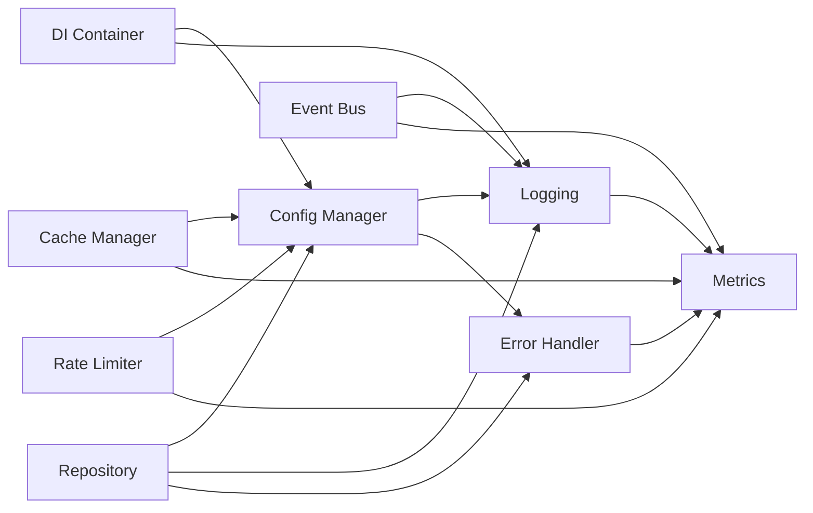
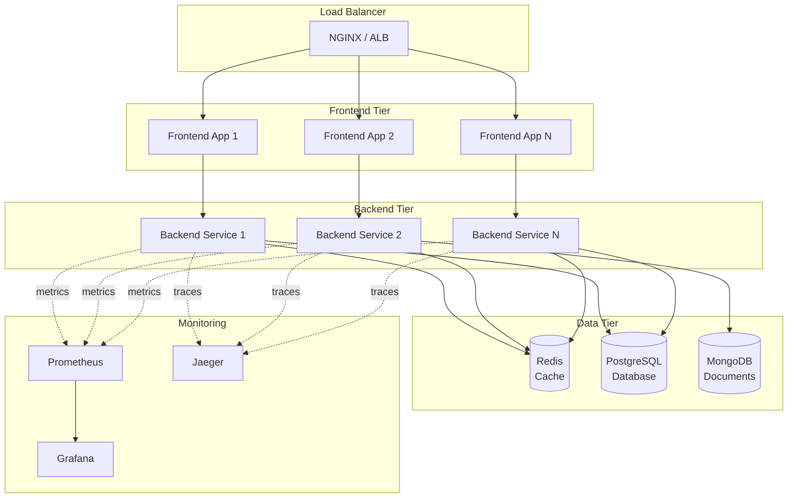
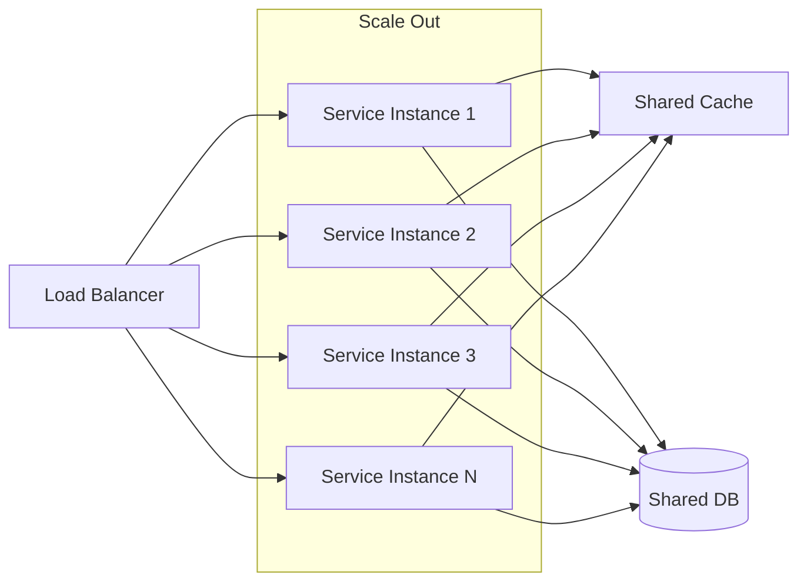
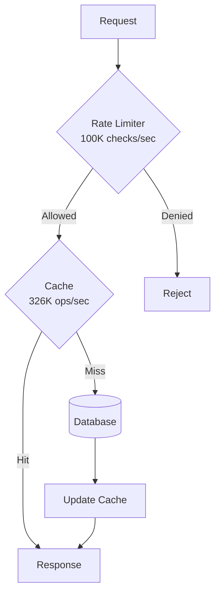
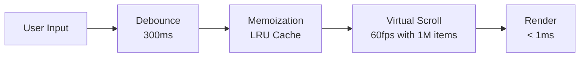
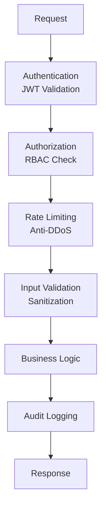

# Architecture Overview

The Composable Toolkit is designed with **composability**, **performance**, and **scalability** as core principles. This document provides a high-level overview of the system architecture.

## System Architecture

The toolkit follows a modular, composable architecture where each component can work independently or together.

## Component Layers

### 1. Frontend Layer

The frontend is built with **React**, **TypeScript**, and **Vite**, following atomic design principles.

**Components**:
- **Atoms**: Basic UI building blocks (Button, Input, Badge, etc.)
- **Design Tokens**: Centralized design system
- **Performance Hooks**: Optimized React hooks mirroring backend patterns

**Key Principles**:
- 🎯 Atomic Design Pattern
- ⚡ Performance-first (< 1ms render targets)
- 📦 Composable and reusable
- 🎨 Consistent design system

### 2. Backend Layer

The backend is built with **Python 3.10+**, emphasizing composability and performance.

**Modules**:
- **Core**: Foundation modules (Config, Logging, Errors, Environment)
- **Performance**: High-performance utilities (Cache, Rate Limit, Metrics)
- **Architecture**: Enterprise patterns (DI, Events, Repository, Middleware)
- **Data**: Data processing patterns (Event Sourcing, Lambda/Kappa, TimeSeries)

**Key Principles**:
- 🧩 Modular and composable
- ⚡ Performance-optimized (100K+ ops/sec)
- 🔒 Type-safe with full type hints
- ⚙️ Configuration-driven

### 3. Infrastructure Layer

**Docker-First**:
- Multi-stage builds for optimization
- Multi-arch support (amd64, arm64)
- Docker Compose for local development

**CI/CD**:
- Automated testing (90%+ coverage)
- Performance regression detection
- Security scanning
- Automated releases

## Data Flow Architecture

## Module Dependencies

## Deployment Architecture

## Scalability Strategy

### Horizontal Scaling

**Characteristics**:
- Stateless services
- Shared cache (Redis)
- Session affinity optional
- Auto-scaling capable

### Vertical Scaling

**Optimization Targets**:
- **Memory**: LRU cache with configurable limits
- **CPU**: Optimized algorithms (< 10μs operations)
- **I/O**: Connection pooling, async operations

## Performance Architecture

### Backend Performance

**Performance Targets**:
- Rate Limiter: **100K+ checks/sec**
- LRU Cache: **326K+ operations/sec**
- Token Bucket: **< 10μs latency**

### Frontend Performance

**Performance Targets**:
- Button Render: **< 1ms**
- Debounce Accuracy: **±10ms**
- Virtual Scroll: **60fps with 1M+ items**
- Hook Memoization: **300K+ ops/sec**

## Security Architecture

**Security Layers**:
1. **Authentication**: JWT token validation
2. **Authorization**: Role-based access control (RBAC)
3. **Rate Limiting**: DDoS protection
4. **Input Validation**: XSS, SQL injection prevention
5. **Audit Logging**: Complete activity trail

## Technology Stack

### Backend
- **Language**: Python 3.10+
- **Frameworks**: FastAPI (optional)
- **Type System**: Python type hints + mypy
- **Testing**: pytest, hypothesis
- **Code Quality**: black, ruff

### Frontend
- **Language**: TypeScript
- **Framework**: React 18
- **Build Tool**: Vite
- **Testing**: Vitest, Playwright
- **Code Quality**: ESLint, Prettier

### Infrastructure
- **Containers**: Docker
- **Orchestration**: Docker Compose (local), Kubernetes (production)
- **CI/CD**: GitHub Actions
- **Monitoring**: Prometheus, Grafana
- **Tracing**: OpenTelemetry, Jaeger

## Design Principles

### 1. Composability
Every module can work independently or compose with others.

### 2. Performance First
Benchmarked and optimized for production scale.

### 3. Type Safety
Full type coverage in Python and TypeScript.

### 4. Configuration-Driven
All behavior configurable via YAML/ENV.

### 5. Deployment Agnostic
Docker-first, runs anywhere (cloud or on-premise).

## Next Steps

- [Backend Architecture →](/architecture/backend)
- [Frontend Architecture →](/architecture/frontend)
- [Data Flow Details →](/architecture/data-flow)
- [Deployment Guide →](/architecture/deployment)
