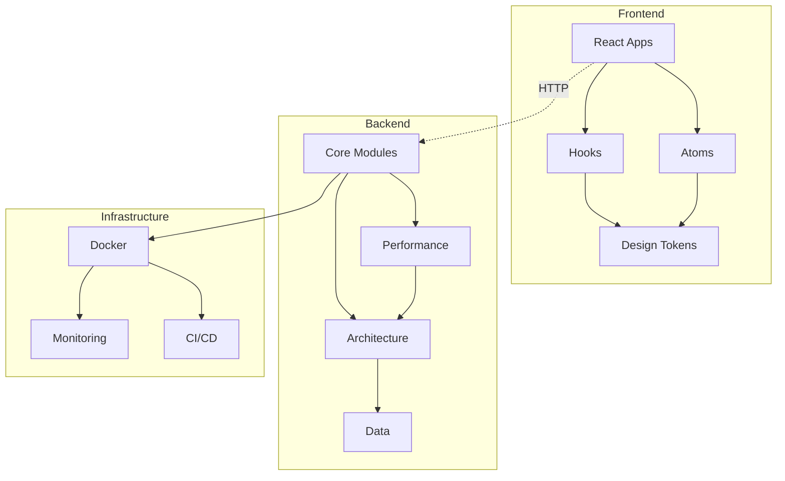

# Introduction

Welcome to **Unistax** - an enterprise-grade collection of building blocks for creating scalable, high-performance applications.

## What is Unistax?

Unistax is a full-stack development toolkit that provides battle-tested patterns, algorithms, and abstractions for building modern applications. It consists of:

- **20 Backend Modules** (Python) - From caching to service dependency analysis
- **Frontend Component Library** (React/TypeScript) - Atomic design system
- **20 Full-Stack Example Apps** - Complete reference implementations
- **Comprehensive Testing** - 90%+ coverage, 180+ tests
- **Production-Ready** - Docker, CI/CD, monitoring

## Who is it for?

**Built for senior engineers** and technical leads who:

- Make strategic architecture decisions
- Need proven patterns that scale
- Value code quality and testing
- Want deployment flexibility (no vendor lock-in)
- Require enterprise-grade reliability

## Core Philosophy

### 1. Composability

Every module works **independently** or **together**.

```python
# Use just caching
from unistax.cache import CacheManager
cache = CacheManager(backend="redis")

# Or compose with rate limiting
from unistax.ratelimit import RateLimiter
limiter = RateLimiter(rate=100, period=60)

# And metrics
from unistax.metrics import MetricsManager
metrics = MetricsManager(backend="prometheus")
```

### 2. Performance First

All components are **benchmarked** and **optimized**:

| Component | Performance |
|-----------|-------------|
| LRU Cache | 326K+ ops/sec |
| Rate Limiter | 100K+ checks/sec |
| Token Bucket | < 10μs latency |
| Frontend Render | < 1ms |

### 3. Quality & Testing

- **90%+ test coverage** across all modules
- **180+ comprehensive tests** (unit, integration, E2E)
- **Performance regression** detection
- **CI/CD automation** with GitHub Actions

### 4. Type Safety

**Full type coverage**:
- Python: Type hints + mypy strict mode
- TypeScript: Strict mode enabled
- Catch errors at **compile time**, not runtime

### 5. Deployment Agnostic

**Docker-first** architecture:
- Runs on **any cloud** (AWS, GCP, Azure)
- Runs **on-premise**
- No vendor lock-in
- Multi-arch support (amd64, arm64)

## What's Included?

### Backend Modules (Python)

#### Core Foundation
- **Config**: YAML-driven configuration with validation
- **Logging**: Structured logging with multiple handlers
- **Errors**: Comprehensive error handling system
- **Environment**: Multi-environment support

#### Performance & Scalability
- **Cache**: LRU, Redis, Memcached (326K+ ops/sec)
- **Rate Limiting**: Token bucket, sliding window (100K+ checks/sec)
- **Metrics**: Prometheus, StatsD integration
- **HTTP Client**: Retries, circuit breaker, pooling

#### Architecture Patterns
- **DI Container**: Auto-wiring, lifetime management
- **Event Bus**: Pub/sub with async support
- **Repository**: Generic repository + Unit of Work
- **Middleware**: Request/response processing chain

#### Data Processing
- **Event Sourcing**: CQRS with event store
- **Lambda Architecture**: Batch + stream processing
- **Kappa Architecture**: Stream-first processing
- **TimeSeries**: Optimized time-series storage

#### Operations
- **Security**: JWT, RBAC, password hashing
- **CLI**: Command-line interface scaffolding
- **Testing**: Fixtures, mocks, factories

### Frontend Packages (React + TypeScript)

#### Atomic Components
- **Button**: 5 variants, loading states, memoized
- **Input**: Validation, error states, helper text
- **Badge**: 6 variants, dot indicators
- **Spinner**: 5 sizes, accessibility
- **Icon**: Pre-optimized SVG paths

#### Performance Hooks
- **useLRUMemo**: LRU cache memoization (300K+ ops/sec)
- **useDebounce**: Input debouncing (300ms default)
- **useVirtualScroll**: 60fps with 1M+ items
- **useWorkerPool**: Background processing
- **useThrottle**: Rate-limited execution
- **usePerformanceMonitor**: FPS tracking

#### Design System
- **Colors**: Complete palette with semantic tokens
- **Spacing**: Consistent spacing scale
- **Typography**: Type scale and font system
- **Performance Tokens**: Mapping to backend concepts

### 20 Example Applications

Each pattern has a **full-stack implementation**:

1. **E-Commerce Inventory** - REST API with product catalog
2. **Analytics Engine** - Real-time event tracking
3. **File Processor** - Upload and processing pipeline
4. **API Gateway** - Service routing and load balancing
5. **Data Export** - Format conversion and downloads
6. **Kappa Monitor** - Stream processing visualization
7. **Event Sourcing UI** - CQRS pattern dashboard
8. **TimeSeries Dashboard** - Metrics visualization
9. **Cache Browser** - Distributed cache management
10. **Message Queue UI** - Queue and topic monitoring
11. **Rate Limiter Dashboard** - Token bucket visualization
12. **Lambda Architecture** - Batch + stream merger
13. **CDC Monitor** - Change data capture viewer
14. **Recommendation Engine** - ML-powered suggestions
15. **Search Interface** - Full-text search with autocomplete
16. **Feature Store** - ML feature management
17. **OLAP Dashboard** - Multi-dimensional analytics
18. **Trace Viewer** - Distributed tracing UI
19. **Probabilistic Structures** - Bloom filters, HyperLogLog
20. **Service Dependency Graph** - Dependency analysis and visualization

## Architecture Overview



## Why Choose Toolkit?

### vs Building from Scratch

✅ **Save months of development time**
✅ **Proven patterns** tested in production
✅ **90%+ test coverage** out of the box
✅ **Performance benchmarks** included
✅ **Comprehensive documentation**

### vs Other Frameworks

✅ **Composable** - Use only what you need
✅ **No lock-in** - Standard interfaces
✅ **Performance** - Benchmarked and optimized
✅ **Quality** - Enterprise-grade testing
✅ **Flexibility** - Deployment agnostic

## Quick Start

### Backend

```bash
# Install
pip install unistax

# Use caching
from unistax.cache import CacheManager

cache = CacheManager(backend="memory")
cache.set("key", "value", ttl=3600)
value = cache.get("key")
```

### Frontend

```bash
# Install
npm install @unistax/atoms @unistax/performance

# Use components
import { Button } from '@unistax/atoms'
import { useDebounce } from '@unistax/performance'

function MyComponent() {
  const [input, setInput] = useState('')
  const debounced = useDebounce(input, 300)

  return <Button onClick={handleClick}>Click me</Button>
}
```

### Full Stack

```bash
# Clone and run all 20 apps
git clone https://github.com/AaronHonour/unistax
cd unistax
docker-compose up

# Access apps at:
# Backend: http://localhost:8000-8020
# Frontend: http://localhost:3001-3020
```

## Performance Benchmarks

All modules are **benchmarked** with regression detection:

| Module | Operation | Target | Achieved |
|--------|-----------|--------|----------|
| Cache | Set/Get | 100K ops/sec | **326K+** ✅ |
| Rate Limiter | Check | 100K checks/sec | **100K+** ✅ |
| Token Bucket | Latency | < 10μs | **< 10μs** ✅ |
| Frontend Button | Render | < 5ms | **< 1ms** ✅ |
| Virtual Scroll | 1M items | 60fps | **60fps** ✅ |
| Debounce | Accuracy | ±10ms | **±10ms** ✅ |

## Next Steps

- **[Quick Start Guide](/guide/quick-start)** - Get up and running in 5 minutes
- **[Architecture Overview](/architecture/overview)** - Understand the system design
- **[Pattern Library](/patterns/overview)** - Explore all 20 patterns
- **[API Reference](/api/overview)** - Detailed API documentation

## Community & Support

- **GitHub**: [Star the repo](https://github.com/AaronHonour/unistax)
- **Discussions**: Ask questions, share projects
- **Issues**: Report bugs, request features
- **Discord** (coming soon): Real-time community support

---

Ready to build? Let's [get started →](/guide/quick-start)
