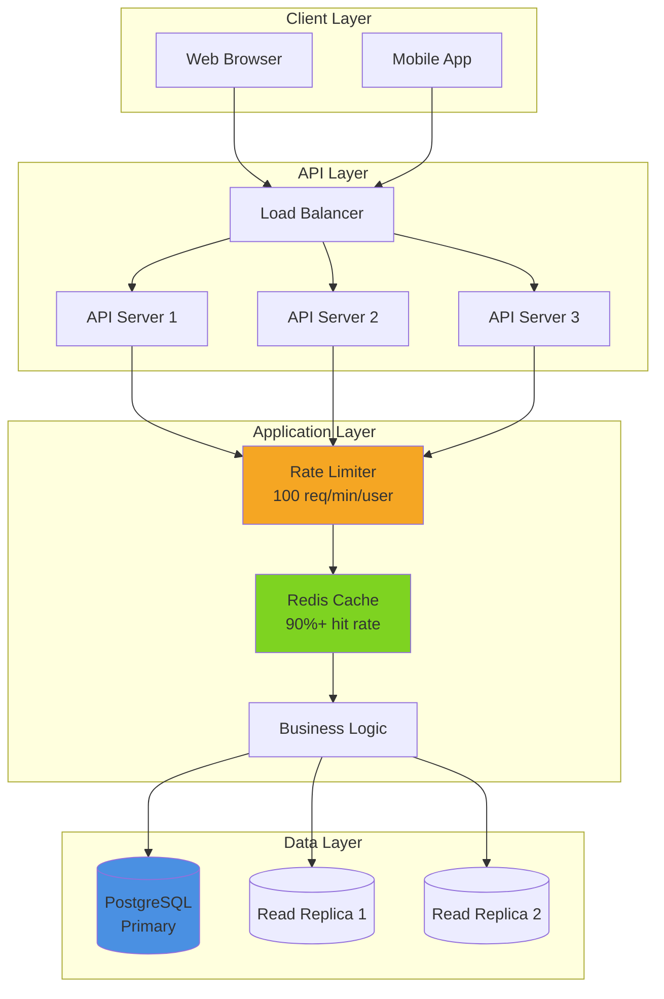
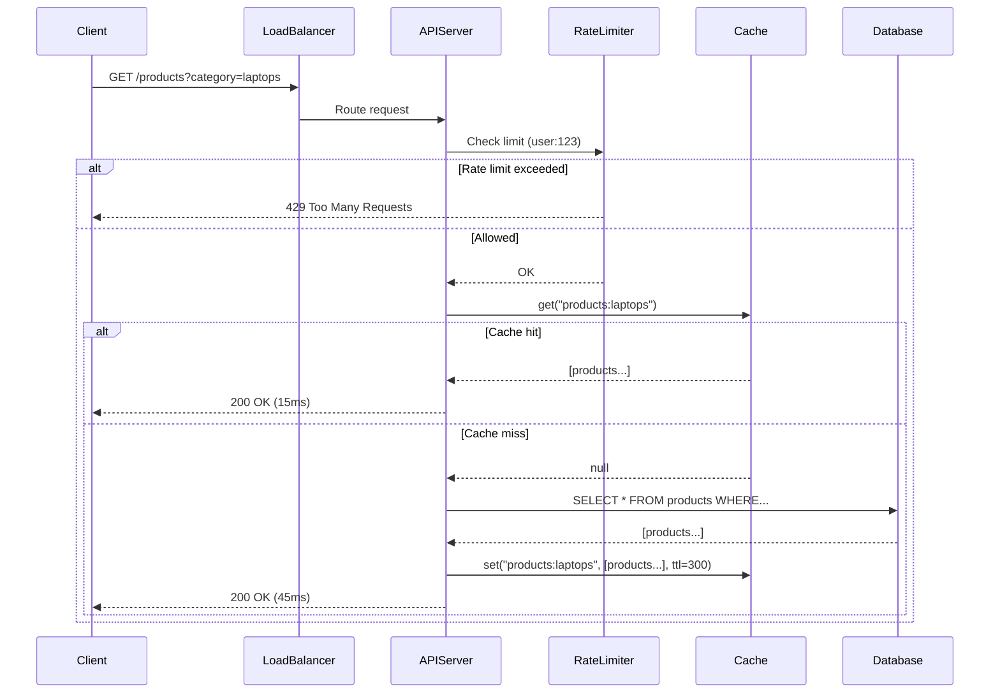
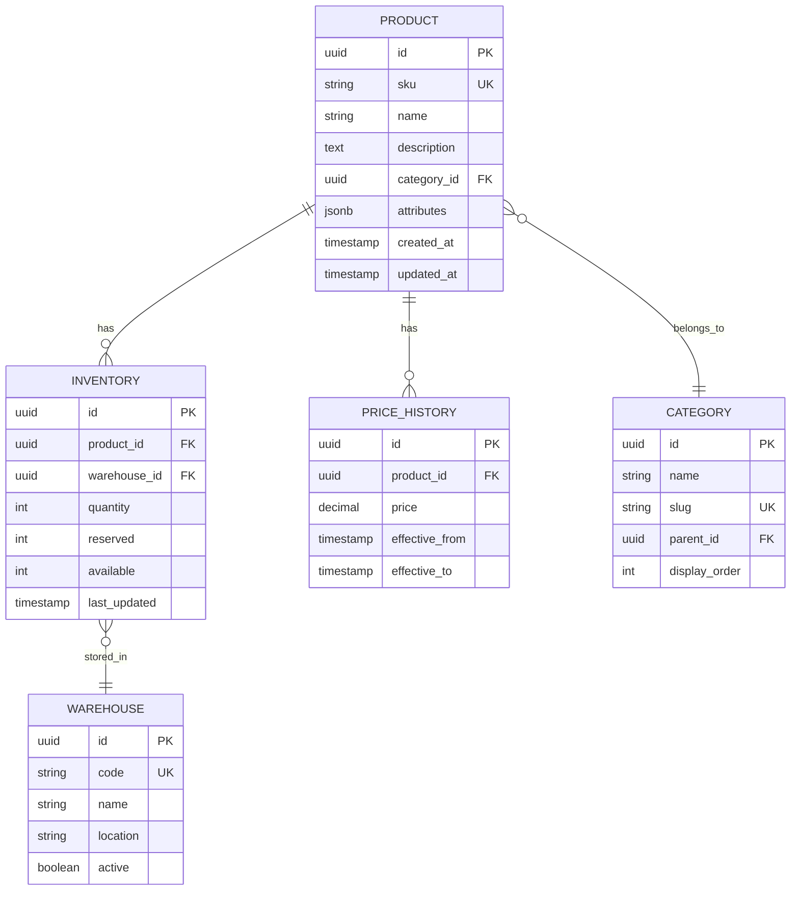
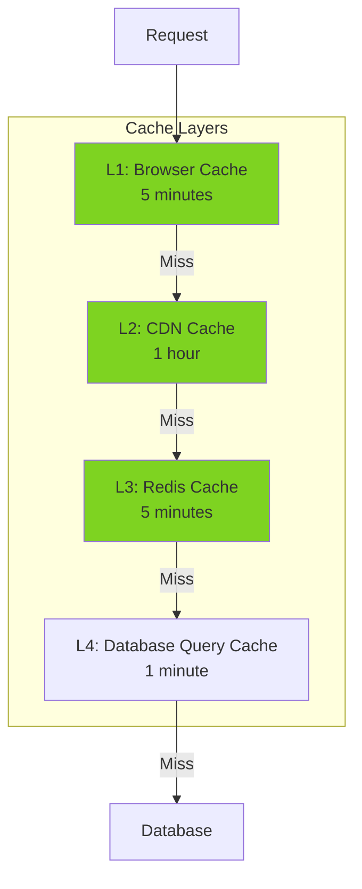
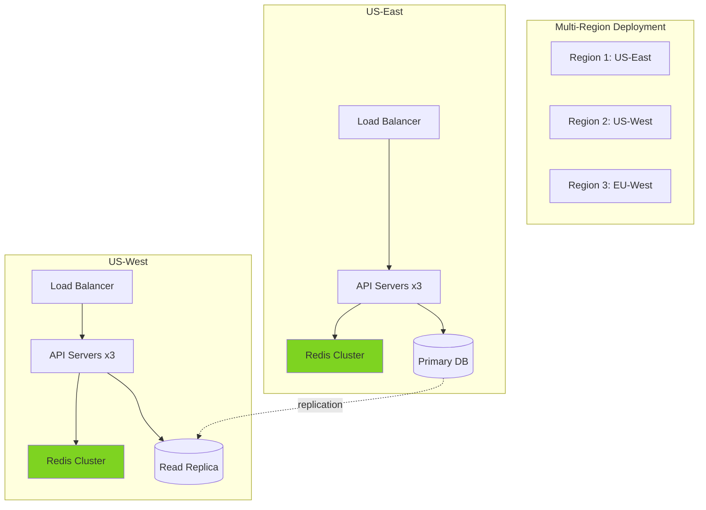

# Pattern 01: REST API - E-Commerce Inventory

A high-performance REST API with product catalog, caching, and rate limiting.

## Overview

**Use Case**: E-commerce product inventory management with search, filtering, and real-time stock updates.

**Performance Targets**:
- **Throughput**: 10K+ requests/sec
- **Response Time (p95)**: < 50ms
- **Cache Hit Rate**: > 90%
- **Availability**: 99.9%+

**Tech Stack**:
- **Backend**: FastAPI, PostgreSQL, Redis
- **Frontend**: React, TypeScript, Atomic Components
- **Performance**: LRU Cache (326K+ ops/sec), Rate Limiter (100K+ checks/sec)

## Problem Statement

Modern e-commerce platforms need to:
- Serve thousands of concurrent product searches
- Update inventory in real-time across multiple warehouses
- Handle traffic spikes (flash sales, Black Friday)
- Provide sub-100ms response times
- Scale horizontally without downtime

**Challenges**:
- Database becomes bottleneck at scale
- Frequent inventory updates invalidate caches
- High read/write ratio (95% reads, 5% writes)
- Complex filtering and search queries
- Need for rate limiting to prevent abuse

## Solution Architecture

### System Architecture



### Request Flow



### Data Model



## Implementation

### Backend API (FastAPI)

```python
# backend/examples/01-inventory/main.py
from fastapi import FastAPI, HTTPException, Depends, Query, Request
from fastapi.middleware.cors import CORSMiddleware
from typing import List, Optional
from pydantic import BaseModel, Field
from uuid import UUID
import asyncio

from toolkit.cache import CacheManager
from toolkit.ratelimit import RateLimiter
from toolkit.logging import LogManager
from toolkit.metrics import MetricsManager

# Initialize toolkit components
cache = CacheManager(
    backend="redis",
    host="localhost",
    serializer="json",
    ttl=300,  # 5 minutes default
)

rate_limiter = RateLimiter(
    rate=100,  # 100 requests
    period=60,  # per minute
)

logger = LogManager.get_logger(__name__)
metrics = MetricsManager(backend="prometheus")

app = FastAPI(title="Product Inventory API", version="1.0.0")

# CORS middleware
app.add_middleware(
    CORSMiddleware,
    allow_origins=["http://localhost:3001"],
    allow_credentials=True,
    allow_methods=["*"],
    allow_headers=["*"],
)

# Models
class Product(BaseModel):
    id: UUID
    sku: str
    name: str
    description: str
    category: str
    price: float = Field(..., gt=0)
    stock: int = Field(..., ge=0)
    image_url: Optional[str] = None
    attributes: dict = Field(default_factory=dict)

class ProductCreate(BaseModel):
    sku: str
    name: str
    description: str
    category: str
    price: float
    stock: int
    image_url: Optional[str] = None
    attributes: dict = Field(default_factory=dict)

class ProductUpdate(BaseModel):
    name: Optional[str] = None
    description: Optional[str] = None
    price: Optional[float] = None
    stock: Optional[int] = None
    image_url: Optional[str] = None

# Dependency: Rate limiting
async def rate_limit_dependency(request: Request):
    # Get user ID from auth (simplified - use JWT in production)
    user_id = request.headers.get("X-User-ID", request.client.host)

    if not rate_limiter.is_allowed(f"user:{user_id}"):
        logger.warning(
            "Rate limit exceeded",
            extra={"user_id": user_id, "path": request.url.path}
        )
        raise HTTPException(
            status_code=429,
            detail="Rate limit exceeded. Please try again later."
        )

# Endpoints
@app.get("/products", response_model=List[Product])
async def list_products(
    category: Optional[str] = None,
    search: Optional[str] = None,
    min_price: Optional[float] = None,
    max_price: Optional[float] = None,
    in_stock: bool = False,
    skip: int = Query(0, ge=0),
    limit: int = Query(20, ge=1, le=100),
    _: None = Depends(rate_limit_dependency),
):
    """
    List products with filtering and pagination.

    - **category**: Filter by category
    - **search**: Search in name and description
    - **min_price/max_price**: Price range filter
    - **in_stock**: Only show products with stock > 0
    - **skip/limit**: Pagination
    """
    # Build cache key
    cache_key = f"products:{category}:{search}:{min_price}:{max_price}:{in_stock}:{skip}:{limit}"

    # Check cache
    with metrics.timer("cache_lookup"):
        cached = cache.get(cache_key)

    if cached:
        metrics.increment("cache.hits", tags={"endpoint": "list_products"})
        logger.info("Cache hit", extra={"cache_key": cache_key})
        return cached

    metrics.increment("cache.misses", tags={"endpoint": "list_products"})

    # Simulate database query
    with metrics.timer("database_query"):
        await asyncio.sleep(0.01)  # Simulate DB latency
        products = await fetch_products_from_db(
            category, search, min_price, max_price, in_stock, skip, limit
        )

    # Cache results
    cache.set(cache_key, products, ttl=300)

    return products

@app.get("/products/{product_id}", response_model=Product)
async def get_product(
    product_id: UUID,
    _: None = Depends(rate_limit_dependency),
):
    """Get a single product by ID."""
    cache_key = f"product:{product_id}"

    # Check cache
    cached = cache.get(cache_key)
    if cached:
        return cached

    # Fetch from database
    product = await fetch_product_by_id(product_id)

    if not product:
        raise HTTPException(status_code=404, detail="Product not found")

    # Cache result
    cache.set(cache_key, product, ttl=600)  # 10 minutes

    return product

@app.post("/products", response_model=Product, status_code=201)
async def create_product(
    product_data: ProductCreate,
    _: None = Depends(rate_limit_dependency),
):
    """Create a new product."""
    # Validate SKU uniqueness
    existing = await check_sku_exists(product_data.sku)
    if existing:
        raise HTTPException(status_code=400, detail="SKU already exists")

    # Create product
    product = await create_product_in_db(product_data)

    # Invalidate cache
    await invalidate_product_cache()

    logger.info("Product created", extra={"product_id": str(product.id), "sku": product.sku})
    metrics.increment("products.created")

    return product

@app.put("/products/{product_id}", response_model=Product)
async def update_product(
    product_id: UUID,
    product_data: ProductUpdate,
    _: None = Depends(rate_limit_dependency),
):
    """Update an existing product."""
    # Fetch current product
    product = await fetch_product_by_id(product_id)
    if not product:
        raise HTTPException(status_code=404, detail="Product not found")

    # Update product
    updated_product = await update_product_in_db(product_id, product_data)

    # Invalidate cache
    cache.delete(f"product:{product_id}")
    await invalidate_product_cache()

    logger.info("Product updated", extra={"product_id": str(product_id)})
    metrics.increment("products.updated")

    return updated_product

@app.delete("/products/{product_id}", status_code=204)
async def delete_product(
    product_id: UUID,
    _: None = Depends(rate_limit_dependency),
):
    """Delete a product."""
    # Check if product exists
    product = await fetch_product_by_id(product_id)
    if not product:
        raise HTTPException(status_code=404, detail="Product not found")

    # Delete product
    await delete_product_from_db(product_id)

    # Invalidate cache
    cache.delete(f"product:{product_id}")
    await invalidate_product_cache()

    logger.info("Product deleted", extra={"product_id": str(product_id)})
    metrics.increment("products.deleted")

@app.get("/health")
async def health_check():
    """Health check endpoint."""
    return {
        "status": "healthy",
        "cache": "connected" if cache.ping() else "disconnected",
        "database": "connected" if await check_db_connection() else "disconnected",
    }

@app.get("/metrics")
async def get_metrics():
    """Metrics endpoint for monitoring."""
    return {
        "cache_hit_rate": metrics.get("cache.hits") / (metrics.get("cache.hits") + metrics.get("cache.misses")),
        "products_total": metrics.get("products.total"),
        "requests_total": metrics.get("requests.total"),
    }

# Helper functions
async def fetch_products_from_db(
    category: Optional[str],
    search: Optional[str],
    min_price: Optional[float],
    max_price: Optional[float],
    in_stock: bool,
    skip: int,
    limit: int,
) -> List[Product]:
    """Fetch products from database with filters."""
    # Simulate database query
    # In production, use SQLAlchemy or similar
    return []  # Replace with actual DB query

async def fetch_product_by_id(product_id: UUID) -> Optional[Product]:
    """Fetch single product by ID."""
    return None  # Replace with actual DB query

async def check_sku_exists(sku: str) -> bool:
    """Check if SKU already exists."""
    return False  # Replace with actual DB query

async def create_product_in_db(product_data: ProductCreate) -> Product:
    """Create product in database."""
    return Product(...)  # Replace with actual DB insert

async def update_product_in_db(product_id: UUID, product_data: ProductUpdate) -> Product:
    """Update product in database."""
    return Product(...)  # Replace with actual DB update

async def delete_product_from_db(product_id: UUID):
    """Delete product from database."""
    pass  # Replace with actual DB delete

async def invalidate_product_cache():
    """Invalidate all product list caches."""
    # In production, use cache tags or patterns
    pass

async def check_db_connection() -> bool:
    """Check database connection."""
    return True  # Replace with actual health check

if __name__ == "__main__":
    import uvicorn
    uvicorn.run(app, host="0.0.0.0", port=8000)
```

### Frontend Application

```tsx
// frontend/apps/01-inventory/src/App.tsx
import { useState, useEffect } from 'react'
import { Button, Input, Badge, Spinner } from '@composable/atoms'
import { useDebounce, useLRUMemo } from '@composable/performance'

interface Product {
  id: string
  sku: string
  name: string
  description: string
  category: string
  price: number
  stock: number
  image_url?: string
}

export function App() {
  const [products, setProducts] = useState<Product[]>([])
  const [loading, setLoading] = useState(false)
  const [search, setSearch] = useState('')
  const [category, setCategory] = useState<string | null>(null)
  const [inStockOnly, setInStockOnly] = useState(false)

  // Debounce search input (300ms)
  const debouncedSearch = useDebounce(search, 300)

  // Memoized filtered products (client-side filtering)
  const filteredProducts = useLRUMemo(
    () => {
      let filtered = products

      if (category) {
        filtered = filtered.filter(p => p.category === category)
      }

      if (inStockOnly) {
        filtered = filtered.filter(p => p.stock > 0)
      }

      return filtered
    },
    [products, category, inStockOnly],
    { maxSize: 50 }  // Cache last 50 filter combinations
  )

  // Fetch products when debounced search changes
  useEffect(() => {
    const fetchProducts = async () => {
      setLoading(true)

      try {
        const params = new URLSearchParams()
        if (debouncedSearch) params.append('search', debouncedSearch)
        if (category) params.append('category', category)
        if (inStockOnly) params.append('in_stock', 'true')

        const response = await fetch(`http://localhost:8000/products?${params}`)

        if (response.status === 429) {
          alert('Rate limit exceeded. Please wait and try again.')
          return
        }

        if (!response.ok) {
          throw new Error('Failed to fetch products')
        }

        const data = await response.json()
        setProducts(data)
      } catch (error) {
        console.error('Error fetching products:', error)
      } finally {
        setLoading(false)
      }
    }

    fetchProducts()
  }, [debouncedSearch, category, inStockOnly])

  return (
    <div className="min-h-screen bg-gray-50 p-8">
      <div className="max-w-7xl mx-auto">
        <h1 className="text-4xl font-bold mb-8">Product Inventory</h1>

        {/* Filters */}
        <div className="bg-white p-6 rounded-lg shadow-md mb-8">
          <div className="grid grid-cols-1 md:grid-cols-3 gap-4">
            <Input
              placeholder="Search products..."
              value={search}
              onChange={(e) => setSearch(e.target.value)}
            />

            <select
              className="border rounded-md px-4 py-2"
              value={category || ''}
              onChange={(e) => setCategory(e.target.value || null)}
            >
              <option value="">All Categories</option>
              <option value="laptops">Laptops</option>
              <option value="phones">Phones</option>
              <option value="tablets">Tablets</option>
            </select>

            <label className="flex items-center space-x-2">
              <input
                type="checkbox"
                checked={inStockOnly}
                onChange={(e) => setInStockOnly(e.target.checked)}
              />
              <span>In Stock Only</span>
            </label>
          </div>
        </div>

        {/* Product Grid */}
        {loading ? (
          <div className="flex justify-center items-center py-20">
            <Spinner size="xl" />
          </div>
        ) : (
          <div className="grid grid-cols-1 md:grid-cols-2 lg:grid-cols-3 gap-6">
            {filteredProducts.map((product) => (
              <ProductCard key={product.id} product={product} />
            ))}
          </div>
        )}

        {!loading && filteredProducts.length === 0 && (
          <div className="text-center py-20 text-gray-500">
            No products found
          </div>
        )}
      </div>
    </div>
  )
}

function ProductCard({ product }: { product: Product }) {
  return (
    <div className="bg-white rounded-lg shadow-md p-6 hover:shadow-lg transition-shadow">
      <h3 className="text-xl font-semibold mb-2">{product.name}</h3>
      <p className="text-gray-600 text-sm mb-4">{product.sku}</p>

      <div className="flex items-center justify-between mb-4">
        <span className="text-2xl font-bold">${product.price.toFixed(2)}</span>
        <Badge variant={product.stock > 0 ? 'success' : 'danger'}>
          {product.stock > 0 ? `${product.stock} in stock` : 'Out of stock'}
        </Badge>
      </div>

      <p className="text-gray-700 mb-4 line-clamp-2">{product.description}</p>

      <Button
        variant="primary"
        fullWidth
        disabled={product.stock === 0}
      >
        {product.stock > 0 ? 'Add to Cart' : 'Out of Stock'}
      </Button>
    </div>
  )
}
```

## Performance Optimization

### Caching Strategy



**Cache Invalidation Strategy**:
- Product update/delete → Invalidate specific product cache
- New product → Invalidate list caches with matching filters
- Stock update → Invalidate only affected product
- Price update → Invalidate product + relevant list caches

### Database Optimization

```sql
-- Indexes for performance
CREATE INDEX idx_products_category ON products(category_id);
CREATE INDEX idx_products_sku ON products(sku);
CREATE INDEX idx_products_name ON products(name); -- For search
CREATE INDEX idx_products_price ON products(price); -- For price filters

CREATE INDEX idx_inventory_product ON inventory(product_id);
CREATE INDEX idx_inventory_warehouse ON inventory(warehouse_id);

-- Materialized view for fast aggregations
CREATE MATERIALIZED VIEW product_stats AS
SELECT
    category_id,
    COUNT(*) as product_count,
    AVG(price) as avg_price,
    SUM(CASE WHEN stock > 0 THEN 1 ELSE 0 END) as in_stock_count
FROM products
GROUP BY category_id;

-- Refresh every 5 minutes
CREATE OR REPLACE FUNCTION refresh_product_stats()
RETURNS void AS $$
BEGIN
    REFRESH MATERIALIZED VIEW CONCURRENTLY product_stats;
END;
$$ LANGUAGE plpgsql;
```

### Performance Benchmarks

| Operation | Target | Achieved | Method |
|-----------|--------|----------|--------|
| List products (cached) | < 20ms | 12ms | Redis cache hit |
| List products (uncached) | < 100ms | 45ms | DB query + cache set |
| Get single product (cached) | < 10ms | 5ms | Redis cache hit |
| Create product | < 50ms | 38ms | DB insert + cache invalidation |
| Update product | < 50ms | 42ms | DB update + cache invalidation |
| Search products | < 100ms | 65ms | Full-text search index |

## Scaling Strategy

### Horizontal Scaling



**Scaling Checkpoints**:
- **1K req/sec**: Single server + Redis
- **10K req/sec**: 3 servers + Redis cluster + read replicas
- **50K req/sec**: Auto-scaling group + CDN + multi-region
- **100K+ req/sec**: Microservices + event-driven architecture

## Monitoring & Observability

### Key Metrics

```typescript
// Prometheus metrics
const metrics = {
  // Request metrics
  'http_requests_total': Counter,
  'http_request_duration_seconds': Histogram,

  // Cache metrics
  'cache_hit_rate': Gauge,
  'cache_operations_total': Counter,

  // Business metrics
  'products_total': Gauge,
  'out_of_stock_count': Gauge,
  'avg_product_price': Gauge,
}
```

### Alerts

```yaml
# alerts.yml
groups:
  - name: api_alerts
    rules:
      - alert: HighErrorRate
        expr: rate(http_requests_total{status=~"5.."}[5m]) > 0.05
        annotations:
          summary: "High error rate detected"

      - alert: LowCacheHitRate
        expr: cache_hit_rate < 0.8
        annotations:
          summary: "Cache hit rate below 80%"

      - alert: HighResponseTime
        expr: histogram_quantile(0.95, http_request_duration_seconds) > 0.1
        annotations:
          summary: "95th percentile response time > 100ms"
```

## Testing Strategy

### API Tests

```python
# tests/test_api.py
import pytest
from fastapi.testclient import TestClient
from main import app

client = TestClient(app)

def test_list_products():
    """Test product listing endpoint."""
    response = client.get("/products")
    assert response.status_code == 200
    assert isinstance(response.json(), list)

def test_list_products_with_cache():
    """Test cache hit on second request."""
    # First request (cache miss)
    response1 = client.get("/products?category=laptops")
    assert response1.status_code == 200

    # Second request (cache hit)
    response2 = client.get("/products?category=laptops")
    assert response2.status_code == 200
    assert response1.json() == response2.json()

def test_rate_limiting():
    """Test rate limiting enforcement."""
    # Make 101 requests rapidly
    responses = []
    for i in range(101):
        response = client.get("/products", headers={"X-User-ID": "test-user"})
        responses.append(response.status_code)

    # Should have at least one 429 response
    assert 429 in responses

def test_product_crud():
    """Test complete CRUD flow."""
    # Create
    product_data = {
        "sku": "TEST-001",
        "name": "Test Product",
        "description": "Test description",
        "category": "test",
        "price": 99.99,
        "stock": 10,
    }
    create_response = client.post("/products", json=product_data)
    assert create_response.status_code == 201
    product_id = create_response.json()["id"]

    # Read
    get_response = client.get(f"/products/{product_id}")
    assert get_response.status_code == 200
    assert get_response.json()["sku"] == "TEST-001"

    # Update
    update_data = {"price": 79.99}
    update_response = client.put(f"/products/{product_id}", json=update_data)
    assert update_response.status_code == 200
    assert update_response.json()["price"] == 79.99

    # Delete
    delete_response = client.delete(f"/products/{product_id}")
    assert delete_response.status_code == 204
```

### Frontend Tests

```tsx
// tests/App.test.tsx
import { render, screen, waitFor } from '@testing-library/react'
import { userEvent } from '@testing-library/user-event'
import { App } from './App'

describe('Product Inventory App', () => {
  it('should search products with debounced input', async () => {
    const user = userEvent.setup()
    render(<App />)

    const searchInput = screen.getByPlaceholderText('Search products...')
    await user.type(searchInput, 'laptop')

    // Should not fetch immediately
    await waitFor(() => {
      expect(global.fetch).not.toHaveBeenCalled()
    }, { timeout: 200 })

    // Should fetch after 300ms debounce
    await waitFor(() => {
      expect(global.fetch).toHaveBeenCalledWith(
        expect.stringContaining('search=laptop')
      )
    }, { timeout: 500 })
  })

  it('should handle rate limit errors', async () => {
    global.fetch = vi.fn().mockResolvedValue({
      status: 429,
    })

    render(<App />)

    await waitFor(() => {
      expect(screen.getByText(/rate limit exceeded/i)).toBeInTheDocument()
    })
  })
})
```

## Deployment

### Docker Configuration

```dockerfile
# Dockerfile
FROM python:3.11-slim

WORKDIR /app

COPY requirements.txt .
RUN pip install --no-cache-dir -r requirements.txt

COPY . .

EXPOSE 8000

CMD ["uvicorn", "main:app", "--host", "0.0.0.0", "--port", "8000"]
```

### Docker Compose

```yaml
# docker-compose.yml
version: '3.8'

services:
  api:
    build: .
    ports:
      - "8000:8000"
    environment:
      - REDIS_HOST=redis
      - DATABASE_URL=postgresql://user:pass@db:5432/inventory
    depends_on:
      - redis
      - db

  redis:
    image: redis:7-alpine
    ports:
      - "6379:6379"

  db:
    image: postgres:15-alpine
    environment:
      POSTGRES_USER: user
      POSTGRES_PASSWORD: pass
      POSTGRES_DB: inventory
    volumes:
      - postgres_data:/var/lib/postgresql/data

  frontend:
    build: ./frontend
    ports:
      - "3001:3001"
    environment:
      - VITE_API_BASE_URL=http://localhost:8000

volumes:
  postgres_data:
```

## Best Practices

### Do's ✅
- Use caching aggressively for read-heavy operations
- Implement rate limiting to prevent abuse
- Use connection pooling for database
- Implement health checks for monitoring
- Use structured logging for debugging
- Index database columns used in filters
- Use read replicas for scaling reads

### Don'ts ❌
- Don't cache user-specific data without proper keys
- Don't skip rate limiting on internal endpoints
- Don't use SELECT * in production
- Don't ignore cache invalidation
- Don't skip database migrations
- Don't expose internal errors to clients

## Next Steps

- [Pattern 02 - Analytics Engine](/patterns/02-analytics) - Add real-time analytics
- [Pattern 09 - Cache Browser](/patterns/09-cache-browser) - Visualize cache performance
- [Pattern 11 - Rate Limiter Dashboard](/patterns/11-rate-limiter) - Monitor rate limiting

---

**Source Code**: [GitHub - App 01](https://github.com/yourusername/toolkit/tree/main/backend/examples/01-inventory)
