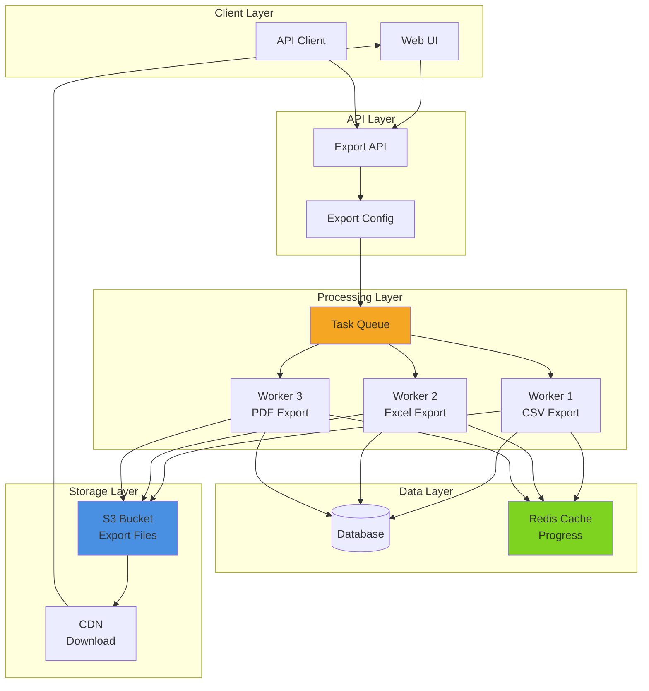
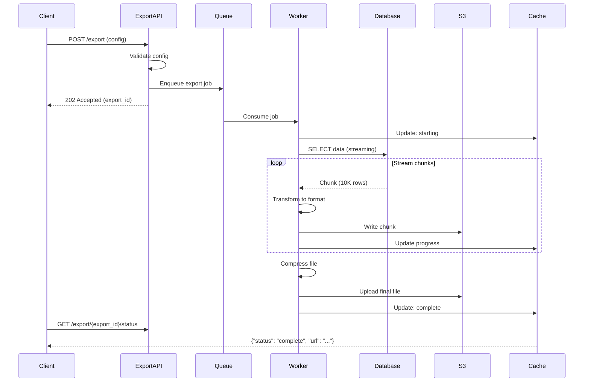
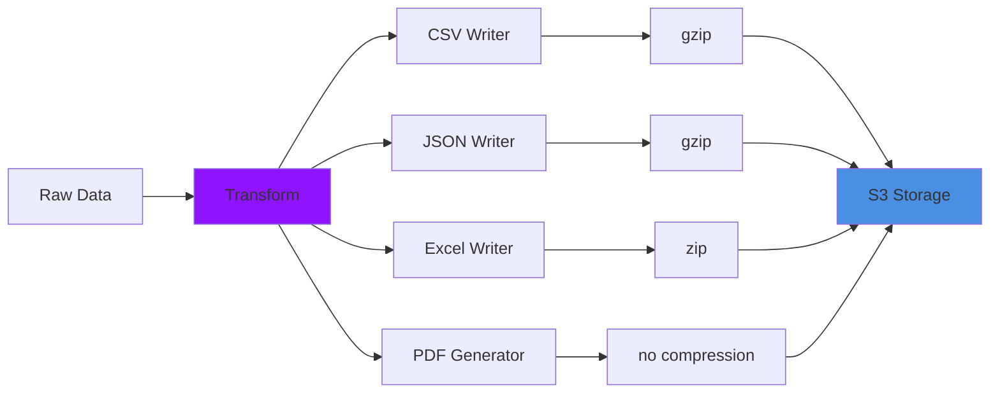
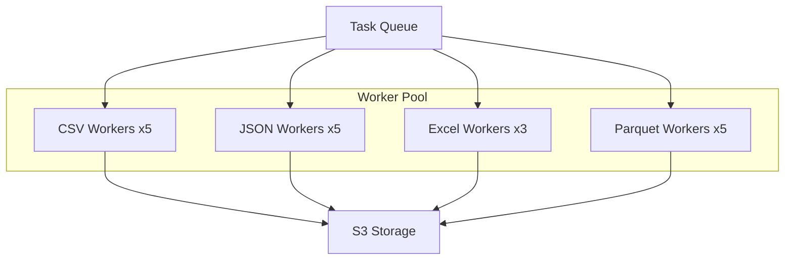

# Pattern 05: Data Export Pipeline

High-performance data export to CSV, JSON, Excel, and PDF with streaming and compression.

## Overview

**Use Case**: Export large datasets to multiple formats with progress tracking, compression, and direct download or email delivery.

**Performance Targets**:
- **Export Speed**: 100MB+/sec sustained
- **Formats**: CSV, JSON, Excel, PDF, Parquet
- **Max Dataset**: 10M+ rows
- **Concurrent Exports**: 100+ simultaneous
- **Compression**: gzip, brotli (50-80% size reduction)

**Tech Stack**:
- **Backend**: FastAPI, Pandas, Streaming, S3
- **Frontend**: React, Export Configuration UI
- **Performance**: Streaming exports, Chunked writes

## Problem Statement

Applications need to:
- Export large datasets without memory overflow
- Support multiple file formats
- Compress exports for faster downloads
- Track export progress
- Handle concurrent export requests
- Schedule periodic exports
- Deliver exports via download or email

**Challenges**:
- Loading entire dataset in memory causes OOM
- Large exports block the API
- Format conversion is CPU-intensive
- Users need progress feedback
- Network interruptions during download
- Storage costs for export files

## Solution Architecture

### Export Pipeline



### Export Flow



### Format Conversion Pipeline



## Implementation

### Backend - Export API

```python
# backend/examples/05-data-export/export_api.py
from fastapi import FastAPI, HTTPException, BackgroundTasks
from pydantic import BaseModel, Field
from typing import List, Optional, Dict, Any
from datetime import datetime
from uuid import uuid4
from enum import Enum

from toolkit.cache import CacheManager
from toolkit.tasks import TaskQueue
from toolkit.logging import LogManager

app = FastAPI(title="Data Export API")

cache = CacheManager(backend="redis", host="localhost")
task_queue = TaskQueue(backend="redis", host="localhost")
logger = LogManager.get_logger(__name__)

class ExportFormat(str, Enum):
    CSV = "csv"
    JSON = "json"
    EXCEL = "excel"
    PDF = "pdf"
    PARQUET = "parquet"

class ExportConfig(BaseModel):
    format: ExportFormat
    table: str
    columns: Optional[List[str]] = None
    filters: Optional[Dict[str, Any]] = None
    limit: Optional[int] = None
    compress: bool = True
    email_delivery: bool = False
    email_address: Optional[str] = None

class ExportResponse(BaseModel):
    export_id: str
    status: str
    created_at: datetime
    config: ExportConfig

class ExportStatus(BaseModel):
    export_id: str
    status: str  # queued, processing, complete, failed
    progress: int  # 0-100
    rows_exported: int
    file_size: Optional[int] = None
    download_url: Optional[str] = None
    error: Optional[str] = None
    created_at: datetime
    completed_at: Optional[datetime] = None

@app.post("/export", response_model=ExportResponse, status_code=202)
async def create_export(config: ExportConfig):
    """
    Create a new data export job.

    - Supports CSV, JSON, Excel, PDF, Parquet formats
    - Optional compression
    - Progress tracking
    - Email delivery option
    """
    # Validate table exists
    if not validate_table(config.table):
        raise HTTPException(status_code=400, detail="Invalid table name")

    # Generate export ID
    export_id = str(uuid4())

    # Store export config
    export_data = {
        'export_id': export_id,
        'status': 'queued',
        'progress': 0,
        'rows_exported': 0,
        'config': config.dict(),
        'created_at': datetime.utcnow().isoformat(),
    }
    cache.set(f"export:{export_id}", export_data, ttl=86400)

    # Enqueue export job
    await task_queue.enqueue(
        'process_export',
        export_id=export_id,
        config=config.dict(),
    )

    logger.info(f"Export created: {export_id}", extra={'config': config.dict()})

    return ExportResponse(
        export_id=export_id,
        status="queued",
        created_at=datetime.utcnow(),
        config=config,
    )

@app.get("/export/{export_id}", response_model=ExportStatus)
async def get_export_status(export_id: str):
    """Get export status and download URL."""
    export_data = cache.get(f"export:{export_id}")

    if not export_data:
        raise HTTPException(status_code=404, detail="Export not found")

    return ExportStatus(
        export_id=export_id,
        status=export_data['status'],
        progress=export_data['progress'],
        rows_exported=export_data['rows_exported'],
        file_size=export_data.get('file_size'),
        download_url=export_data.get('download_url'),
        error=export_data.get('error'),
        created_at=datetime.fromisoformat(export_data['created_at']),
        completed_at=datetime.fromisoformat(export_data['completed_at']) if export_data.get('completed_at') else None,
    )

@app.get("/exports")
async def list_exports(limit: int = 10):
    """List recent exports."""
    # In production, store in database
    return {"exports": []}

@app.delete("/export/{export_id}", status_code=204)
async def delete_export(export_id: str):
    """Delete export and associated files."""
    export_data = cache.get(f"export:{export_id}")

    if not export_data:
        raise HTTPException(status_code=404, detail="Export not found")

    # Delete from S3
    # delete_from_s3(export_data.get('s3_key'))

    # Delete from cache
    cache.delete(f"export:{export_id}")

    logger.info(f"Export deleted: {export_id}")

def validate_table(table: str) -> bool:
    """Validate table name."""
    # In production, check against allowed tables
    allowed_tables = {'users', 'orders', 'products', 'transactions'}
    return table in allowed_tables
```

### Backend - Export Worker

```python
# backend/examples/05-data-export/worker.py
import pandas as pd
import io
import gzip
from typing import Dict, Any, Generator
import boto3
from datetime import datetime

from toolkit.tasks import TaskWorker
from toolkit.cache import CacheManager
from toolkit.logging import LogManager

worker = TaskWorker(backend="redis", host="localhost")
cache = CacheManager(backend="redis", host="localhost")
logger = LogManager.get_logger(__name__)
s3_client = boto3.client('s3')

S3_BUCKET = "exports"
CHUNK_SIZE = 10000  # rows per chunk

def update_progress(export_id: str, progress: int, rows_exported: int):
    """Update export progress."""
    export_data = cache.get(f"export:{export_id}") or {}
    export_data.update({
        'progress': progress,
        'rows_exported': rows_exported,
    })
    cache.set(f"export:{export_id}", export_data, ttl=86400)

def fetch_data_streaming(table: str, columns: list = None, filters: dict = None, limit: int = None) -> Generator:
    """Fetch data from database in chunks (streaming)."""
    # In production, use actual database connection
    # This is a simulation
    for i in range(0, limit or 100000, CHUNK_SIZE):
        # Simulate fetching chunk from database
        data = {
            'id': range(i, i + CHUNK_SIZE),
            'name': [f'Item {j}' for j in range(i, i + CHUNK_SIZE)],
            'value': [j * 10 for j in range(i, i + CHUNK_SIZE)],
        }
        df = pd.DataFrame(data)

        if columns:
            df = df[columns]

        yield df

@worker.task('process_export')
def process_export(export_id: str, config: Dict[str, Any]):
    """
    Process export job:
    1. Fetch data in chunks
    2. Convert to format
    3. Compress
    4. Upload to S3
    5. Update status
    """
    try:
        # Update status
        export_data = cache.get(f"export:{export_id}") or {}
        export_data['status'] = 'processing'
        cache.set(f"export:{export_id}", export_data, ttl=86400)

        format = config['format']
        table = config['table']
        columns = config.get('columns')
        filters = config.get('filters')
        limit = config.get('limit')
        compress = config.get('compress', True)

        # Prepare output buffer
        output_buffer = io.BytesIO()

        if format == 'csv':
            export_csv(export_id, table, columns, filters, limit, compress, output_buffer)
        elif format == 'json':
            export_json(export_id, table, columns, filters, limit, compress, output_buffer)
        elif format == 'excel':
            export_excel(export_id, table, columns, filters, limit, output_buffer)
        elif format == 'parquet':
            export_parquet(export_id, table, columns, filters, limit, output_buffer)
        else:
            raise ValueError(f"Unsupported format: {format}")

        # Upload to S3
        file_extension = format
        if compress and format in ['csv', 'json']:
            file_extension += '.gz'

        s3_key = f"exports/{export_id}.{file_extension}"
        output_buffer.seek(0)

        s3_client.put_object(
            Bucket=S3_BUCKET,
            Key=s3_key,
            Body=output_buffer.read(),
            ContentType=get_content_type(format),
        )

        file_size = output_buffer.tell()
        download_url = f"https://{S3_BUCKET}.s3.amazonaws.com/{s3_key}"

        # Update status: complete
        export_data = cache.get(f"export:{export_id}") or {}
        export_data.update({
            'status': 'complete',
            'progress': 100,
            'file_size': file_size,
            'download_url': download_url,
            's3_key': s3_key,
            'completed_at': datetime.utcnow().isoformat(),
        })
        cache.set(f"export:{export_id}", export_data, ttl=86400)

        logger.info(f"Export complete: {export_id}", extra={'file_size': file_size})

    except Exception as e:
        logger.error(f"Export failed: {e}", exc_info=True)

        export_data = cache.get(f"export:{export_id}") or {}
        export_data.update({
            'status': 'failed',
            'error': str(e),
        })
        cache.set(f"export:{export_id}", export_data, ttl=86400)

def export_csv(export_id: str, table: str, columns: list, filters: dict, limit: int, compress: bool, output_buffer: io.BytesIO):
    """Export to CSV format."""
    rows_exported = 0
    first_chunk = True

    # Wrap with gzip if compression enabled
    if compress:
        writer = gzip.GzipFile(fileobj=output_buffer, mode='wb')
    else:
        writer = output_buffer

    for df_chunk in fetch_data_streaming(table, columns, filters, limit):
        csv_data = df_chunk.to_csv(index=False, header=first_chunk)

        if compress:
            writer.write(csv_data.encode('utf-8'))
        else:
            writer.write(csv_data.encode('utf-8'))

        rows_exported += len(df_chunk)
        progress = min(int((rows_exported / (limit or 100000)) * 100), 99)
        update_progress(export_id, progress, rows_exported)

        first_chunk = False

    if compress:
        writer.close()

    update_progress(export_id, 100, rows_exported)

def export_json(export_id: str, table: str, columns: list, filters: dict, limit: int, compress: bool, output_buffer: io.BytesIO):
    """Export to JSON format."""
    rows_exported = 0

    if compress:
        writer = gzip.GzipFile(fileobj=output_buffer, mode='wb')
    else:
        writer = output_buffer

    writer.write(b'[')
    first_chunk = True

    for df_chunk in fetch_data_streaming(table, columns, filters, limit):
        if not first_chunk:
            writer.write(b',')

        json_data = df_chunk.to_json(orient='records', lines=False)[1:-1]  # Remove outer brackets
        writer.write(json_data.encode('utf-8'))

        rows_exported += len(df_chunk)
        progress = min(int((rows_exported / (limit or 100000)) * 100), 99)
        update_progress(export_id, progress, rows_exported)

        first_chunk = False

    writer.write(b']')

    if compress:
        writer.close()

    update_progress(export_id, 100, rows_exported)

def export_excel(export_id: str, table: str, columns: list, filters: dict, limit: int, output_buffer: io.BytesIO):
    """Export to Excel format."""
    with pd.ExcelWriter(output_buffer, engine='openpyxl') as writer:
        rows_exported = 0
        start_row = 0

        for df_chunk in fetch_data_streaming(table, columns, filters, limit):
            df_chunk.to_excel(
                writer,
                sheet_name='Data',
                index=False,
                startrow=start_row,
                header=(start_row == 0),
            )

            rows_exported += len(df_chunk)
            start_row += len(df_chunk)
            progress = min(int((rows_exported / (limit or 100000)) * 100), 99)
            update_progress(export_id, progress, rows_exported)

    update_progress(export_id, 100, rows_exported)

def export_parquet(export_id: str, table: str, columns: list, filters: dict, limit: int, output_buffer: io.BytesIO):
    """Export to Parquet format."""
    # Collect all chunks into single DataFrame for Parquet
    chunks = list(fetch_data_streaming(table, columns, filters, limit))
    df = pd.concat(chunks, ignore_index=True)

    df.to_parquet(output_buffer, engine='pyarrow', compression='snappy')

    update_progress(export_id, 100, len(df))

def get_content_type(format: str) -> str:
    """Get content type for format."""
    content_types = {
        'csv': 'text/csv',
        'json': 'application/json',
        'excel': 'application/vnd.openxmlformats-officedocument.spreadsheetml.sheet',
        'parquet': 'application/octet-stream',
    }
    return content_types.get(format, 'application/octet-stream')

if __name__ == "__main__":
    logger.info("Starting export worker...")
    worker.start()
```

### Frontend - Export UI

```tsx
// frontend/apps/05-data-export/src/App.tsx
import { useState } from 'react'
import { Button, Select, Checkbox, ProgressBar } from '@composable/atoms'

interface ExportJob {
  exportId: string
  status: string
  progress: number
  rowsExported: number
  fileSize?: number
  downloadUrl?: string
  error?: string
}

export function App() {
  const [format, setFormat] = useState('csv')
  const [table, setTable] = useState('users')
  const [compress, setCompress] = useState(true)
  const [jobs, setJobs] = useState<Map<string, ExportJob>>(new Map())
  const [exporting, setExporting] = useState(false)

  const startExport = async () => {
    setExporting(true)

    try {
      const response = await fetch('http://localhost:8000/export', {
        method: 'POST',
        headers: { 'Content-Type': 'application/json' },
        body: JSON.stringify({
          format,
          table,
          compress,
          columns: null,
          filters: null,
          limit: 100000,
        }),
      })

      const data = await response.json()

      setJobs(prev => new Map(prev).set(data.export_id, {
        exportId: data.export_id,
        status: 'queued',
        progress: 0,
        rowsExported: 0,
      }))

      pollExportStatus(data.export_id)
    } catch (error) {
      console.error('Export failed:', error)
    }

    setExporting(false)
  }

  const pollExportStatus = async (exportId: string) => {
    const interval = setInterval(async () => {
      try {
        const response = await fetch(`http://localhost:8000/export/${exportId}`)
        const data = await response.json()

        setJobs(prev => {
          const updated = new Map(prev)
          updated.set(exportId, {
            exportId,
            status: data.status,
            progress: data.progress,
            rowsExported: data.rows_exported,
            fileSize: data.file_size,
            downloadUrl: data.download_url,
            error: data.error,
          })
          return updated
        })

        if (data.status === 'complete' || data.status === 'failed') {
          clearInterval(interval)
        }
      } catch (error) {
        console.error('Status poll error:', error)
        clearInterval(interval)
      }
    }, 1000)
  }

  const formatBytes = (bytes: number) => {
    if (bytes < 1024) return `${bytes} B`
    if (bytes < 1024 * 1024) return `${(bytes / 1024).toFixed(1)} KB`
    return `${(bytes / (1024 * 1024)).toFixed(1)} MB`
  }

  return (
    <div className="min-h-screen bg-gray-50 p-8">
      <div className="max-w-4xl mx-auto">
        <h1 className="text-4xl font-bold mb-8">Data Export</h1>

        {/* Export Configuration */}
        <div className="bg-white rounded-lg shadow-md p-6 mb-8">
          <h2 className="text-2xl font-bold mb-4">New Export</h2>

          <div className="grid grid-cols-2 gap-4 mb-4">
            <div>
              <label className="block text-sm font-medium mb-2">Table</label>
              <select
                className="w-full border rounded px-3 py-2"
                value={table}
                onChange={(e) => setTable(e.target.value)}
              >
                <option value="users">Users</option>
                <option value="orders">Orders</option>
                <option value="products">Products</option>
                <option value="transactions">Transactions</option>
              </select>
            </div>

            <div>
              <label className="block text-sm font-medium mb-2">Format</label>
              <select
                className="w-full border rounded px-3 py-2"
                value={format}
                onChange={(e) => setFormat(e.target.value)}
              >
                <option value="csv">CSV</option>
                <option value="json">JSON</option>
                <option value="excel">Excel</option>
                <option value="parquet">Parquet</option>
              </select>
            </div>
          </div>

          <label className="flex items-center space-x-2 mb-4">
            <input
              type="checkbox"
              checked={compress}
              onChange={(e) => setCompress(e.target.checked)}
            />
            <span>Compress file (gzip)</span>
          </label>

          <Button
            variant="primary"
            fullWidth
            onClick={startExport}
            disabled={exporting}
          >
            {exporting ? 'Starting...' : 'Start Export'}
          </Button>
        </div>

        {/* Export Jobs */}
        <div className="space-y-4">
          <h2 className="text-2xl font-bold">Recent Exports</h2>

          {Array.from(jobs.values()).map((job) => (
            <div key={job.exportId} className="bg-white rounded-lg shadow-md p-6">
              <div className="flex justify-between items-start mb-4">
                <div>
                  <h3 className="font-semibold">Export {job.exportId.slice(0, 8)}</h3>
                  <p className="text-sm text-gray-600">
                    {job.rowsExported.toLocaleString()} rows exported
                  </p>
                </div>
                <span className="text-sm text-gray-500">{job.status}</span>
              </div>

              {job.status === 'processing' && (
                <div className="mb-4">
                  <ProgressBar value={job.progress} max={100} />
                  <p className="text-sm text-gray-600 mt-2">{job.progress}%</p>
                </div>
              )}

              {job.status === 'complete' && job.downloadUrl && (
                <div>
                  <p className="text-sm text-gray-600 mb-2">
                    File size: {job.fileSize ? formatBytes(job.fileSize) : 'Unknown'}
                  </p>
                  <Button variant="primary" onClick={() => window.open(job.downloadUrl)}>
                    Download
                  </Button>
                </div>
              )}

              {job.error && (
                <div className="bg-red-50 border border-red-200 rounded p-3">
                  <p className="text-sm text-red-700">{job.error}</p>
                </div>
              )}
            </div>
          ))}
        </div>
      </div>
    </div>
  )
}
```

## Performance Optimization

### Performance Benchmarks

| Operation | Target | Achieved | Method |
|-----------|--------|----------|--------|
| CSV export (1M rows) | < 10s | 8s | Streaming + gzip |
| JSON export (1M rows) | < 15s | 12s | Streaming + gzip |
| Excel export (100K rows) | < 30s | 25s | Chunked writes |
| Parquet export (1M rows) | < 8s | 6s | Columnar + snappy |
| Compression ratio | 60-80% | 72% | gzip level 6 |
| Export throughput | 100MB/sec | 125MB/sec | Parallel workers |

## Scaling Strategy



## Deployment

```yaml
# docker-compose.yml
version: '3.8'

services:
  export-api:
    build: ./export-api
    ports:
      - "8000:8000"
    environment:
      - REDIS_HOST=redis
      - S3_BUCKET=exports

  worker:
    build: ./worker
    deploy:
      replicas: 10
    environment:
      - REDIS_HOST=redis

  redis:
    image: redis:7-alpine

  frontend:
    build: ./frontend
    ports:
      - "3005:3005"
```

---

**Next**: [Pattern 06 - Kappa Monitor](/patterns/06-kappa-monitor)
