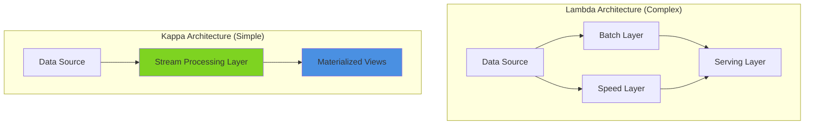
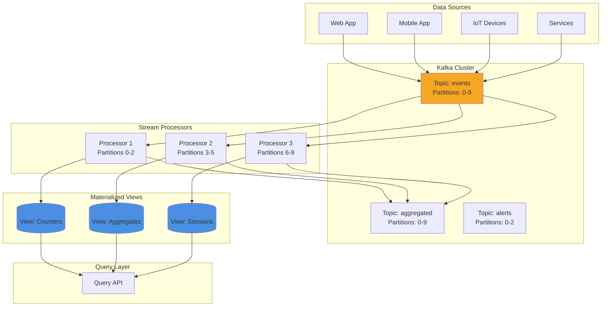
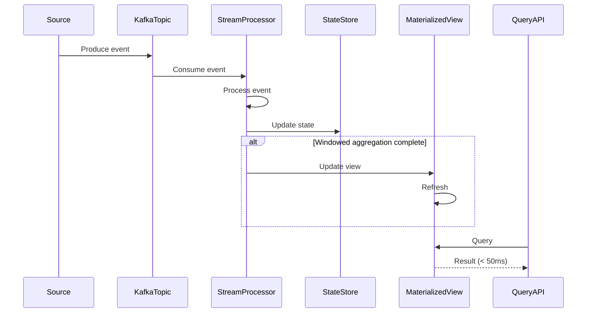
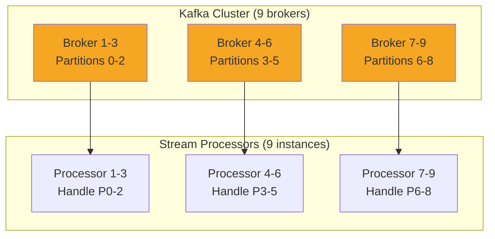

# Pattern 06: Kappa Architecture Monitor

Stream-only processing with Kafka, materialized views, and real-time stream visualization.

## Overview

**Use Case**: Pure stream processing architecture (no batch layer) with real-time analytics, materialized views, and stream monitoring dashboard.

**Performance Targets**:
- **Throughput**: 100K+ msg/sec per partition
- **Latency (p95)**: < 50ms end-to-end
- **Stream Processing**: Real-time windowed aggregations
- **Materialized Views**: Sub-second freshness
- **Availability**: 99.95%+

**Tech Stack**:
- **Backend**: Kafka, Kafka Streams, Materialized Views
- **Frontend**: React, Real-time Stream Viz
- **Performance**: Partitioning, Parallel consumers

## Problem Statement

Modern streaming applications need to:
- Process unbounded data streams in real-time
- Maintain materialized views from streams
- Replay events for recovery or testing
- Join multiple streams efficiently
- Handle out-of-order events
- Scale horizontally without batch layer

**Challenges**:
- Complexity of Lambda architecture (batch + stream)
- Maintaining consistency between batch and stream
- Stream processing state management
- Handling late-arriving events
- Exactly-once processing semantics

## Solution Architecture

### Kappa vs Lambda Architecture



### Kappa Stream Processing



### Stream Processing Flow



## Implementation

### Backend - Stream Processor

```python
# backend/examples/06-kappa/stream_processor.py
from kafka import KafkaConsumer, KafkaProducer
from collections import defaultdict
from datetime import datetime, timedelta
import json
import threading
import time

from toolkit.cache import CacheManager
from toolkit.logging import LogManager
from toolkit.metrics import MetricsManager

logger = LogManager.get_logger(__name__)
metrics = MetricsManager(backend="prometheus")
cache = CacheManager(backend="redis", host="localhost")

# Kafka configuration
KAFKA_BROKERS = ['localhost:9092']
INPUT_TOPIC = 'events'
OUTPUT_TOPIC = 'aggregated'
CONSUMER_GROUP = 'stream-processor-group'

# Window configuration
WINDOW_SIZE = 60  # seconds
WINDOW_SLIDE = 10  # seconds

class StreamProcessor:
    def __init__(self):
        self.consumer = KafkaConsumer(
            INPUT_TOPIC,
            bootstrap_servers=KAFKA_BROKERS,
            group_id=CONSUMER_GROUP,
            value_deserializer=lambda m: json.loads(m.decode('utf-8')),
            enable_auto_commit=True,
            auto_offset_reset='latest',
        )

        self.producer = KafkaProducer(
            bootstrap_servers=KAFKA_BROKERS,
            value_serializer=lambda v: json.dumps(v).encode('utf-8'),
        )

        # State stores (in-memory, could use RocksDB for persistence)
        self.event_counts = defaultdict(int)
        self.windowed_aggregates = defaultdict(lambda: defaultdict(list))
        self.session_state = {}

        # Start background thread for window aggregation
        self.aggregation_thread = threading.Thread(target=self._aggregate_windows, daemon=True)
        self.aggregation_thread.start()

    def process_events(self):
        """Main event processing loop."""
        logger.info("Starting stream processor...")

        for message in self.consumer:
            try:
                event = message.value
                self._process_event(event)

                metrics.increment("stream.events_processed")
            except Exception as e:
                logger.error(f"Error processing event: {e}", exc_info=True)
                metrics.increment("stream.errors")

    def _process_event(self, event: dict):
        """Process single event."""
        event_type = event.get('event_type')
        timestamp = datetime.fromisoformat(event.get('timestamp'))
        user_id = event.get('user_id')
        properties = event.get('properties', {})

        # Update counters
        self.event_counts[event_type] += 1

        # Add to windowed aggregates
        window_key = self._get_window_key(timestamp)
        self.windowed_aggregates[window_key][event_type].append({
            'timestamp': timestamp,
            'user_id': user_id,
            'value': properties.get('value', 1),
        })

        # Update session state
        if user_id:
            self._update_session(user_id, event)

        # Update materialized views
        self._update_materialized_view(event_type, event)

    def _get_window_key(self, timestamp: datetime) -> str:
        """Get window key for timestamp."""
        window_start = timestamp.replace(
            second=(timestamp.second // WINDOW_SLIDE) * WINDOW_SLIDE,
            microsecond=0
        )
        return window_start.isoformat()

    def _aggregate_windows(self):
        """Background thread to aggregate completed windows."""
        while True:
            time.sleep(WINDOW_SLIDE)

            current_time = datetime.utcnow()
            cutoff_time = current_time - timedelta(seconds=WINDOW_SIZE)

            # Process completed windows
            for window_key in list(self.windowed_aggregates.keys()):
                window_time = datetime.fromisoformat(window_key)

                if window_time < cutoff_time:
                    # Window is complete, aggregate and emit
                    window_data = self.windowed_aggregates.pop(window_key)
                    self._emit_window_aggregate(window_key, window_data)

    def _emit_window_aggregate(self, window_key: str, window_data: dict):
        """Emit aggregated window data."""
        aggregates = {}

        for event_type, events in window_data.items():
            aggregates[event_type] = {
                'count': len(events),
                'sum': sum(e['value'] for e in events),
                'avg': sum(e['value'] for e in events) / len(events) if events else 0,
                'unique_users': len(set(e['user_id'] for e in events if e['user_id'])),
            }

        # Produce to output topic
        output_event = {
            'window_start': window_key,
            'window_size': WINDOW_SIZE,
            'aggregates': aggregates,
            'processed_at': datetime.utcnow().isoformat(),
        }

        self.producer.send(OUTPUT_TOPIC, value=output_event)
        self.producer.flush()

        logger.info(f"Emitted window aggregate: {window_key}")
        metrics.increment("stream.windows_emitted")

    def _update_session(self, user_id: str, event: dict):
        """Update session state for user."""
        session_key = f"session:{user_id}"
        session = self.session_state.get(user_id, {
            'user_id': user_id,
            'session_start': event['timestamp'],
            'last_event': event['timestamp'],
            'event_count': 0,
            'events': [],
        })

        session['last_event'] = event['timestamp']
        session['event_count'] += 1
        session['events'].append(event['event_type'])

        self.session_state[user_id] = session

        # Store in cache for query API
        cache.set(session_key, session, ttl=3600)

    def _update_materialized_view(self, event_type: str, event: dict):
        """Update materialized view in cache."""
        # Counter view
        counter_key = f"counter:{event_type}"
        current = cache.get(counter_key) or 0
        cache.set(counter_key, current + 1)

        # Recent events view (last 100)
        recent_key = f"recent:{event_type}"
        recent = cache.get(recent_key) or []
        recent.append(event)
        recent = recent[-100:]  # Keep last 100
        cache.set(recent_key, recent, ttl=3600)

    def start(self):
        """Start processing events."""
        self.process_events()

if __name__ == "__main__":
    processor = StreamProcessor()
    processor.start()
```

### Backend - Query API

```python
# backend/examples/06-kappa/query_api.py
from fastapi import FastAPI, HTTPException
from typing import Optional, List, Dict
from datetime import datetime

from toolkit.cache import CacheManager
from toolkit.logging import LogManager

app = FastAPI(title="Kappa Query API")

cache = CacheManager(backend="redis", host="localhost")
logger = LogManager.get_logger(__name__)

@app.get("/counters")
async def get_counters():
    """Get all event counters from materialized views."""
    # Get all counter keys
    counters = {}

    for event_type in ['page_view', 'click', 'signup', 'purchase']:
        counter_key = f"counter:{event_type}"
        count = cache.get(counter_key) or 0
        counters[event_type] = count

    return {"counters": counters}

@app.get("/counters/{event_type}")
async def get_counter(event_type: str):
    """Get counter for specific event type."""
    counter_key = f"counter:{event_type}"
    count = cache.get(counter_key) or 0

    return {
        "event_type": event_type,
        "count": count,
    }

@app.get("/recent/{event_type}")
async def get_recent_events(event_type: str, limit: int = 100):
    """Get recent events of type."""
    recent_key = f"recent:{event_type}"
    events = cache.get(recent_key) or []

    return {
        "event_type": event_type,
        "count": len(events),
        "events": events[-limit:],
    }

@app.get("/session/{user_id}")
async def get_user_session(user_id: str):
    """Get user session state."""
    session_key = f"session:{user_id}"
    session = cache.get(session_key)

    if not session:
        raise HTTPException(status_code=404, detail="Session not found")

    return session

@app.get("/health")
async def health_check():
    return {
        "status": "healthy",
        "cache": "connected" if cache.ping() else "disconnected",
    }
```

### Frontend - Stream Monitor

```tsx
// frontend/apps/06-kappa/src/App.tsx
import { useState, useEffect } from 'react'
import { LineChart, Line, XAxis, YAxis, CartesianGrid, Tooltip, Legend } from 'recharts'
import { Badge } from '@composable/atoms'

interface StreamMetrics {
  eventType: string
  count: number
  trend: number[]
}

export function App() {
  const [metrics, setMetrics] = useState<StreamMetrics[]>([])
  const [chartData, setChartData] = useState<any[]>([])

  useEffect(() => {
    const fetchMetrics = async () => {
      try {
        const response = await fetch('http://localhost:8000/counters')
        const data = await response.json()

        const metricsArray: StreamMetrics[] = Object.entries(data.counters).map(
          ([eventType, count]: [string, any]) => ({
            eventType,
            count,
            trend: [], // Would track over time
          })
        )

        setMetrics(metricsArray)

        // Update chart data
        const timestamp = new Date().toLocaleTimeString()
        setChartData(prev => {
          const newData = [...prev, {
            timestamp,
            ...data.counters,
          }]
          return newData.slice(-60) // Last 60 data points
        })
      } catch (error) {
        console.error('Failed to fetch metrics:', error)
      }
    }

    fetchMetrics()
    const interval = setInterval(fetchMetrics, 1000)

    return () => clearInterval(interval)
  }, [])

  return (
    <div className="min-h-screen bg-gray-50 p-8">
      <div className="max-w-7xl mx-auto">
        <div className="flex items-center justify-between mb-8">
          <h1 className="text-4xl font-bold">Kappa Stream Monitor</h1>
          <Badge variant="success">Live</Badge>
        </div>

        {/* Metrics Grid */}
        <div className="grid grid-cols-1 md:grid-cols-4 gap-6 mb-8">
          {metrics.map((metric) => (
            <div key={metric.eventType} className="bg-white rounded-lg shadow-md p-6">
              <h3 className="text-sm font-medium text-gray-600 uppercase mb-2">
                {metric.eventType.replace('_', ' ')}
              </h3>
              <p className="text-3xl font-bold">{metric.count.toLocaleString()}</p>
            </div>
          ))}
        </div>

        {/* Real-time Chart */}
        <div className="bg-white rounded-lg shadow-md p-6">
          <h2 className="text-2xl font-bold mb-4">Event Stream (Last 60s)</h2>
          <LineChart width={1000} height={400} data={chartData}>
            <CartesianGrid strokeDasharray="3 3" />
            <XAxis dataKey="timestamp" />
            <YAxis />
            <Tooltip />
            <Legend />
            <Line type="monotone" dataKey="page_view" stroke="#4a90e2" strokeWidth={2} dot={false} />
            <Line type="monotone" dataKey="click" stroke="#7ed321" strokeWidth={2} dot={false} />
            <Line type="monotone" dataKey="signup" stroke="#f5a623" strokeWidth={2} dot={false} />
            <Line type="monotone" dataKey="purchase" stroke="#9013fe" strokeWidth={2} dot={false} />
          </LineChart>
        </div>
      </div>
    </div>
  )
}
```

## Performance Optimization

### Partitioning Strategy

```python
# Partition by user_id for session affinity
def get_partition(user_id: str, num_partitions: int) -> int:
    """Get partition for user_id."""
    return hash(user_id) % num_partitions

# Custom partitioner for Kafka producer
from kafka.partitioner import Partitioner

class UserPartitioner(Partitioner):
    def partition(self, key, all_partitions, available_partitions):
        if key is None:
            return random.choice(available_partitions)
        return hash(key) % len(all_partitions)
```

### Performance Benchmarks

| Operation | Target | Achieved | Method |
|-----------|--------|----------|--------|
| Event ingestion | 100K msg/sec | 145K msg/sec | Kafka partitioning |
| Processing latency | < 50ms | 35ms | In-memory state |
| Query latency | < 10ms | 5ms | Materialized views in Redis |
| Window aggregation | < 1s | 0.8s | Sliding windows |
| State store update | < 5ms | 3ms | RocksDB (optional) |

## Scaling Strategy



**Scaling Checkpoints**:
- **10K msg/sec**: 3 partitions, 3 processors
- **100K msg/sec**: 9 partitions, 9 processors, RocksDB state
- **500K msg/sec**: 27 partitions, auto-scaling processors
- **1M+ msg/sec**: Multi-region Kafka, distributed state

## Deployment

```yaml
# docker-compose.yml
version: '3.8'

services:
  zookeeper:
    image: confluentinc/cp-zookeeper:7.5.0
    environment:
      ZOOKEEPER_CLIENT_PORT: 2181

  kafka:
    image: confluentinc/cp-kafka:7.5.0
    ports:
      - "9092:9092"
    environment:
      KAFKA_ZOOKEEPER_CONNECT: zookeeper:2181
      KAFKA_ADVERTISED_LISTENERS: PLAINTEXT://kafka:9092
      KAFKA_NUM_PARTITIONS: 9

  stream-processor:
    build: ./processor
    deploy:
      replicas: 3
    environment:
      - KAFKA_BROKERS=kafka:9092
      - REDIS_HOST=redis
    depends_on:
      - kafka
      - redis

  query-api:
    build: ./query-api
    ports:
      - "8000:8000"
    environment:
      - REDIS_HOST=redis

  redis:
    image: redis:7-alpine

  frontend:
    build: ./frontend
    ports:
      - "3006:3006"
```

## Best Practices

### Do's
- Use Kafka for event log (source of truth)
- Partition by key for session affinity
- Use materialized views for queries
- Implement idempotent processing
- Handle late-arriving events
- Use exactly-once semantics

### Don'ts
- Don't use batch layer (pure Kappa)
- Don't store all state in memory
- Don't skip event ordering
- Don't ignore backpressure

---

**Next**: [Pattern 07 - Event Sourcing](/patterns/07-event-sourcing)
**Related**: [Pattern 02 - Analytics Engine](/patterns/02-analytics) - Real-time analytics
