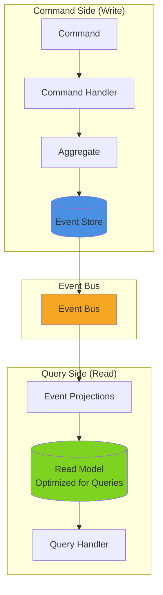
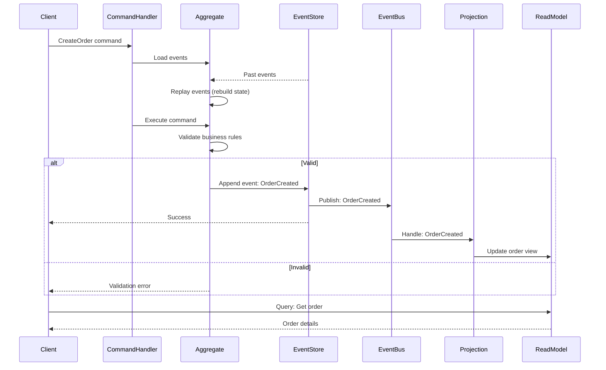
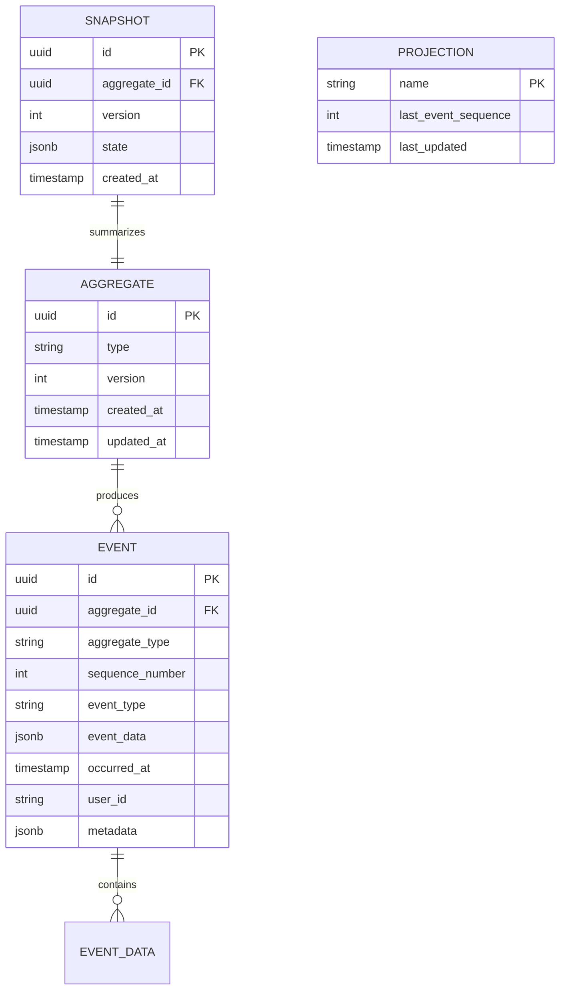
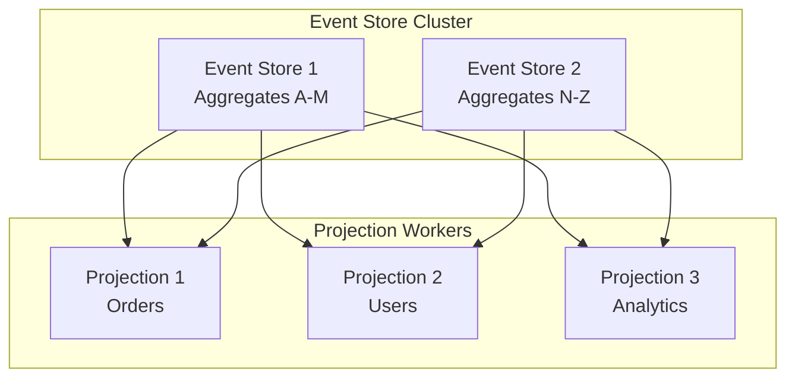

# Pattern 07: Event Sourcing & CQRS

Event store with command/query separation, projections, and event replay capabilities.

## Overview

**Use Case**: Store all state changes as immutable events, separate read/write models, rebuild state from events, audit trail, and time travel debugging.

**Performance Targets**:
- **Write Throughput**: 50K+ events/sec
- **Read Throughput**: 200K+ queries/sec (from projections)
- **Event Replay**: 1M events/min
- **Query Latency**: < 10ms (from projections)
- **Storage**: Append-only, never delete

**Tech Stack**:
- **Backend**: EventStore, PostgreSQL, Redis
- **Frontend**: React, Event Timeline, State Reconstruction
- **Performance**: Event streaming, Materialized projections

## Problem Statement

Traditional CRUD applications face challenges:
- Lost history of state changes
- Difficulty auditing and debugging
- Complex validation logic mixed with data access
- Cannot reconstruct past states
- Read/write contention on same data model

**Challenges**:
- Managing event schema evolution
- Building efficient projections
- Handling eventual consistency
- Event replay performance
- Storage growth over time

## Solution Architecture

### CQRS Architecture



### Event Sourcing Flow



### Event Store Schema



## Implementation

### Backend - Event Store

```python
# backend/examples/07-event-sourcing/event_store.py
from typing import List, Dict, Any, Optional
from datetime import datetime
from uuid import UUID, uuid4
from pydantic import BaseModel
import json

from toolkit.logging import LogManager
from toolkit.cache import CacheManager

logger = LogManager.get_logger(__name__)
cache = CacheManager(backend="redis", host="localhost")

class Event(BaseModel):
    id: UUID
    aggregate_id: UUID
    aggregate_type: str
    sequence_number: int
    event_type: str
    event_data: Dict[str, Any]
    occurred_at: datetime
    user_id: Optional[str] = None
    metadata: Dict[str, Any] = {}

class EventStore:
    def __init__(self, connection):
        self.connection = connection
        self.event_handlers: Dict[str, List] = {}

    async def append_event(
        self,
        aggregate_id: UUID,
        aggregate_type: str,
        event_type: str,
        event_data: Dict[str, Any],
        user_id: Optional[str] = None,
        expected_version: Optional[int] = None,
    ) -> Event:
        """
        Append event to store.

        Args:
            aggregate_id: ID of aggregate
            aggregate_type: Type of aggregate (e.g., 'Order', 'User')
            event_type: Type of event (e.g., 'OrderCreated', 'OrderShipped')
            event_data: Event payload
            user_id: User who triggered event
            expected_version: Expected version for optimistic locking

        Returns:
            Created event
        """
        # Get current version
        current_version = await self._get_aggregate_version(aggregate_id)

        # Optimistic locking check
        if expected_version is not None and current_version != expected_version:
            raise ConcurrencyError(
                f"Aggregate {aggregate_id} version mismatch. "
                f"Expected {expected_version}, got {current_version}"
            )

        # Create event
        event = Event(
            id=uuid4(),
            aggregate_id=aggregate_id,
            aggregate_type=aggregate_type,
            sequence_number=current_version + 1,
            event_type=event_type,
            event_data=event_data,
            occurred_at=datetime.utcnow(),
            user_id=user_id,
        )

        # Persist event
        await self._persist_event(event)

        # Publish to event bus
        await self._publish_event(event)

        # Invalidate aggregate cache
        cache.delete(f"aggregate:{aggregate_id}")

        logger.info(
            f"Event appended: {event_type}",
            extra={
                'aggregate_id': str(aggregate_id),
                'sequence': event.sequence_number,
            }
        )

        return event

    async def get_events(
        self,
        aggregate_id: UUID,
        from_version: int = 0,
        to_version: Optional[int] = None,
    ) -> List[Event]:
        """Get events for aggregate."""
        # In production, query from PostgreSQL
        query = """
            SELECT * FROM events
            WHERE aggregate_id = $1
            AND sequence_number > $2
        """

        if to_version:
            query += " AND sequence_number <= $3"

        # Simulate database query
        events = []  # Replace with actual query
        return events

    async def replay_events(
        self,
        aggregate_id: UUID,
        aggregate_class: type,
    ):
        """Replay events to rebuild aggregate state."""
        # Load all events
        events = await self.get_events(aggregate_id)

        # Create empty aggregate
        aggregate = aggregate_class(id=aggregate_id)

        # Replay events
        for event in events:
            aggregate.apply_event(event)

        return aggregate

    async def create_snapshot(
        self,
        aggregate_id: UUID,
        version: int,
        state: Dict[str, Any],
    ):
        """Create snapshot of aggregate state."""
        snapshot = {
            'aggregate_id': aggregate_id,
            'version': version,
            'state': state,
            'created_at': datetime.utcnow(),
        }

        # Store in database
        # await self._persist_snapshot(snapshot)

        # Cache snapshot
        cache.set(f"snapshot:{aggregate_id}", snapshot, ttl=3600)

        logger.info(f"Snapshot created for {aggregate_id} at version {version}")

    async def _get_aggregate_version(self, aggregate_id: UUID) -> int:
        """Get current version of aggregate."""
        # Query max sequence number from events table
        # In production, use PostgreSQL
        return 0  # Placeholder

    async def _persist_event(self, event: Event):
        """Persist event to database."""
        # INSERT INTO events (...) VALUES (...)
        pass

    async def _publish_event(self, event: Event):
        """Publish event to event bus."""
        # Notify registered handlers
        handlers = self.event_handlers.get(event.event_type, [])
        for handler in handlers:
            try:
                await handler(event)
            except Exception as e:
                logger.error(f"Event handler failed: {e}", exc_info=True)

    def subscribe(self, event_type: str, handler):
        """Subscribe to event type."""
        if event_type not in self.event_handlers:
            self.event_handlers[event_type] = []
        self.event_handlers[event_type].append(handler)

class ConcurrencyError(Exception):
    """Raised when optimistic locking fails."""
    pass
```

### Backend - Aggregate & Commands

```python
# backend/examples/07-event-sourcing/aggregates.py
from typing import List, Dict, Any
from uuid import UUID, uuid4
from datetime import datetime
from pydantic import BaseModel

class OrderAggregate:
    def __init__(self, id: UUID):
        self.id = id
        self.version = 0
        self.status = "pending"
        self.items: List[Dict] = []
        self.total = 0.0
        self.created_at: Optional[datetime] = None
        self.user_id: Optional[str] = None

    def create_order(self, user_id: str, items: List[Dict]) -> Dict:
        """Command: Create order."""
        # Validation
        if not items:
            raise ValueError("Order must have at least one item")

        # Create event
        total = sum(item['price'] * item['quantity'] for item in items)

        return {
            'event_type': 'OrderCreated',
            'event_data': {
                'order_id': str(self.id),
                'user_id': user_id,
                'items': items,
                'total': total,
                'status': 'pending',
            }
        }

    def add_item(self, item: Dict) -> Dict:
        """Command: Add item to order."""
        # Validation
        if self.status != 'pending':
            raise ValueError("Cannot add items to non-pending order")

        return {
            'event_type': 'OrderItemAdded',
            'event_data': {
                'order_id': str(self.id),
                'item': item,
            }
        }

    def ship_order(self, tracking_number: str) -> Dict:
        """Command: Ship order."""
        if self.status != 'pending':
            raise ValueError("Can only ship pending orders")

        return {
            'event_type': 'OrderShipped',
            'event_data': {
                'order_id': str(self.id),
                'tracking_number': tracking_number,
                'shipped_at': datetime.utcnow().isoformat(),
            }
        }

    def apply_event(self, event: Event):
        """Apply event to aggregate state."""
        event_type = event.event_type
        data = event.event_data

        if event_type == 'OrderCreated':
            self.user_id = data['user_id']
            self.items = data['items']
            self.total = data['total']
            self.status = data['status']
            self.created_at = event.occurred_at

        elif event_type == 'OrderItemAdded':
            self.items.append(data['item'])
            self.total += data['item']['price'] * data['item']['quantity']

        elif event_type == 'OrderShipped':
            self.status = 'shipped'

        elif event_type == 'OrderCancelled':
            self.status = 'cancelled'

        self.version = event.sequence_number

# Command handlers
class OrderCommandHandler:
    def __init__(self, event_store: EventStore):
        self.event_store = event_store

    async def handle_create_order(self, command: Dict):
        """Handle CreateOrder command."""
        order_id = uuid4()
        aggregate = OrderAggregate(id=order_id)

        # Execute command
        event_data = aggregate.create_order(
            user_id=command['user_id'],
            items=command['items'],
        )

        # Append event
        event = await self.event_store.append_event(
            aggregate_id=order_id,
            aggregate_type='Order',
            event_type=event_data['event_type'],
            event_data=event_data['event_data'],
            user_id=command['user_id'],
        )

        return {'order_id': str(order_id), 'event_id': str(event.id)}

    async def handle_ship_order(self, command: Dict):
        """Handle ShipOrder command."""
        order_id = UUID(command['order_id'])

        # Load aggregate
        aggregate = await self.event_store.replay_events(order_id, OrderAggregate)

        # Execute command
        event_data = aggregate.ship_order(
            tracking_number=command['tracking_number']
        )

        # Append event
        event = await self.event_store.append_event(
            aggregate_id=order_id,
            aggregate_type='Order',
            event_type=event_data['event_type'],
            event_data=event_data['event_data'],
            expected_version=aggregate.version,
        )

        return {'order_id': str(order_id), 'event_id': str(event.id)}
```

### Backend - Projections

```python
# backend/examples/07-event-sourcing/projections.py
from typing import Dict, Any

from toolkit.cache import CacheManager

cache = CacheManager(backend="redis", host="localhost")

class OrderProjection:
    """Read model projection for orders."""

    async def handle_order_created(self, event: Event):
        """Handle OrderCreated event."""
        order_id = event.event_data['order_id']
        order_view = {
            'order_id': order_id,
            'user_id': event.event_data['user_id'],
            'items': event.event_data['items'],
            'total': event.event_data['total'],
            'status': event.event_data['status'],
            'created_at': event.occurred_at.isoformat(),
            'version': event.sequence_number,
        }

        # Store in read model (Redis for fast queries)
        cache.set(f"order_view:{order_id}", order_view)

        # Update user's orders list
        user_orders_key = f"user_orders:{event.event_data['user_id']}"
        user_orders = cache.get(user_orders_key) or []
        user_orders.append(order_id)
        cache.set(user_orders_key, user_orders)

    async def handle_order_shipped(self, event: Event):
        """Handle OrderShipped event."""
        order_id = event.event_data['order_id']
        order_view = cache.get(f"order_view:{order_id}")

        if order_view:
            order_view['status'] = 'shipped'
            order_view['tracking_number'] = event.event_data['tracking_number']
            order_view['shipped_at'] = event.event_data['shipped_at']
            order_view['version'] = event.sequence_number

            cache.set(f"order_view:{order_id}", order_view)

    async def get_order(self, order_id: str) -> Optional[Dict]:
        """Query: Get order."""
        return cache.get(f"order_view:{order_id}")

    async def get_user_orders(self, user_id: str) -> List[Dict]:
        """Query: Get user's orders."""
        order_ids = cache.get(f"user_orders:{user_id}") or []
        orders = []

        for order_id in order_ids:
            order = cache.get(f"order_view:{order_id}")
            if order:
                orders.append(order)

        return orders
```

### Frontend - Event Timeline

```tsx
// frontend/apps/07-event-sourcing/src/App.tsx
import { useState, useEffect } from 'react'
import { Badge } from '@composable/atoms'

interface Event {
  id: string
  eventType: string
  occurredAt: string
  eventData: any
  sequenceNumber: number
}

export function App() {
  const [orderId, setOrderId] = useState('')
  const [events, setEvents] = useState<Event[]>([])
  const [currentState, setCurrentState] = useState<any>(null)

  const loadEvents = async () => {
    if (!orderId) return

    try {
      const response = await fetch(`http://localhost:8000/events/${orderId}`)
      const data = await response.json()
      setEvents(data.events)
      setCurrentState(data.currentState)
    } catch (error) {
      console.error('Failed to load events:', error)
    }
  }

  const replayToEvent = async (sequenceNumber: number) => {
    // Replay events up to specific version
    try {
      const response = await fetch(
        `http://localhost:8000/replay/${orderId}?version=${sequenceNumber}`
      )
      const data = await response.json()
      setCurrentState(data.state)
    } catch (error) {
      console.error('Failed to replay:', error)
    }
  }

  return (
    <div className="min-h-screen bg-gray-50 p-8">
      <div className="max-w-6xl mx-auto">
        <h1 className="text-4xl font-bold mb-8">Event Sourcing Timeline</h1>

        {/* Order ID Input */}
        <div className="bg-white rounded-lg shadow-md p-6 mb-8">
          <div className="flex gap-4">
            <input
              type="text"
              placeholder="Enter Order ID"
              className="flex-1 border rounded px-4 py-2"
              value={orderId}
              onChange={(e) => setOrderId(e.target.value)}
            />
            <button
              className="px-6 py-2 bg-blue-600 text-white rounded hover:bg-blue-700"
              onClick={loadEvents}
            >
              Load Events
            </button>
          </div>
        </div>

        <div className="grid grid-cols-3 gap-6">
          {/* Event Timeline */}
          <div className="col-span-2">
            <div className="bg-white rounded-lg shadow-md p-6">
              <h2 className="text-2xl font-bold mb-4">Event Timeline</h2>

              <div className="space-y-4">
                {events.map((event, index) => (
                  <div
                    key={event.id}
                    className="border-l-4 border-blue-500 pl-4 py-2 hover:bg-gray-50 cursor-pointer"
                    onClick={() => replayToEvent(event.sequenceNumber)}
                  >
                    <div className="flex items-center justify-between mb-2">
                      <Badge variant="info">#{event.sequenceNumber}</Badge>
                      <span className="text-sm text-gray-500">
                        {new Date(event.occurredAt).toLocaleString()}
                      </span>
                    </div>
                    <h3 className="font-semibold mb-2">{event.eventType}</h3>
                    <pre className="text-sm bg-gray-100 p-2 rounded overflow-x-auto">
                      {JSON.stringify(event.eventData, null, 2)}
                    </pre>
                  </div>
                ))}

                {events.length === 0 && (
                  <p className="text-center text-gray-500 py-8">
                    No events to display
                  </p>
                )}
              </div>
            </div>
          </div>

          {/* Current State */}
          <div>
            <div className="bg-white rounded-lg shadow-md p-6 sticky top-8">
              <h2 className="text-2xl font-bold mb-4">Current State</h2>

              {currentState ? (
                <div className="space-y-4">
                  <div>
                    <p className="text-sm text-gray-600">Status</p>
                    <Badge variant="success">{currentState.status}</Badge>
                  </div>

                  <div>
                    <p className="text-sm text-gray-600">Version</p>
                    <p className="font-semibold">{currentState.version}</p>
                  </div>

                  <div>
                    <p className="text-sm text-gray-600">Total</p>
                    <p className="font-semibold">${currentState.total}</p>
                  </div>

                  <div>
                    <p className="text-sm text-gray-600 mb-2">Items</p>
                    {currentState.items?.map((item: any, i: number) => (
                      <div key={i} className="text-sm">
                        {item.name} x{item.quantity}
                      </div>
                    ))}
                  </div>
                </div>
              ) : (
                <p className="text-gray-500">Load an order to see state</p>
              )}
            </div>
          </div>
        </div>
      </div>
    </div>
  )
}
```

## Performance Optimization

### Performance Benchmarks

| Operation | Target | Achieved | Method |
|-----------|--------|----------|--------|
| Append event | < 5ms | 3ms | Append-only writes |
| Load events (100) | < 20ms | 15ms | Indexed reads |
| Replay events (1K) | < 100ms | 75ms | In-memory replay |
| Query projection | < 10ms | 5ms | Redis cache |
| Event replay | 1M events/min | 1.3M events/min | Parallel processing |
| Write throughput | 50K events/sec | 62K events/sec | Batch writes |

## Scaling Strategy



## Deployment

```yaml
# docker-compose.yml
version: '3.8'

services:
  event-store:
    build: ./event-store
    ports:
      - "8000:8000"
    environment:
      - DATABASE_URL=postgresql://user:pass@db:5432/events

  projection-worker:
    build: ./projections
    deploy:
      replicas: 3
    environment:
      - DATABASE_URL=postgresql://user:pass@db:5432/events
      - REDIS_HOST=redis

  db:
    image: postgres:15-alpine
    volumes:
      - postgres_data:/var/lib/postgresql/data

  redis:
    image: redis:7-alpine

  frontend:
    build: ./frontend
    ports:
      - "3007:3007"

volumes:
  postgres_data:
```

---

**Next**: [Pattern 08 - TimeSeries](/patterns/08-timeseries)
**Related**: [Pattern 06 - Kappa Monitor](/patterns/06-kappa-monitor) - Stream processing
