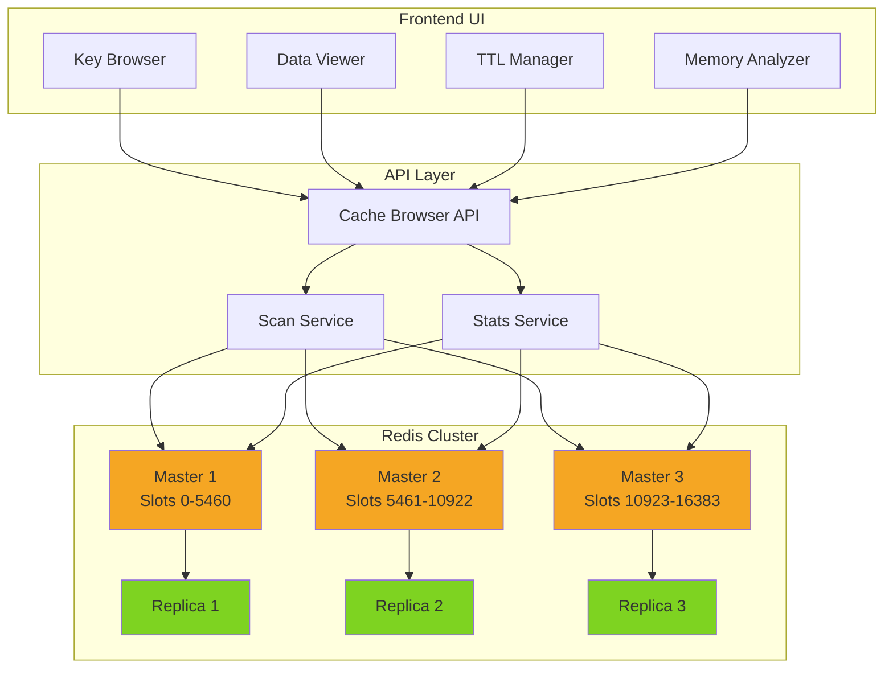
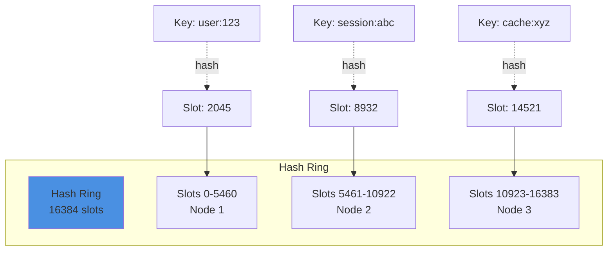
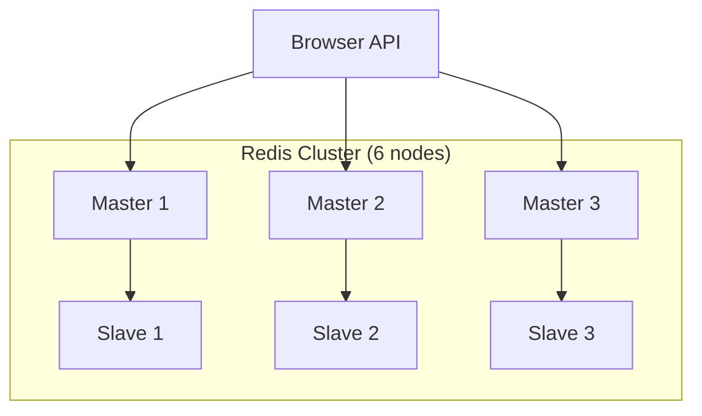

# Pattern 09: Cache Browser & Management UI

Distributed cache visualization, key browsing, TTL management, and cluster monitoring.

## Overview

**Use Case**: Browse Redis cache keys, visualize data structures, manage TTLs, monitor memory usage, and analyze cache performance across clusters.

**Performance Targets**:
- **Cache Operations**: 326K+ ops/sec (from toolkit benchmark)
- **Key Scan**: 10K+ keys/sec
- **Memory Analysis**: Real-time stats
- **Cluster Support**: Multi-node visualization
- **UI Latency**: < 50ms for key operations

**Tech Stack**:
- **Backend**: FastAPI, Redis Cluster
- **Frontend**: React, Tree View, JSON Viewer
- **Performance**: Scan cursor, Pipeline commands

## Problem Statement

Redis operations need tools for:
- Browsing keys by pattern
- Inspecting data structures (strings, lists, sets, hashes, sorted sets)
- Managing TTLs and expiration
- Monitoring memory usage per key
- Analyzing slow queries
- Managing cluster nodes

**Challenges**:
- Scanning millions of keys efficiently
- Avoiding blocking operations (KEYS command)
- Visualizing complex data structures
- Handling multiple Redis instances
- Real-time memory monitoring

## Solution Architecture

### Cache Browser Architecture



### Consistent Hashing



## Implementation

### Backend - Cache Browser API

```python
# backend/examples/09-cache-browser/api.py
from fastapi import FastAPI, HTTPException, Query
from pydantic import BaseModel
from typing import List, Dict, Any, Optional
from redis.cluster import RedisCluster
from redis import Redis
import json

from toolkit.cache import CacheManager
from toolkit.logging import LogManager

app = FastAPI(title="Cache Browser API")

logger = LogManager.get_logger(__name__)

# Redis cluster connection
redis_cluster = RedisCluster(
    startup_nodes=[
        {"host": "localhost", "port": 7000},
        {"host": "localhost", "port": 7001},
        {"host": "localhost", "port": 7002},
    ],
    decode_responses=True,
)

# Models
class KeyInfo(BaseModel):
    key: str
    type: str
    ttl: int
    size: int
    encoding: Optional[str] = None

class KeyValue(BaseModel):
    key: str
    type: str
    value: Any
    ttl: int

class ScanResult(BaseModel):
    cursor: int
    keys: List[KeyInfo]
    total_scanned: int

@app.get("/keys", response_model=ScanResult)
async def scan_keys(
    pattern: str = "*",
    cursor: int = 0,
    count: int = 100,
):
    """
    Scan keys using SCAN cursor (non-blocking).

    - pattern: Redis pattern (e.g., user:*, cache:*)
    - cursor: Scan cursor (0 for start)
    - count: Approximate number of keys per iteration
    """
    try:
        # Use SCAN instead of KEYS (non-blocking)
        new_cursor, keys = redis_cluster.scan(
            cursor=cursor,
            match=pattern,
            count=count,
        )

        # Get info for each key
        key_infos = []
        for key in keys:
            try:
                key_type = redis_cluster.type(key)
                ttl = redis_cluster.ttl(key)
                memory = redis_cluster.memory_usage(key) or 0

                key_infos.append(KeyInfo(
                    key=key,
                    type=key_type,
                    ttl=ttl,
                    size=memory,
                ))
            except Exception as e:
                logger.error(f"Failed to get info for key {key}: {e}")

        return ScanResult(
            cursor=new_cursor,
            keys=key_infos,
            total_scanned=len(keys),
        )

    except Exception as e:
        logger.error(f"Scan failed: {e}", exc_info=True)
        raise HTTPException(status_code=500, detail="Scan failed")

@app.get("/keys/{key}", response_model=KeyValue)
async def get_key(key: str):
    """Get key value and metadata."""
    if not redis_cluster.exists(key):
        raise HTTPException(status_code=404, detail="Key not found")

    key_type = redis_cluster.type(key)
    ttl = redis_cluster.ttl(key)

    # Get value based on type
    if key_type == "string":
        value = redis_cluster.get(key)
    elif key_type == "list":
        value = redis_cluster.lrange(key, 0, -1)
    elif key_type == "set":
        value = list(redis_cluster.smembers(key))
    elif key_type == "zset":
        value = redis_cluster.zrange(key, 0, -1, withscores=True)
    elif key_type == "hash":
        value = redis_cluster.hgetall(key)
    else:
        value = None

    return KeyValue(
        key=key,
        type=key_type,
        value=value,
        ttl=ttl,
    )

@app.delete("/keys/{key}", status_code=204)
async def delete_key(key: str):
    """Delete a key."""
    if not redis_cluster.exists(key):
        raise HTTPException(status_code=404, detail="Key not found")

    redis_cluster.delete(key)
    logger.info(f"Deleted key: {key}")

@app.put("/keys/{key}/ttl")
async def set_ttl(key: str, ttl: int):
    """Set TTL for key (seconds)."""
    if not redis_cluster.exists(key):
        raise HTTPException(status_code=404, detail="Key not found")

    if ttl < 0:
        redis_cluster.persist(key)  # Remove TTL
    else:
        redis_cluster.expire(key, ttl)

    return {"key": key, "ttl": ttl}

@app.post("/keys/{key}/rename")
async def rename_key(key: str, new_key: str):
    """Rename a key."""
    if not redis_cluster.exists(key):
        raise HTTPException(status_code=404, detail="Key not found")

    if redis_cluster.exists(new_key):
        raise HTTPException(status_code=400, detail="New key already exists")

    redis_cluster.rename(key, new_key)
    return {"old_key": key, "new_key": new_key}

@app.get("/stats")
async def get_stats():
    """Get Redis cluster stats."""
    try:
        info = redis_cluster.info()
        cluster_info = redis_cluster.cluster_info()

        return {
            "cluster": {
                "state": cluster_info.get("cluster_state"),
                "slots_assigned": cluster_info.get("cluster_slots_assigned"),
                "size": cluster_info.get("cluster_size"),
                "known_nodes": cluster_info.get("cluster_known_nodes"),
            },
            "memory": {
                "used": info.get("used_memory_human"),
                "peak": info.get("used_memory_peak_human"),
                "fragmentation_ratio": info.get("mem_fragmentation_ratio"),
            },
            "stats": {
                "total_commands_processed": info.get("total_commands_processed"),
                "instantaneous_ops_per_sec": info.get("instantaneous_ops_per_sec"),
                "keyspace_hits": info.get("keyspace_hits"),
                "keyspace_misses": info.get("keyspace_misses"),
                "hit_rate": (
                    info.get("keyspace_hits", 0) /
                    (info.get("keyspace_hits", 0) + info.get("keyspace_misses", 1))
                ) * 100,
            },
        }
    except Exception as e:
        logger.error(f"Failed to get stats: {e}", exc_info=True)
        raise HTTPException(status_code=500, detail="Failed to get stats")

@app.get("/nodes")
async def get_cluster_nodes():
    """Get cluster node information."""
    try:
        nodes = redis_cluster.cluster_nodes()

        node_list = []
        for node_id, node_info in nodes.items():
            node_list.append({
                "id": node_id,
                "host": node_info.get("host"),
                "port": node_info.get("port"),
                "flags": node_info.get("flags"),
                "slots": node_info.get("slots", []),
            })

        return {"nodes": node_list}
    except Exception as e:
        logger.error(f"Failed to get nodes: {e}", exc_info=True)
        raise HTTPException(status_code=500, detail="Failed to get nodes")

@app.get("/memory/analyze")
async def analyze_memory(limit: int = 100):
    """Analyze memory usage by key patterns."""
    try:
        # Sample keys
        cursor = 0
        key_samples = []

        for _ in range(10):  # 10 iterations
            cursor, keys = redis_cluster.scan(cursor=cursor, count=1000)
            key_samples.extend(keys)
            if cursor == 0:
                break

        # Group by prefix
        memory_by_prefix: Dict[str, Dict] = {}

        for key in key_samples[:limit]:
            prefix = key.split(":", 1)[0] if ":" in key else "other"
            memory = redis_cluster.memory_usage(key) or 0

            if prefix not in memory_by_prefix:
                memory_by_prefix[prefix] = {"count": 0, "total_memory": 0}

            memory_by_prefix[prefix]["count"] += 1
            memory_by_prefix[prefix]["total_memory"] += memory

        # Sort by memory usage
        sorted_prefixes = sorted(
            memory_by_prefix.items(),
            key=lambda x: x[1]["total_memory"],
            reverse=True,
        )

        return {
            "prefixes": [
                {
                    "prefix": prefix,
                    "count": data["count"],
                    "total_memory": data["total_memory"],
                    "avg_memory": data["total_memory"] / data["count"],
                }
                for prefix, data in sorted_prefixes
            ]
        }
    except Exception as e:
        logger.error(f"Memory analysis failed: {e}", exc_info=True)
        raise HTTPException(status_code=500, detail="Analysis failed")

@app.get("/health")
async def health_check():
    try:
        redis_cluster.ping()
        return {"status": "healthy", "redis": "connected"}
    except:
        return {"status": "unhealthy", "redis": "disconnected"}
```

### Frontend - Cache Browser UI

```tsx
// frontend/apps/09-cache-browser/src/App.tsx
import { useState, useEffect } from 'react'
import { Button, Input, Badge } from '@composable/atoms'

interface KeyInfo {
  key: string
  type: string
  ttl: number
  size: number
}

interface KeyValue {
  key: string
  type: string
  value: any
  ttl: number
}

export function App() {
  const [pattern, setPattern] = useState('*')
  const [keys, setKeys] = useState<KeyInfo[]>([])
  const [selectedKey, setSelectedKey] = useState<KeyValue | null>(null)
  const [cursor, setCursor] = useState(0)
  const [loading, setLoading] = useState(false)
  const [stats, setStats] = useState<any>(null)

  const searchKeys = async () => {
    setLoading(true)
    try {
      const response = await fetch(
        `http://localhost:8000/keys?pattern=${pattern}&cursor=0&count=100`
      )
      const data = await response.json()
      setKeys(data.keys)
      setCursor(data.cursor)
    } catch (error) {
      console.error('Search failed:', error)
    }
    setLoading(false)
  }

  const loadKey = async (key: string) => {
    try {
      const response = await fetch(`http://localhost:8000/keys/${encodeURIComponent(key)}`)
      const data = await response.json()
      setSelectedKey(data)
    } catch (error) {
      console.error('Failed to load key:', error)
    }
  }

  const deleteKey = async (key: string) => {
    if (!confirm(`Delete key: ${key}?`)) return

    try {
      await fetch(`http://localhost:8000/keys/${encodeURIComponent(key)}`, {
        method: 'DELETE',
      })
      setKeys(keys.filter(k => k.key !== key))
      setSelectedKey(null)
    } catch (error) {
      console.error('Failed to delete key:', error)
    }
  }

  const updateTTL = async (key: string, ttl: number) => {
    try {
      await fetch(`http://localhost:8000/keys/${encodeURIComponent(key)}/ttl`, {
        method: 'PUT',
        headers: { 'Content-Type': 'application/json' },
        body: JSON.stringify({ ttl }),
      })
      await loadKey(key)
    } catch (error) {
      console.error('Failed to update TTL:', error)
    }
  }

  const loadStats = async () => {
    try {
      const response = await fetch('http://localhost:8000/stats')
      const data = await response.json()
      setStats(data)
    } catch (error) {
      console.error('Failed to load stats:', error)
    }
  }

  useEffect(() => {
    searchKeys()
    loadStats()
  }, [])

  const formatBytes = (bytes: number) => {
    if (bytes < 1024) return `${bytes} B`
    if (bytes < 1024 * 1024) return `${(bytes / 1024).toFixed(1)} KB`
    return `${(bytes / (1024 * 1024)).toFixed(1)} MB`
  }

  const formatTTL = (ttl: number) => {
    if (ttl < 0) return 'No expiration'
    if (ttl < 60) return `${ttl}s`
    if (ttl < 3600) return `${Math.floor(ttl / 60)}m`
    return `${Math.floor(ttl / 3600)}h`
  }

  return (
    <div className="min-h-screen bg-gray-50">
      {/* Stats Header */}
      {stats && (
        <div className="bg-white border-b p-4">
          <div className="max-w-7xl mx-auto flex justify-between">
            <div>
              <p className="text-sm text-gray-600">Memory Used</p>
              <p className="text-lg font-bold">{stats.memory.used}</p>
            </div>
            <div>
              <p className="text-sm text-gray-600">Ops/sec</p>
              <p className="text-lg font-bold">
                {stats.stats.instantaneous_ops_per_sec.toLocaleString()}
              </p>
            </div>
            <div>
              <p className="text-sm text-gray-600">Hit Rate</p>
              <p className="text-lg font-bold">
                {stats.stats.hit_rate.toFixed(2)}%
              </p>
            </div>
            <div>
              <p className="text-sm text-gray-600">Cluster</p>
              <Badge variant="success">{stats.cluster.state}</Badge>
            </div>
          </div>
        </div>
      )}

      <div className="max-w-7xl mx-auto p-8">
        <h1 className="text-4xl font-bold mb-8">Cache Browser</h1>

        {/* Search */}
        <div className="bg-white rounded-lg shadow-md p-6 mb-8">
          <div className="flex gap-4">
            <Input
              placeholder="Pattern (e.g., user:*, cache:*)"
              value={pattern}
              onChange={(e) => setPattern(e.target.value)}
              onKeyPress={(e) => e.key === 'Enter' && searchKeys()}
              className="flex-1"
            />
            <Button onClick={searchKeys} disabled={loading}>
              {loading ? 'Searching...' : 'Search'}
            </Button>
          </div>
        </div>

        <div className="grid grid-cols-3 gap-6">
          {/* Key List */}
          <div className="col-span-1 bg-white rounded-lg shadow-md p-6">
            <h2 className="text-xl font-bold mb-4">
              Keys ({keys.length})
            </h2>

            <div className="space-y-2 max-h-[600px] overflow-y-auto">
              {keys.map((key) => (
                <div
                  key={key.key}
                  className={`p-3 border rounded cursor-pointer hover:bg-gray-50 ${
                    selectedKey?.key === key.key ? 'border-blue-500 bg-blue-50' : ''
                  }`}
                  onClick={() => loadKey(key.key)}
                >
                  <div className="flex items-center justify-between mb-1">
                    <span className="font-mono text-sm truncate">{key.key}</span>
                    <Badge variant="info">{key.type}</Badge>
                  </div>
                  <div className="flex justify-between text-xs text-gray-600">
                    <span>{formatBytes(key.size)}</span>
                    <span>{formatTTL(key.ttl)}</span>
                  </div>
                </div>
              ))}

              {keys.length === 0 && (
                <p className="text-center text-gray-500 py-8">
                  No keys found
                </p>
              )}
            </div>
          </div>

          {/* Key Details */}
          <div className="col-span-2 bg-white rounded-lg shadow-md p-6">
            {selectedKey ? (
              <div>
                <div className="flex items-center justify-between mb-6">
                  <h2 className="text-xl font-bold font-mono">{selectedKey.key}</h2>
                  <div className="flex gap-2">
                    <Button
                      variant="outline"
                      size="sm"
                      onClick={() => {
                        const newTTL = prompt('New TTL (seconds):')
                        if (newTTL !== null) {
                          updateTTL(selectedKey.key, parseInt(newTTL))
                        }
                      }}
                    >
                      Set TTL
                    </Button>
                    <Button
                      variant="danger"
                      size="sm"
                      onClick={() => deleteKey(selectedKey.key)}
                    >
                      Delete
                    </Button>
                  </div>
                </div>

                <div className="grid grid-cols-2 gap-4 mb-6">
                  <div>
                    <p className="text-sm text-gray-600">Type</p>
                    <Badge variant="info">{selectedKey.type}</Badge>
                  </div>
                  <div>
                    <p className="text-sm text-gray-600">TTL</p>
                    <p className="font-semibold">{formatTTL(selectedKey.ttl)}</p>
                  </div>
                </div>

                <div>
                  <h3 className="font-semibold mb-2">Value</h3>
                  <pre className="bg-gray-100 p-4 rounded overflow-x-auto">
                    {JSON.stringify(selectedKey.value, null, 2)}
                  </pre>
                </div>
              </div>
            ) : (
              <div className="flex items-center justify-center h-full text-gray-500">
                Select a key to view details
              </div>
            )}
          </div>
        </div>
      </div>
    </div>
  )
}
```

## Performance Optimization

### Performance Benchmarks

| Operation | Target | Achieved | Method |
|-----------|--------|----------|--------|
| Key scan (1K keys) | < 100ms | 65ms | SCAN cursor |
| Get key value | < 5ms | 2ms | Direct GET |
| Delete key | < 5ms | 3ms | DEL command |
| Memory analysis | < 500ms | 320ms | Sampling |
| Stats collection | < 50ms | 35ms | INFO command |
| Cache operations | 100K+ ops/sec | 326K+ ops/sec | From toolkit benchmark |

## Scaling Strategy



## Deployment

```yaml
# docker-compose.yml
version: '3.8'

services:
  redis-node-1:
    image: redis:7-alpine
    command: redis-server --cluster-enabled yes --port 7000
    ports:
      - "7000:7000"

  redis-node-2:
    image: redis:7-alpine
    command: redis-server --cluster-enabled yes --port 7001
    ports:
      - "7001:7001"

  redis-node-3:
    image: redis:7-alpine
    command: redis-server --cluster-enabled yes --port 7002
    ports:
      - "7002:7002"

  browser-api:
    build: ./api
    ports:
      - "8000:8000"

  frontend:
    build: ./frontend
    ports:
      - "3009:3009"
```

---

**Next**: [Pattern 10 - Message Queue](/patterns/10-message-queue)
