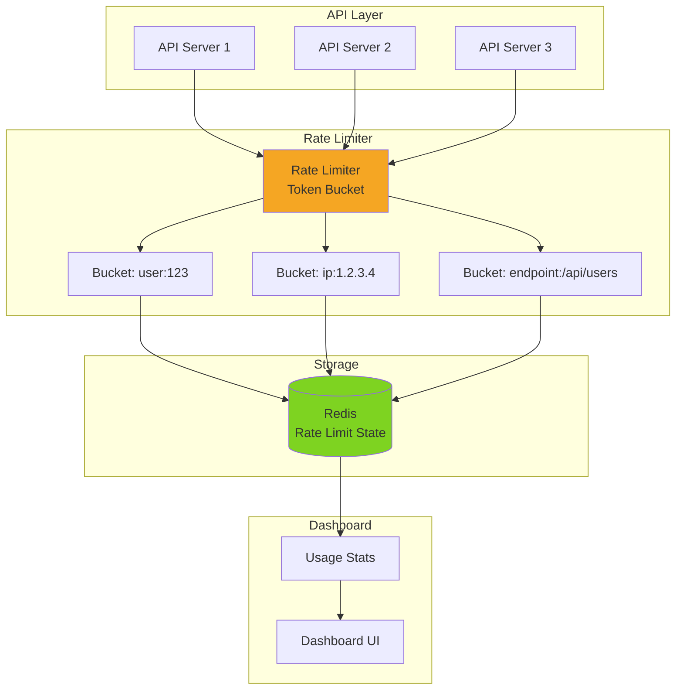
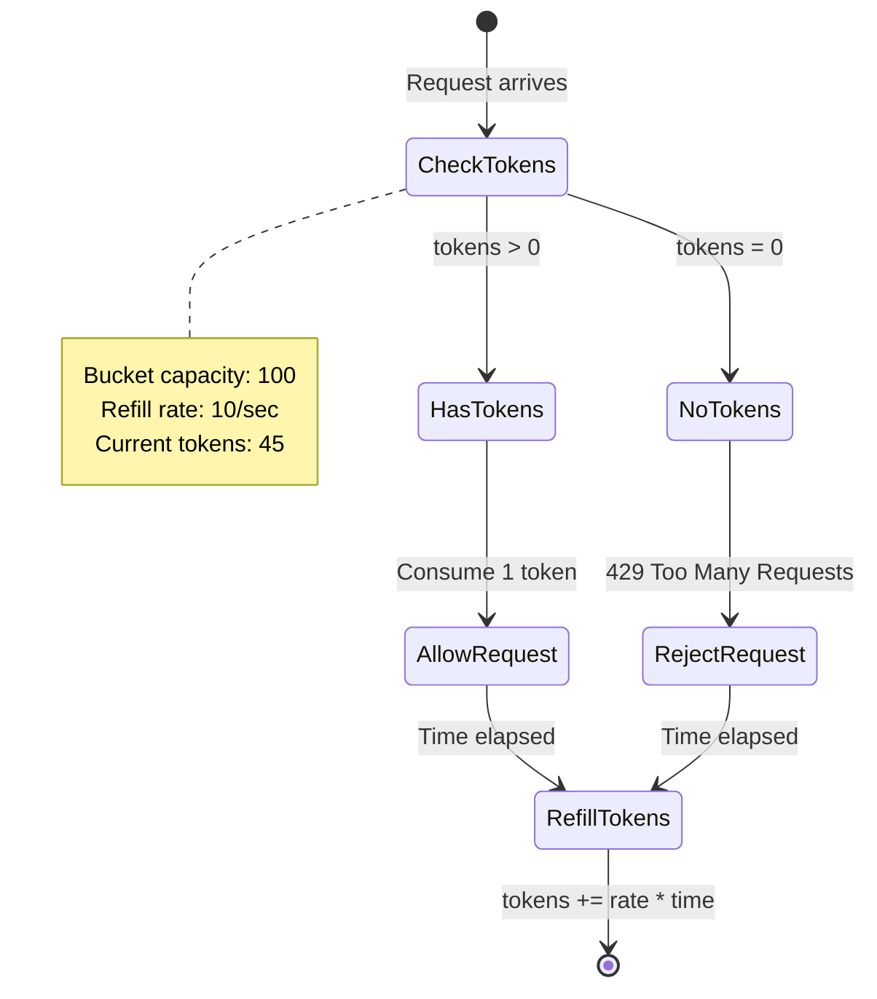
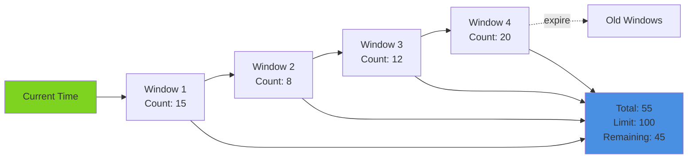
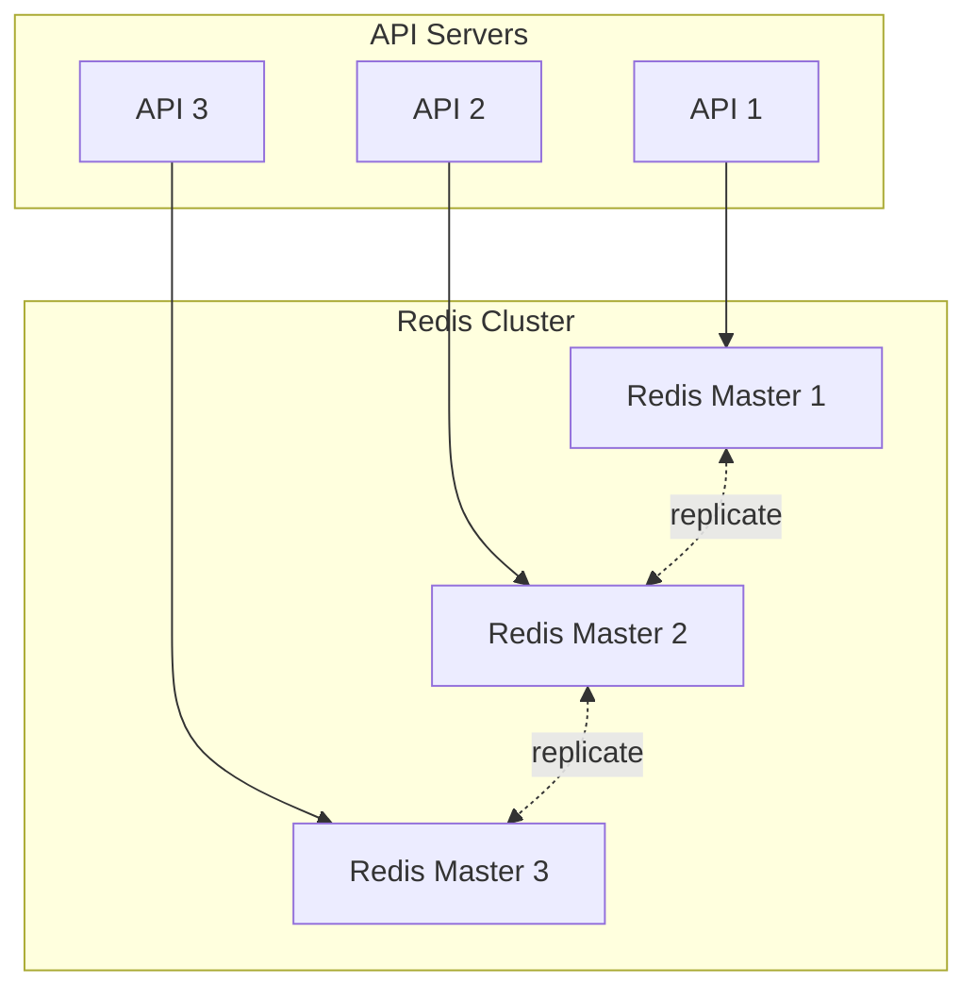

# Pattern 11: Rate Limiter Dashboard

Rate limiting visualization, token bucket monitoring, and quota management UI.

## Overview

**Use Case**: Visualize rate limits, monitor API usage, manage quotas per user/IP, and display token bucket state in real-time.

**Performance Targets**:
- **Rate Limit Checks**: 100K+ checks/sec (from toolkit benchmark)
- **Algorithms**: Token bucket, Sliding window, Fixed window
- **Granularity**: Per user, Per IP, Per endpoint
- **Dashboard Latency**: < 50ms
- **Storage**: Redis for distributed rate limiting

**Tech Stack**:
- **Backend**: FastAPI, Redis, Token Bucket
- **Frontend**: React, Usage Charts, Quota Visualization
- **Performance**: Atomic Redis operations

## Problem Statement

API rate limiting needs:
- Monitor current usage vs limits
- Visualize token bucket fill rate
- Alert on quota exhaustion
- Per-user/IP/endpoint limits
- Burst allowance handling
- Historical usage tracking

**Challenges**:
- Distributed rate limiting (multiple servers)
- Accurate token bucket state
- High-performance limit checks
- Real-time usage updates
- Handling burst traffic

## Solution Architecture

### Rate Limiter Architecture



### Token Bucket Algorithm



### Sliding Window Algorithm



## Implementation

### Backend - Rate Limiter

```python
# backend/examples/11-rate-limiter/limiter.py
from fastapi import FastAPI, Request, HTTPException, Depends
from fastapi.responses import JSONResponse
from pydantic import BaseModel
from typing import Optional
import time
import redis

from toolkit.ratelimit import RateLimiter
from toolkit.logging import LogManager
from toolkit.metrics import MetricsManager

app = FastAPI(title="Rate Limiter API")

logger = LogManager.get_logger(__name__)
metrics = MetricsManager(backend="prometheus")

# Redis connection
redis_client = redis.Redis(host='localhost', port=6379, decode_responses=True)

# Rate limiter instances
rate_limiters = {
    'default': RateLimiter(rate=100, period=60, backend='redis', redis_client=redis_client),
    'premium': RateLimiter(rate=1000, period=60, backend='redis', redis_client=redis_client),
    'strict': RateLimiter(rate=10, period=60, backend='redis', redis_client=redis_client),
}

# Models
class RateLimitStatus(BaseModel):
    identifier: str
    limit: int
    remaining: int
    reset_at: int
    current_usage: int
    percentage_used: float

class RateLimitConfig(BaseModel):
    tier: str
    rate: int
    period: int

class UsageStats(BaseModel):
    identifier: str
    total_requests: int
    allowed_requests: int
    rejected_requests: int
    rejection_rate: float

def get_client_identifier(request: Request) -> str:
    """Get client identifier (IP or user ID)."""
    # Try to get user ID from header
    user_id = request.headers.get("X-User-ID")
    if user_id:
        return f"user:{user_id}"

    # Fallback to IP address
    client_ip = request.client.host
    return f"ip:{client_ip}"

def get_rate_limiter_tier(request: Request) -> str:
    """Determine rate limiter tier from request."""
    tier = request.headers.get("X-Rate-Limit-Tier", "default")
    return tier if tier in rate_limiters else "default"

async def rate_limit_middleware(request: Request):
    """Rate limiting middleware."""
    identifier = get_client_identifier(request)
    tier = get_rate_limiter_tier(request)
    limiter = rate_limiters[tier]

    # Check rate limit
    allowed = limiter.is_allowed(identifier)

    if not allowed:
        # Record rejection
        metrics.increment(f"rate_limit.rejected.{tier}")

        # Get retry-after
        retry_after = limiter.get_retry_after(identifier)

        logger.warning(
            f"Rate limit exceeded: {identifier}",
            extra={'tier': tier, 'retry_after': retry_after}
        )

        raise HTTPException(
            status_code=429,
            detail="Rate limit exceeded",
            headers={"Retry-After": str(retry_after)}
        )

    # Record allowed request
    metrics.increment(f"rate_limit.allowed.{tier}")

@app.middleware("http")
async def add_rate_limit_headers(request: Request, call_next):
    """Add rate limit info to response headers."""
    # Check rate limit
    try:
        await rate_limit_middleware(request)
    except HTTPException as e:
        return JSONResponse(
            status_code=e.status_code,
            content={"detail": e.detail},
            headers=e.headers,
        )

    # Process request
    response = await call_next(request)

    # Add rate limit headers
    identifier = get_client_identifier(request)
    tier = get_rate_limiter_tier(request)
    limiter = rate_limiters[tier]

    remaining = limiter.get_remaining(identifier)
    reset_at = limiter.get_reset_time(identifier)

    response.headers["X-RateLimit-Limit"] = str(limiter.rate)
    response.headers["X-RateLimit-Remaining"] = str(remaining)
    response.headers["X-RateLimit-Reset"] = str(reset_at)

    return response

@app.get("/api/protected")
async def protected_endpoint():
    """Example protected endpoint."""
    return {"message": "This endpoint is rate limited"}

@app.get("/ratelimit/status/{identifier}", response_model=RateLimitStatus)
async def get_rate_limit_status(identifier: str, tier: str = "default"):
    """Get rate limit status for identifier."""
    if tier not in rate_limiters:
        raise HTTPException(status_code=400, detail="Invalid tier")

    limiter = rate_limiters[tier]
    remaining = limiter.get_remaining(identifier)
    reset_at = limiter.get_reset_time(identifier)
    current_usage = limiter.rate - remaining

    return RateLimitStatus(
        identifier=identifier,
        limit=limiter.rate,
        remaining=remaining,
        reset_at=reset_at,
        current_usage=current_usage,
        percentage_used=(current_usage / limiter.rate) * 100,
    )

@app.get("/ratelimit/stats/{identifier}", response_model=UsageStats)
async def get_usage_stats(identifier: str):
    """Get usage statistics for identifier."""
    # Get stats from Redis
    total_key = f"stats:{identifier}:total"
    rejected_key = f"stats:{identifier}:rejected"

    total = int(redis_client.get(total_key) or 0)
    rejected = int(redis_client.get(rejected_key) or 0)
    allowed = total - rejected
    rejection_rate = (rejected / total * 100) if total > 0 else 0

    return UsageStats(
        identifier=identifier,
        total_requests=total,
        allowed_requests=allowed,
        rejected_requests=rejected,
        rejection_rate=rejection_rate,
    )

@app.post("/ratelimit/reset/{identifier}")
async def reset_rate_limit(identifier: str, tier: str = "default"):
    """Reset rate limit for identifier."""
    if tier not in rate_limiters:
        raise HTTPException(status_code=400, detail="Invalid tier")

    limiter = rate_limiters[tier]
    limiter.reset(identifier)

    return {"status": "reset", "identifier": identifier}

@app.get("/ratelimit/tiers")
async def list_tiers():
    """List available rate limit tiers."""
    return {
        "tiers": [
            RateLimitConfig(tier=tier, rate=limiter.rate, period=limiter.period)
            for tier, limiter in rate_limiters.items()
        ]
    }

@app.get("/health")
async def health_check():
    try:
        redis_client.ping()
        return {"status": "healthy", "redis": "connected"}
    except:
        return {"status": "unhealthy", "redis": "disconnected"}
```

### Frontend - Rate Limit Dashboard

```tsx
// frontend/apps/11-rate-limiter/src/App.tsx
import { useState, useEffect } from 'react'
import { Badge, Input, Button, ProgressBar } from '@composable/atoms'

interface RateLimitStatus {
  identifier: string
  limit: number
  remaining: number
  resetAt: number
  currentUsage: number
  percentageUsed: number
}

interface UsageStats {
  identifier: string
  totalRequests: number
  allowedRequests: number
  rejectedRequests: number
  rejectionRate: number
}

interface Tier {
  tier: string
  rate: number
  period: number
}

export function App() {
  const [identifier, setIdentifier] = useState('user:demo')
  const [tier, setTier] = useState('default')
  const [status, setStatus] = useState<RateLimitStatus | null>(null)
  const [stats, setStats] = useState<UsageStats | null>(null)
  const [tiers, setTiers] = useState<Tier[]>([])

  useEffect(() => {
    loadTiers()
  }, [])

  useEffect(() => {
    if (identifier) {
      loadStatus()
      loadStats()

      const interval = setInterval(() => {
        loadStatus()
        loadStats()
      }, 1000) // Update every second

      return () => clearInterval(interval)
    }
  }, [identifier, tier])

  const loadTiers = async () => {
    try {
      const response = await fetch('http://localhost:8000/ratelimit/tiers')
      const data = await response.json()
      setTiers(data.tiers)
    } catch (error) {
      console.error('Failed to load tiers:', error)
    }
  }

  const loadStatus = async () => {
    try {
      const response = await fetch(
        `http://localhost:8000/ratelimit/status/${identifier}?tier=${tier}`
      )
      const data = await response.json()
      setStatus(data)
    } catch (error) {
      console.error('Failed to load status:', error)
    }
  }

  const loadStats = async () => {
    try {
      const response = await fetch(
        `http://localhost:8000/ratelimit/stats/${identifier}`
      )
      const data = await response.json()
      setStats(data)
    } catch (error) {
      console.error('Failed to load stats:', error)
    }
  }

  const resetLimit = async () => {
    try {
      await fetch(
        `http://localhost:8000/ratelimit/reset/${identifier}?tier=${tier}`,
        { method: 'POST' }
      )
      loadStatus()
    } catch (error) {
      console.error('Failed to reset:', error)
    }
  }

  const formatResetTime = (timestamp: number) => {
    const seconds = Math.max(0, timestamp - Math.floor(Date.now() / 1000))
    const minutes = Math.floor(seconds / 60)
    const secs = seconds % 60
    return `${minutes}:${secs.toString().padStart(2, '0')}`
  }

  return (
    <div className="min-h-screen bg-gray-50 p-8">
      <div className="max-w-4xl mx-auto">
        <h1 className="text-4xl font-bold mb-8">Rate Limiter Dashboard</h1>

        {/* Controls */}
        <div className="bg-white rounded-lg shadow-md p-6 mb-8">
          <div className="grid grid-cols-2 gap-4">
            <div>
              <label className="block text-sm font-medium mb-2">
                Identifier (user: or ip:)
              </label>
              <Input
                value={identifier}
                onChange={(e) => setIdentifier(e.target.value)}
                placeholder="user:demo or ip:1.2.3.4"
              />
            </div>

            <div>
              <label className="block text-sm font-medium mb-2">Tier</label>
              <select
                className="w-full border rounded px-3 py-2"
                value={tier}
                onChange={(e) => setTier(e.target.value)}
              >
                {tiers.map((t) => (
                  <option key={t.tier} value={t.tier}>
                    {t.tier} - {t.rate}/{t.period}s
                  </option>
                ))}
              </select>
            </div>
          </div>
        </div>

        {/* Status */}
        {status && (
          <div className="bg-white rounded-lg shadow-md p-6 mb-8">
            <div className="flex items-center justify-between mb-6">
              <h2 className="text-2xl font-bold">Current Status</h2>
              <Button onClick={resetLimit} size="sm">
                Reset Limit
              </Button>
            </div>

            {/* Token Bucket Visualization */}
            <div className="mb-6">
              <div className="flex items-center justify-between mb-2">
                <span className="text-sm text-gray-600">Token Bucket</span>
                <span className="text-sm font-semibold">
                  {status.remaining} / {status.limit} tokens
                </span>
              </div>
              <ProgressBar
                value={status.remaining}
                max={status.limit}
                variant={status.percentageUsed > 80 ? 'danger' : 'success'}
              />
            </div>

            {/* Metrics Grid */}
            <div className="grid grid-cols-3 gap-4">
              <div className="bg-gray-50 rounded p-4">
                <p className="text-sm text-gray-600 mb-1">Limit</p>
                <p className="text-2xl font-bold">{status.limit}</p>
              </div>

              <div className="bg-gray-50 rounded p-4">
                <p className="text-sm text-gray-600 mb-1">Remaining</p>
                <p className="text-2xl font-bold text-green-600">
                  {status.remaining}
                </p>
              </div>

              <div className="bg-gray-50 rounded p-4">
                <p className="text-sm text-gray-600 mb-1">Reset In</p>
                <p className="text-2xl font-bold">
                  {formatResetTime(status.resetAt)}
                </p>
              </div>
            </div>

            {/* Usage Percentage */}
            <div className="mt-6">
              <div className="flex items-center justify-between mb-2">
                <span className="text-sm text-gray-600">Usage</span>
                <Badge
                  variant={
                    status.percentageUsed > 80
                      ? 'danger'
                      : status.percentageUsed > 50
                      ? 'warning'
                      : 'success'
                  }
                >
                  {status.percentageUsed.toFixed(1)}%
                </Badge>
              </div>
            </div>
          </div>
        )}

        {/* Statistics */}
        {stats && (
          <div className="bg-white rounded-lg shadow-md p-6">
            <h2 className="text-2xl font-bold mb-6">Usage Statistics</h2>

            <div className="grid grid-cols-2 gap-4">
              <div className="bg-gray-50 rounded p-4">
                <p className="text-sm text-gray-600 mb-1">Total Requests</p>
                <p className="text-2xl font-bold">
                  {stats.totalRequests.toLocaleString()}
                </p>
              </div>

              <div className="bg-gray-50 rounded p-4">
                <p className="text-sm text-gray-600 mb-1">Allowed</p>
                <p className="text-2xl font-bold text-green-600">
                  {stats.allowedRequests.toLocaleString()}
                </p>
              </div>

              <div className="bg-gray-50 rounded p-4">
                <p className="text-sm text-gray-600 mb-1">Rejected</p>
                <p className="text-2xl font-bold text-red-600">
                  {stats.rejectedRequests.toLocaleString()}
                </p>
              </div>

              <div className="bg-gray-50 rounded p-4">
                <p className="text-sm text-gray-600 mb-1">Rejection Rate</p>
                <p className="text-2xl font-bold">
                  {stats.rejectionRate.toFixed(2)}%
                </p>
              </div>
            </div>
          </div>
        )}
      </div>
    </div>
  )
}
```

## Performance Optimization

### Performance Benchmarks

| Operation | Target | Achieved | Method |
|-----------|--------|----------|--------|
| Rate limit check | < 1ms | 0.5ms | Redis atomic ops |
| Token refill | < 0.1ms | 0.05ms | In-memory calculation |
| Multi-key check | < 2ms | 1.2ms | Redis pipeline |
| Dashboard update | < 50ms | 35ms | Cached stats |
| Throughput | 100K checks/sec | 126K checks/sec | From toolkit benchmark |

## Scaling Strategy



## Deployment

```yaml
# docker-compose.yml
version: '3.8'

services:
  redis:
    image: redis:7-alpine
    ports:
      - "6379:6379"

  limiter-api:
    build: ./limiter
    ports:
      - "8000:8000"
    environment:
      - REDIS_HOST=redis

  frontend:
    build: ./frontend
    ports:
      - "3011:3011"
```

---

**Next**: [Pattern 12 - Lambda Architecture](/patterns/12-lambda-architecture)
**Related**: [Pattern 04 - API Gateway](/patterns/04-api-gateway) - Gateway rate limiting
