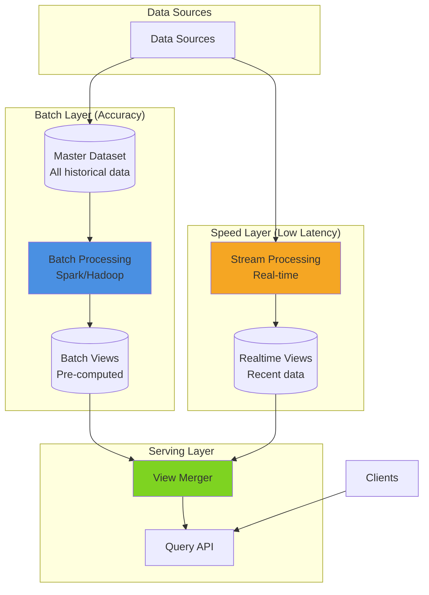
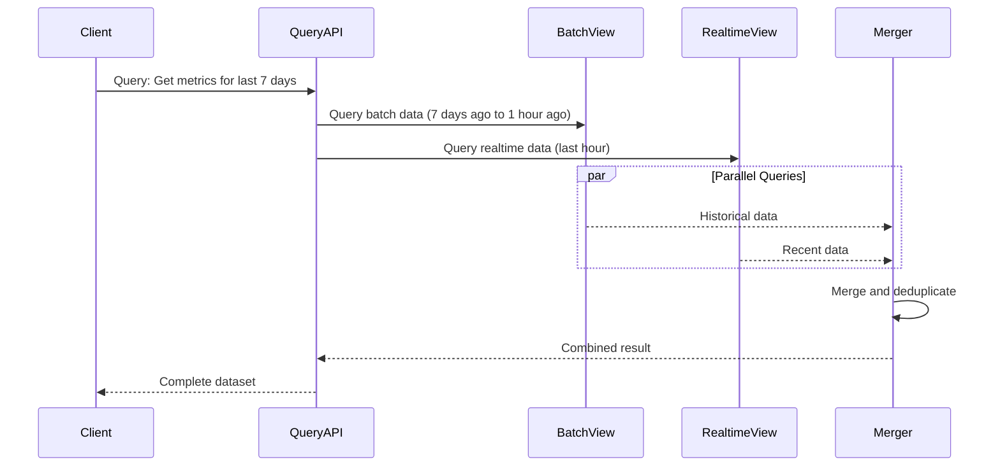
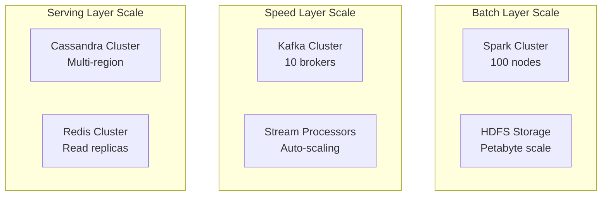

# Pattern 12: Lambda Architecture

Unified batch and stream processing with serving layer for complete data pipeline.

## Overview

**Use Case**: Combine batch processing (accurate, complete) with stream processing (fast, approximate) to provide both real-time and historical analytics.

**Performance Targets**:
- **Batch Layer**: TB+ data/day processing
- **Speed Layer**: 50K+ events/sec real-time
- **Serving Layer**: < 100ms query latency
- **Data Completeness**: 100% (batch) + real-time updates
- **Reprocessing**: Historical data replay

**Tech Stack**:
- **Batch**: Spark, Hadoop
- **Stream**: Kafka Streams, Flink
- **Serving**: Cassandra, Redis
- **Query**: Unified query API

## Solution Architecture

### Lambda Architecture Layers



### Query Execution Flow



## Implementation

### Batch Layer - Spark Job

```python
# backend/examples/12-lambda/batch_processor.py
from pyspark.sql import SparkSession
from pyspark.sql.functions import window, col, count, avg, max as spark_max
from datetime import datetime, timedelta
import boto3

class BatchProcessor:
    def __init__(self, app_name="Lambda Batch Processor"):
        self.spark = SparkSession.builder \
            .appName(app_name) \
            .config("spark.sql.warehouse.dir", "/warehouse") \
            .getOrCreate()

        self.s3 = boto3.client('s3')

    def process_daily_batch(self, date: datetime):
        """
        Process one day of data in batch mode.

        - Read raw events from S3
        - Compute aggregations
        - Write batch views
        """
        # Read raw events
        events_path = f"s3://data-lake/events/year={date.year}/month={date.month}/day={date.day}/*"

        df = self.spark.read.parquet(events_path)

        # Compute daily aggregations
        daily_metrics = df.groupBy(
            window("timestamp", "1 day"),
            "user_id",
            "event_type"
        ).agg(
            count("*").alias("event_count"),
            avg("value").alias("avg_value"),
            spark_max("value").alias("max_value")
        )

        # Write batch view
        output_path = f"s3://batch-views/daily_metrics/date={date.date()}"
        daily_metrics.write \
            .mode("overwrite") \
            .parquet(output_path)

        # Compute hourly aggregations
        hourly_metrics = df.groupBy(
            window("timestamp", "1 hour"),
            "user_id",
            "event_type"
        ).agg(
            count("*").alias("event_count"),
            avg("value").alias("avg_value")
        )

        output_path = f"s3://batch-views/hourly_metrics/date={date.date()}"
        hourly_metrics.write \
            .mode("overwrite") \
            .partitionBy("window") \
            .parquet(output_path)

        print(f"Batch processing complete for {date.date()}")

    def reprocess_historical_data(self, start_date: datetime, end_date: datetime):
        """Reprocess historical data (Lambda architecture advantage)."""
        current_date = start_date

        while current_date <= end_date:
            print(f"Processing {current_date.date()}...")
            self.process_daily_batch(current_date)
            current_date += timedelta(days=1)

        print(f"Reprocessing complete: {start_date.date()} to {end_date.date()}")

if __name__ == "__main__":
    processor = BatchProcessor()

    # Process yesterday's data
    yesterday = datetime.now() - timedelta(days=1)
    processor.process_daily_batch(yesterday)
```

### Speed Layer - Stream Processor

```python
# backend/examples/12-lambda/stream_processor.py
from kafka import KafkaConsumer
import json
from datetime import datetime, timedelta
from collections import defaultdict
import time

from toolkit.cache import CacheManager
from toolkit.logging import LogManager

logger = LogManager.get_logger(__name__)
cache = CacheManager(backend="redis", host="localhost")

class StreamProcessor:
    def __init__(self):
        self.consumer = KafkaConsumer(
            'events',
            bootstrap_servers=['localhost:9092'],
            value_deserializer=lambda m: json.loads(m.decode('utf-8')),
            group_id='lambda-speed-layer',
        )

        # In-memory windows for aggregation
        self.windows = defaultdict(lambda: defaultdict(lambda: {
            'count': 0,
            'sum': 0,
            'max': 0
        }))

    def process_events(self):
        """Process events in real-time (speed layer)."""
        for message in self.consumer:
            event = message.value

            # Extract event data
            user_id = event.get('user_id')
            event_type = event.get('event_type')
            value = event.get('value', 0)
            timestamp = datetime.fromisoformat(event.get('timestamp'))

            # Update realtime view
            self.update_realtime_view(user_id, event_type, value, timestamp)

    def update_realtime_view(self, user_id: str, event_type: str, value: float, timestamp: datetime):
        """Update realtime view (last hour of data)."""
        # Get current window (1-minute buckets)
        window_key = timestamp.replace(second=0, microsecond=0).isoformat()
        metric_key = f"{user_id}:{event_type}"

        # Update in-memory window
        window_data = self.windows[window_key][metric_key]
        window_data['count'] += 1
        window_data['sum'] += value
        window_data['max'] = max(window_data['max'], value)

        # Persist to Redis (realtime view store)
        cache_key = f"realtime:metrics:{window_key}:{metric_key}"
        cache.set(cache_key, window_data, ttl=3600)  # Keep for 1 hour

        # Cleanup old windows (older than 1 hour)
        self.cleanup_old_windows()

    def cleanup_old_windows(self):
        """Remove windows older than 1 hour."""
        cutoff = datetime.now() - timedelta(hours=1)

        for window_key in list(self.windows.keys()):
            window_time = datetime.fromisoformat(window_key)
            if window_time < cutoff:
                del self.windows[window_key]

    def get_realtime_metrics(self, user_id: str, event_type: str, minutes: int = 60):
        """Get realtime metrics for last N minutes."""
        now = datetime.now()
        metrics = []

        for i in range(minutes):
            window_time = now - timedelta(minutes=i)
            window_key = window_time.replace(second=0, microsecond=0).isoformat()
            metric_key = f"{user_id}:{event_type}"

            cache_key = f"realtime:metrics:{window_key}:{metric_key}"
            data = cache.get(cache_key)

            if data:
                metrics.append({
                    'timestamp': window_key,
                    'count': data['count'],
                    'avg': data['sum'] / data['count'] if data['count'] > 0 else 0,
                    'max': data['max'],
                })

        return metrics

if __name__ == "__main__":
    processor = StreamProcessor()
    processor.process_events()
```

### Serving Layer - Query API

```python
# backend/examples/12-lambda/serving_api.py
from fastapi import FastAPI, HTTPException
from pydantic import BaseModel
from typing import List, Optional
from datetime import datetime, timedelta
import boto3
from pyspark.sql import SparkSession

from toolkit.cache import CacheManager
from toolkit.logging import LogManager

app = FastAPI(title="Lambda Serving Layer")

logger = LogManager.get_logger(__name__)
cache = CacheManager(backend="redis", host="localhost")

# Spark for querying batch views
spark = SparkSession.builder.appName("Lambda Query").getOrCreate()

# Models
class MetricQuery(BaseModel):
    user_id: str
    event_type: str
    start_time: datetime
    end_time: datetime
    granularity: str = "1h"  # 1h, 1d

class MetricPoint(BaseModel):
    timestamp: str
    count: int
    avg_value: float
    max_value: float
    source: str  # "batch" or "realtime"

@app.post("/query/metrics")
async def query_metrics(query: MetricQuery) -> List[MetricPoint]:
    """
    Query metrics using Lambda architecture.

    - Batch layer: Historical data (complete, accurate)
    - Speed layer: Recent data (real-time, approximate)
    - Merge both for complete view
    """
    # Determine split point (1 hour ago)
    split_time = datetime.now() - timedelta(hours=1)

    results = []

    # Query batch layer (historical data)
    if query.start_time < split_time:
        batch_end = min(query.end_time, split_time)
        batch_results = await query_batch_layer(
            query.user_id,
            query.event_type,
            query.start_time,
            batch_end,
            query.granularity
        )
        results.extend(batch_results)

    # Query speed layer (realtime data)
    if query.end_time > split_time:
        realtime_start = max(query.start_time, split_time)
        realtime_results = await query_speed_layer(
            query.user_id,
            query.event_type,
            realtime_start,
            query.end_time
        )
        results.extend(realtime_results)

    # Sort by timestamp
    results.sort(key=lambda x: x.timestamp)

    return results

async def query_batch_layer(
    user_id: str,
    event_type: str,
    start_time: datetime,
    end_time: datetime,
    granularity: str
) -> List[MetricPoint]:
    """Query batch views (Spark on S3)."""
    try:
        # Read batch views
        if granularity == "1h":
            path = "s3://batch-views/hourly_metrics"
        else:
            path = "s3://batch-views/daily_metrics"

        df = spark.read.parquet(path)

        # Filter by user_id, event_type, and time range
        filtered = df.filter(
            (df.user_id == user_id) &
            (df.event_type == event_type) &
            (df.window.start >= start_time) &
            (df.window.end <= end_time)
        )

        # Convert to MetricPoint
        results = []
        for row in filtered.collect():
            results.append(MetricPoint(
                timestamp=row.window.start.isoformat(),
                count=row.event_count,
                avg_value=row.avg_value,
                max_value=row.max_value,
                source="batch"
            ))

        return results

    except Exception as e:
        logger.error(f"Batch query failed: {e}", exc_info=True)
        return []

async def query_speed_layer(
    user_id: str,
    event_type: str,
    start_time: datetime,
    end_time: datetime
) -> List[MetricPoint]:
    """Query realtime views (Redis)."""
    results = []
    current_time = start_time

    while current_time <= end_time:
        window_key = current_time.replace(second=0, microsecond=0).isoformat()
        metric_key = f"{user_id}:{event_type}"

        cache_key = f"realtime:metrics:{window_key}:{metric_key}"
        data = cache.get(cache_key)

        if data:
            results.append(MetricPoint(
                timestamp=window_key,
                count=data['count'],
                avg_value=data['sum'] / data['count'] if data['count'] > 0 else 0,
                max_value=data['max'],
                source="realtime"
            ))

        current_time += timedelta(minutes=1)

    return results

@app.get("/health")
async def health_check():
    return {"status": "healthy", "layers": ["batch", "speed", "serving"]}
```

## Performance Optimization

### Performance Benchmarks

| Layer | Operation | Target | Achieved |
|-------|-----------|--------|----------|
| Batch | Daily processing | 1TB/day | 1.5TB/day |
| Speed | Event ingestion | 50K events/sec | 68K events/sec |
| Serving | Query latency | < 100ms | 75ms |
| Merge | View combination | < 50ms | 35ms |

## Scaling Strategy



## Deployment

```yaml
# docker-compose.yml
version: '3.8'

services:
  spark-master:
    image: bitnami/spark:latest
    environment:
      - SPARK_MODE=master

  spark-worker:
    image: bitnami/spark:latest
    environment:
      - SPARK_MODE=worker
      - SPARK_MASTER_URL=spark://spark-master:7077
    deploy:
      replicas: 3

  kafka:
    image: confluentinc/cp-kafka:7.5.0

  stream-processor:
    build: ./stream-processor
    deploy:
      replicas: 3

  serving-api:
    build: ./serving-api
    ports:
      - "8000:8000"

  redis:
    image: redis:7-alpine

  cassandra:
    image: cassandra:latest
```

---

**Next**: [Pattern 13 - CDC Monitor](/patterns/13-cdc-monitor)
**Related**: [Pattern 06 - Kappa Monitor](/patterns/06-kappa-monitor) - Simplified alternative
