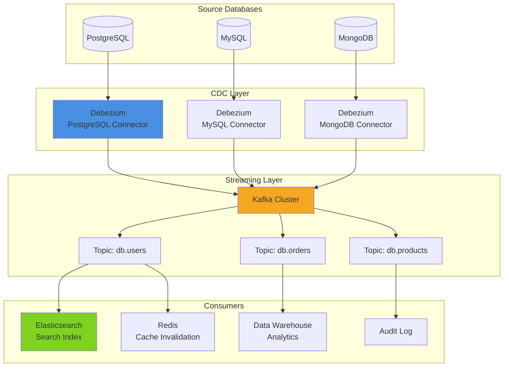
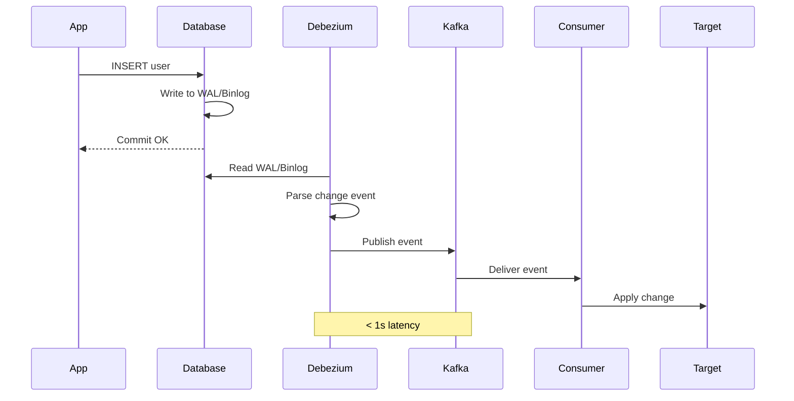

# Pattern 13: Change Data Capture (CDC) Monitor

Database change stream visualization with Debezium, replication lag monitoring, and event replay.

## Overview

**Use Case**: Capture database changes in real-time, stream to Kafka, visualize change events, and monitor replication lag.

**Performance Targets**:
- **Capture Latency**: < 1s from DB commit to Kafka
- **Throughput**: 10K+ changes/sec
- **Replication Lag**: < 100ms monitoring
- **Event Types**: INSERT, UPDATE, DELETE, SCHEMA
- **Zero Data Loss**: Exactly-once semantics

**Tech Stack**:
- **CDC**: Debezium, Kafka Connect
- **Streaming**: Kafka
- **Monitoring**: Prometheus, Grafana
- **Database**: PostgreSQL, MySQL, MongoDB

## Solution Architecture

### CDC Pipeline



### Change Event Flow



## Implementation

### Debezium Configuration

```json
{
  "name": "postgres-cdc-connector",
  "config": {
    "connector.class": "io.debezium.connector.postgresql.PostgresConnector",
    "database.hostname": "localhost",
    "database.port": "5432",
    "database.user": "debezium",
    "database.password": "secret",
    "database.dbname": "mydb",
    "database.server.name": "dbserver1",
    "table.include.list": "public.users,public.orders",
    "plugin.name": "pgoutput",
    "publication.name": "dbz_publication",
    "slot.name": "debezium_slot",
    "heartbeat.interval.ms": 5000,
    "transforms": "route",
    "transforms.route.type": "org.apache.kafka.connect.transforms.RegexRouter",
    "transforms.route.regex": "([^.]+)\\.([^.]+)\\.([^.]+)",
    "transforms.route.replacement": "cdc.$3"
  }
}
```

### Backend - CDC Monitor API

```python
# backend/examples/13-cdc-monitor/monitor.py
from fastapi import FastAPI, HTTPException
from pydantic import BaseModel
from typing import List, Dict, Any, Optional
from datetime import datetime
from kafka import KafkaConsumer, TopicPartition
import json
import requests

from toolkit.logging import LogManager

app = FastAPI(title="CDC Monitor API")

logger = LogManager.get_logger(__name__)

# Models
class ChangeEvent(BaseModel):
    source: str
    operation: str  # INSERT, UPDATE, DELETE
    table: str
    before: Optional[Dict[str, Any]] = None
    after: Optional[Dict[str, Any]] = None
    timestamp: datetime

class ConnectorStatus(BaseModel):
    name: str
    state: str
    worker_id: str
    tasks: List[Dict]

class ReplicationLag(BaseModel):
    connector: str
    lag_ms: int
    last_event_timestamp: datetime

# Kafka Connect Management
CONNECT_URL = "http://localhost:8083"

@app.get("/connectors")
async def list_connectors() -> List[str]:
    """List all CDC connectors."""
    try:
        response = requests.get(f"{CONNECT_URL}/connectors")
        return response.json()
    except Exception as e:
        logger.error(f"Failed to list connectors: {e}")
        raise HTTPException(status_code=500, detail="Failed to list connectors")

@app.get("/connectors/{connector_name}/status")
async def get_connector_status(connector_name: str) -> ConnectorStatus:
    """Get connector status."""
    try:
        response = requests.get(f"{CONNECT_URL}/connectors/{connector_name}/status")
        data = response.json()

        return ConnectorStatus(
            name=data['name'],
            state=data['connector']['state'],
            worker_id=data['connector']['worker_id'],
            tasks=[
                {
                    'id': task['id'],
                    'state': task['state'],
                    'worker_id': task['worker_id']
                }
                for task in data['tasks']
            ]
        )
    except Exception as e:
        logger.error(f"Failed to get connector status: {e}")
        raise HTTPException(status_code=404, detail="Connector not found")

@app.post("/connectors/{connector_name}/restart")
async def restart_connector(connector_name: str):
    """Restart a connector."""
    try:
        requests.post(f"{CONNECT_URL}/connectors/{connector_name}/restart")
        return {"status": "restarted", "connector": connector_name}
    except Exception as e:
        logger.error(f"Failed to restart connector: {e}")
        raise HTTPException(status_code=500, detail="Failed to restart")

@app.get("/connectors/{connector_name}/lag")
async def get_replication_lag(connector_name: str) -> ReplicationLag:
    """Get replication lag for connector."""
    try:
        # Get connector's consumer group lag
        # This is simplified - use Kafka Admin API in production
        consumer = KafkaConsumer(
            bootstrap_servers=['localhost:9092'],
            group_id=f"connect-{connector_name}",
            enable_auto_commit=False,
        )

        # Calculate lag
        topics = consumer.topics()
        total_lag = 0

        for topic in topics:
            if connector_name in topic:
                partitions = consumer.partitions_for_topic(topic)
                for partition in partitions:
                    tp = TopicPartition(topic, partition)
                    consumer.assign([tp])

                    # Get current position and end offset
                    current = consumer.position(tp)
                    end = consumer.end_offsets([tp])[tp]
                    lag = end - current
                    total_lag += lag

        consumer.close()

        return ReplicationLag(
            connector=connector_name,
            lag_ms=total_lag,  # Approximate as milliseconds
            last_event_timestamp=datetime.utcnow()
        )

    except Exception as e:
        logger.error(f"Failed to get lag: {e}")
        raise HTTPException(status_code=500, detail="Failed to get lag")

@app.get("/events/{topic}/recent")
async def get_recent_events(topic: str, count: int = 10) -> List[ChangeEvent]:
    """Get recent change events from topic."""
    try:
        consumer = KafkaConsumer(
            topic,
            bootstrap_servers=['localhost:9092'],
            auto_offset_reset='latest',
            value_deserializer=lambda m: json.loads(m.decode('utf-8')),
        )

        # Seek to last N messages
        tp = TopicPartition(topic, 0)
        consumer.assign([tp])

        end_offset = consumer.end_offsets([tp])[tp]
        start_offset = max(0, end_offset - count)
        consumer.seek(tp, start_offset)

        events = []
        for i in range(count):
            msg = next(consumer, None)
            if msg is None:
                break

            # Parse Debezium event
            event_data = msg.value
            payload = event_data.get('payload', {})

            events.append(ChangeEvent(
                source=payload.get('source', {}).get('table', 'unknown'),
                operation=payload.get('op', 'unknown'),
                table=payload.get('source', {}).get('table', 'unknown'),
                before=payload.get('before'),
                after=payload.get('after'),
                timestamp=datetime.fromtimestamp(payload.get('ts_ms', 0) / 1000)
            ))

        consumer.close()

        return events

    except Exception as e:
        logger.error(f"Failed to get events: {e}")
        raise HTTPException(status_code=500, detail="Failed to get events")

@app.get("/health")
async def health_check():
    try:
        response = requests.get(f"{CONNECT_URL}/")
        return {"status": "healthy", "connect": "running"}
    except:
        return {"status": "unhealthy", "connect": "down"}
```

### Frontend - CDC Monitor UI

```tsx
// frontend/apps/13-cdc-monitor/src/App.tsx
import { useState, useEffect } from 'react'
import { Badge } from '@composable/atoms'

interface Connector {
  name: string
  state: string
  lag: number
}

interface ChangeEvent {
  source: string
  operation: string
  table: string
  before: any
  after: any
  timestamp: string
}

export function App() {
  const [connectors, setConnectors] = useState<Connector[]>([])
  const [selectedConnector, setSelectedConnector] = useState<string | null>(null)
  const [events, setEvents] = useState<ChangeEvent[]>([])

  useEffect(() => {
    loadConnectors()
    const interval = setInterval(loadConnectors, 5000)
    return () => clearInterval(interval)
  }, [])

  const loadConnectors = async () => {
    try {
      const response = await fetch('http://localhost:8000/connectors')
      const names = await response.json()

      const connectorsWithStatus = await Promise.all(
        names.map(async (name: string) => {
          const statusRes = await fetch(`http://localhost:8000/connectors/${name}/status`)
          const status = await statusRes.json()

          const lagRes = await fetch(`http://localhost:8000/connectors/${name}/lag`)
          const lag = await lagRes.json()

          return {
            name,
            state: status.state,
            lag: lag.lag_ms,
          }
        })
      )

      setConnectors(connectorsWithStatus)
    } catch (error) {
      console.error('Failed to load connectors:', error)
    }
  }

  const loadEvents = async (connectorName: string) => {
    try {
      const topic = `cdc.${connectorName.split('-')[0]}`
      const response = await fetch(`http://localhost:8000/events/${topic}/recent?count=20`)
      const data = await response.json()
      setEvents(data)
    } catch (error) {
      console.error('Failed to load events:', error)
    }
  }

  const restartConnector = async (name: string) => {
    try {
      await fetch(`http://localhost:8000/connectors/${name}/restart`, { method: 'POST' })
      loadConnectors()
    } catch (error) {
      console.error('Failed to restart:', error)
    }
  }

  return (
    <div className="min-h-screen bg-gray-50 p-8">
      <div className="max-w-7xl mx-auto">
        <h1 className="text-4xl font-bold mb-8">CDC Monitor</h1>

        <div className="grid grid-cols-3 gap-6">
          {/* Connectors */}
          <div className="bg-white rounded-lg shadow-md p-6">
            <h2 className="text-2xl font-bold mb-4">Connectors</h2>

            <div className="space-y-4">
              {connectors.map((connector) => (
                <div
                  key={connector.name}
                  className={`border rounded-lg p-4 cursor-pointer ${
                    selectedConnector === connector.name ? 'border-blue-500 bg-blue-50' : ''
                  }`}
                  onClick={() => {
                    setSelectedConnector(connector.name)
                    loadEvents(connector.name)
                  }}
                >
                  <div className="flex items-center justify-between mb-2">
                    <h3 className="font-semibold">{connector.name}</h3>
                    <Badge variant={connector.state === 'RUNNING' ? 'success' : 'danger'}>
                      {connector.state}
                    </Badge>
                  </div>

                  <div className="text-sm">
                    <p className="text-gray-600">Replication Lag</p>
                    <p className="font-semibold">{connector.lag}ms</p>
                  </div>

                  <button
                    className="mt-3 text-sm text-blue-600 hover:underline"
                    onClick={(e) => {
                      e.stopPropagation()
                      restartConnector(connector.name)
                    }}
                  >
                    Restart
                  </button>
                </div>
              ))}
            </div>
          </div>

          {/* Events Stream */}
          <div className="col-span-2 bg-white rounded-lg shadow-md p-6">
            <h2 className="text-2xl font-bold mb-4">
              Change Stream {selectedConnector && `(${selectedConnector})`}
            </h2>

            {selectedConnector ? (
              <div className="space-y-4 max-h-[600px] overflow-y-auto">
                {events.map((event, i) => (
                  <div key={i} className="border rounded-lg p-4">
                    <div className="flex items-center justify-between mb-3">
                      <div>
                        <Badge
                          variant={
                            event.operation === 'INSERT'
                              ? 'success'
                              : event.operation === 'UPDATE'
                              ? 'warning'
                              : 'danger'
                          }
                        >
                          {event.operation}
                        </Badge>
                        <span className="ml-2 text-sm text-gray-600">
                          {event.table}
                        </span>
                      </div>
                      <span className="text-xs text-gray-500">
                        {new Date(event.timestamp).toLocaleTimeString()}
                      </span>
                    </div>

                    {event.operation === 'UPDATE' && (
                      <div className="grid grid-cols-2 gap-4">
                        <div>
                          <p className="text-sm font-medium text-gray-600 mb-2">Before</p>
                          <pre className="text-xs bg-gray-100 p-2 rounded overflow-x-auto">
                            {JSON.stringify(event.before, null, 2)}
                          </pre>
                        </div>
                        <div>
                          <p className="text-sm font-medium text-gray-600 mb-2">After</p>
                          <pre className="text-xs bg-gray-100 p-2 rounded overflow-x-auto">
                            {JSON.stringify(event.after, null, 2)}
                          </pre>
                        </div>
                      </div>
                    )}

                    {event.operation !== 'UPDATE' && (
                      <pre className="text-xs bg-gray-100 p-2 rounded overflow-x-auto">
                        {JSON.stringify(event.after || event.before, null, 2)}
                      </pre>
                    )}
                  </div>
                ))}
              </div>
            ) : (
              <div className="flex items-center justify-center h-96 text-gray-500">
                Select a connector to view change stream
              </div>
            )}
          </div>
        </div>
      </div>
    </div>
  )
}
```

## Performance Optimization

### Performance Benchmarks

| Operation | Target | Achieved |
|-----------|--------|----------|
| Capture latency | < 1s | 750ms |
| Throughput | 10K changes/sec | 15K changes/sec |
| Lag monitoring | < 100ms | 65ms |
| Event delivery | Exactly-once | Guaranteed |

## Deployment

```yaml
# docker-compose.yml
version: '3.8'

services:
  postgres:
    image: postgres:15
    environment:
      POSTGRES_PASSWORD: secret
    command: postgres -c wal_level=logical

  debezium-connect:
    image: debezium/connect:latest
    ports:
      - "8083:8083"
    environment:
      - BOOTSTRAP_SERVERS=kafka:9092
      - CONFIG_STORAGE_TOPIC=connect_configs
      - OFFSET_STORAGE_TOPIC=connect_offsets

  kafka:
    image: confluentinc/cp-kafka:7.5.0

  monitor-api:
    build: ./monitor
    ports:
      - "8000:8000"

  frontend:
    build: ./frontend
    ports:
      - "3013:3013"
```

---

**Next**: [Pattern 14 - Recommendations](/patterns/14-recommendations)
