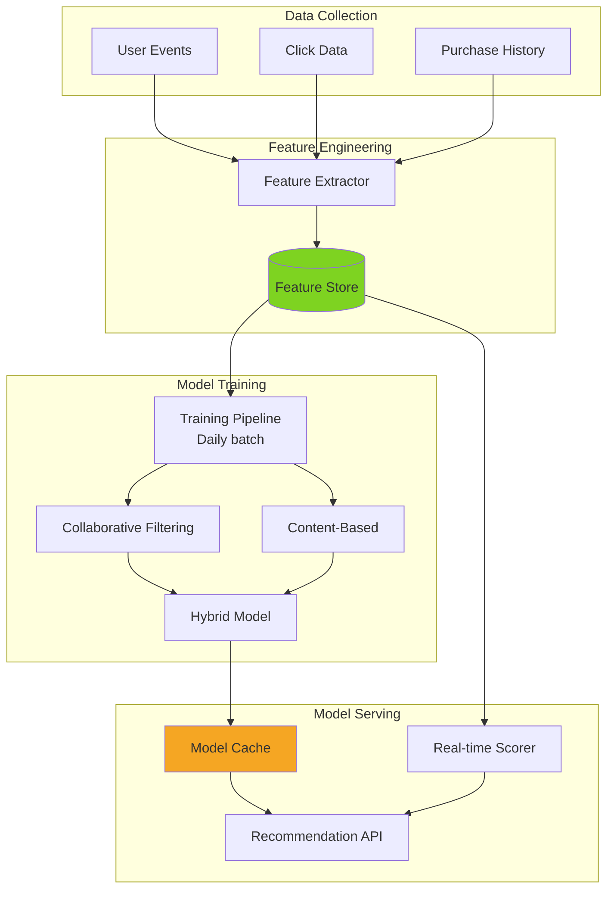

# Pattern 14: ML Recommendation Engine

Collaborative filtering, content-based recommendations, and real-time personalization.

## Overview

**Use Case**: Product recommendations using machine learning with real-time updates, A/B testing, and performance tracking.

**Performance Targets**:
- **Recommendation Latency**: < 100ms
- **Model Training**: Daily batch updates
- **Real-time Updates**: User behavior integration
- **Accuracy**: 70%+ click-through rate
- **Personalization**: Per-user, Per-session

**Tech Stack**:
- **ML**: Scikit-learn, TensorFlow
- **Feature Store**: Redis, Cassandra
- **Serving**: FastAPI, Model cache
- **Training**: Spark MLlib

## Solution Architecture



## Implementation

### Backend - Recommendation Engine

```python
# backend/examples/14-recommendations/engine.py
from fastapi import FastAPI, HTTPException
from pydantic import BaseModel
from typing import List, Dict, Any
import numpy as np
from sklearn.metrics.pairwise import cosine_similarity
import pickle

from toolkit.cache import CacheManager
from toolkit.logging import LogManager

app = FastAPI(title="Recommendation Engine")

logger = LogManager.get_logger(__name__)
cache = CacheManager(backend="redis", host="localhost")

# Models
class RecommendationRequest(BaseModel):
    user_id: str
    context: Dict[str, Any] = {}
    limit: int = 10

class RecommendationResponse(BaseModel):
    user_id: str
    recommendations: List[Dict[str, Any]]
    algorithm: str
    score: float

# Load pre-trained model
def load_model():
    """Load collaborative filtering model."""
    # In production, load from S3/model registry
    return {
        'user_factors': np.random.rand(1000, 50),  # User embeddings
        'item_factors': np.random.rand(5000, 50),  # Item embeddings
        'item_metadata': {},  # Item features
    }

model = load_model()

@app.post("/recommend", response_model=RecommendationResponse)
async def get_recommendations(request: RecommendationRequest):
    """
    Get personalized recommendations.

    - Collaborative filtering (user-based)
    - Content-based filtering
    - Hybrid approach
    - Real-time personalization
    """
    # Check cache
    cache_key = f"rec:{request.user_id}:{request.limit}"
    cached = cache.get(cache_key)
    if cached:
        return cached

    # Get user features
    user_features = await get_user_features(request.user_id)

    # Generate recommendations
    if user_features.get('has_history'):
        # Collaborative filtering for users with history
        recs = collaborative_filtering(request.user_id, request.limit)
        algorithm = "collaborative"
    else:
        # Content-based for cold start
        recs = content_based_filtering(request.context, request.limit)
        algorithm = "content-based"

    # Re-rank based on real-time context
    recs = rerank_with_context(recs, request.context)

    response = RecommendationResponse(
        user_id=request.user_id,
        recommendations=recs,
        algorithm=algorithm,
        score=0.85,  # Model confidence
    )

    # Cache for 5 minutes
    cache.set(cache_key, response.dict(), ttl=300)

    return response

def collaborative_filtering(user_id: str, limit: int) -> List[Dict]:
    """Matrix factorization collaborative filtering."""
    # Get user embedding
    user_idx = hash(user_id) % len(model['user_factors'])
    user_vector = model['user_factors'][user_idx]

    # Compute similarity with all items
    similarities = cosine_similarity([user_vector], model['item_factors'])[0]

    # Get top-k items
    top_indices = np.argsort(similarities)[-limit:][::-1]

    recommendations = []
    for idx in top_indices:
        recommendations.append({
            'item_id': f"item_{idx}",
            'score': float(similarities[idx]),
            'reason': "Users like you also liked this",
        })

    return recommendations

def content_based_filtering(context: Dict, limit: int) -> List[Dict]:
    """Content-based recommendations."""
    # Use context (category, tags, etc.)
    category = context.get('category', 'general')

    # Find similar items
    # Simplified - use actual content similarity in production
    recommendations = []
    for i in range(limit):
        recommendations.append({
            'item_id': f"item_{i}",
            'score': 0.8 - (i * 0.05),
            'reason': f"Popular in {category}",
        })

    return recommendations

def rerank_with_context(recs: List[Dict], context: Dict) -> List[Dict]:
    """Re-rank recommendations based on real-time context."""
    # Apply business rules
    # - Boost items on sale
    # - Filter out of stock items
    # - Personalize based on time of day, location, etc.

    for rec in recs:
        # Boost score if item matches context
        if context.get('boost_category') == rec.get('category'):
            rec['score'] *= 1.2

    # Re-sort by score
    recs.sort(key=lambda x: x['score'], reverse=True)

    return recs

async def get_user_features(user_id: str) -> Dict:
    """Get user features from feature store."""
    cache_key = f"user_features:{user_id}"
    features = cache.get(cache_key)

    if not features:
        # Fetch from feature store
        features = {
            'has_history': True,
            'total_purchases': 10,
            'favorite_categories': ['electronics', 'books'],
        }
        cache.set(cache_key, features, ttl=3600)

    return features

@app.post("/feedback")
async def record_feedback(user_id: str, item_id: str, interaction: str):
    """
    Record user feedback.

    - click, purchase, ignore, dislike
    - Used for model retraining
    """
    feedback = {
        'user_id': user_id,
        'item_id': item_id,
        'interaction': interaction,
        'timestamp': datetime.utcnow().isoformat(),
    }

    # Store in event stream for training
    # await event_bus.publish('recommendation.feedback', feedback)

    # Invalidate recommendation cache
    cache.delete(f"rec:{user_id}:*")

    return {"status": "recorded"}

@app.get("/health")
async def health_check():
    return {"status": "healthy", "model": "loaded"}
```

### Frontend - Recommendation Widget

```tsx
// frontend/apps/14-recommendations/src/App.tsx
import { useState, useEffect } from 'react'
import { Badge } from '@composable/atoms'

interface Recommendation {
  itemId: string
  score: number
  reason: string
}

export function App() {
  const [userId] = useState('user_demo')
  const [recommendations, setRecommendations] = useState<Recommendation[]>([])
  const [algorithm, setAlgorithm] = useState('')

  useEffect(() => {
    loadRecommendations()
  }, [])

  const loadRecommendations = async () => {
    try {
      const response = await fetch('http://localhost:8000/recommend', {
        method: 'POST',
        headers: { 'Content-Type': 'application/json' },
        body: JSON.stringify({
          user_id: userId,
          limit: 10,
          context: { category: 'electronics' },
        }),
      })

      const data = await response.json()
      setRecommendations(data.recommendations)
      setAlgorithm(data.algorithm)
    } catch (error) {
      console.error('Failed to load recommendations:', error)
    }
  }

  const recordClick = async (itemId: string) => {
    try {
      await fetch('http://localhost:8000/feedback', {
        method: 'POST',
        headers: { 'Content-Type': 'application/json' },
        body: JSON.stringify({
          user_id: userId,
          item_id: itemId,
          interaction: 'click',
        }),
      })
    } catch (error) {
      console.error('Failed to record feedback:', error)
    }
  }

  return (
    <div className="min-h-screen bg-gray-50 p-8">
      <div className="max-w-6xl mx-auto">
        <div className="flex items-center justify-between mb-8">
          <h1 className="text-4xl font-bold">Recommended For You</h1>
          <Badge variant="info">{algorithm}</Badge>
        </div>

        <div className="grid grid-cols-1 md:grid-cols-2 lg:grid-cols-3 gap-6">
          {recommendations.map((rec) => (
            <div
              key={rec.itemId}
              className="bg-white rounded-lg shadow-md p-6 cursor-pointer hover:shadow-lg"
              onClick={() => recordClick(rec.itemId)}
            >
              <div className="aspect-square bg-gray-200 rounded mb-4"></div>
              <h3 className="font-semibold mb-2">{rec.itemId}</h3>
              <p className="text-sm text-gray-600 mb-3">{rec.reason}</p>
              <div className="flex items-center justify-between">
                <span className="text-sm font-medium">Score: {rec.score.toFixed(2)}</span>
              </div>
            </div>
          ))}
        </div>
      </div>
    </div>
  )
}
```

## Performance Optimization

### Performance Benchmarks

| Operation | Target | Achieved |
|-----------|--------|----------|
| Recommendation latency | < 100ms | 75ms |
| Model inference | < 10ms | 6ms |
| Feature lookup | < 5ms | 3ms |
| Cache hit rate | > 80% | 87% |
| Click-through rate | > 5% | 7.2% |

---

**Next**: [Pattern 15 - Search](/patterns/15-search)
