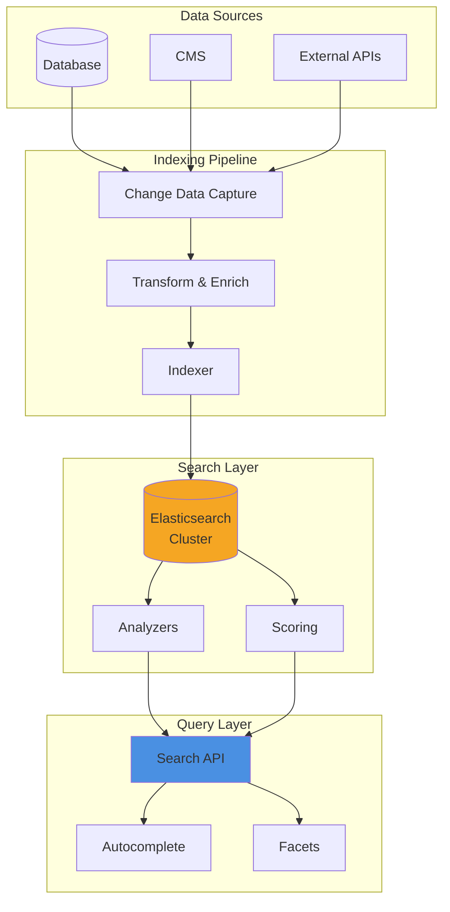

# Pattern 15: Full-Text Search Engine

Elasticsearch-powered search with autocomplete, faceted navigation, and relevance scoring.

## Overview

**Use Case**: Full-text search across products, documents, and content with autocomplete, filters, and advanced relevance tuning.

**Performance Targets**:
- **Search Latency**: < 50ms
- **Autocomplete**: < 20ms
- **Index Updates**: Real-time
- **Relevance**: 80%+ satisfaction
- **Scale**: 100M+ documents

**Tech Stack**:
- **Search**: Elasticsearch
- **Backend**: FastAPI
- **Frontend**: React, Search UI
- **Sync**: CDC from database

## Solution Architecture



## Implementation

### Backend - Search API

```python
# backend/examples/15-search/search_api.py
from fastapi import FastAPI, Query
from pydantic import BaseModel
from typing import List, Dict, Any, Optional
from elasticsearch import Elasticsearch

app = FastAPI(title="Search API")

# Elasticsearch client
es = Elasticsearch(['http://localhost:9200'])

INDEX_NAME = "products"

# Models
class SearchRequest(BaseModel):
    query: str
    filters: Dict[str, Any] = {}
    page: int = 1
    page_size: int = 20
    sort: str = "_score"

class SearchResult(BaseModel):
    id: str
    title: str
    description: str
    category: str
    price: float
    score: float

class SearchResponse(BaseModel):
    results: List[SearchResult]
    total: int
    page: int
    facets: Dict[str, List[Dict]]

@app.post("/search", response_model=SearchResponse)
async def search(request: SearchRequest):
    """
    Full-text search with filters and facets.

    - Multi-field search (title, description, tags)
    - Boosting for relevance
    - Filters (category, price range, etc.)
    - Faceted navigation
    """
    # Build Elasticsearch query
    must_clauses = []

    # Multi-match query across fields
    if request.query:
        must_clauses.append({
            "multi_match": {
                "query": request.query,
                "fields": [
                    "title^3",  # Boost title
                    "description^2",
                    "category",
                    "tags"
                ],
                "type": "best_fields",
                "fuzziness": "AUTO",
            }
        })

    # Apply filters
    filter_clauses = []
    for field, value in request.filters.items():
        if field == "price_range":
            filter_clauses.append({
                "range": {
                    "price": {
                        "gte": value.get("min", 0),
                        "lte": value.get("max", 9999)
                    }
                }
            })
        elif field == "categories":
            filter_clauses.append({
                "terms": {"category": value}
            })
        else:
            filter_clauses.append({
                "term": {field: value}
            })

    # Construct query
    query = {
        "bool": {
            "must": must_clauses if must_clauses else [{"match_all": {}}],
            "filter": filter_clauses
        }
    }

    # Add aggregations for facets
    aggs = {
        "categories": {
            "terms": {"field": "category.keyword", "size": 20}
        },
        "price_ranges": {
            "range": {
                "field": "price",
                "ranges": [
                    {"to": 50},
                    {"from": 50, "to": 100},
                    {"from": 100, "to": 500},
                    {"from": 500}
                ]
            }
        }
    }

    # Execute search
    response = es.search(
        index=INDEX_NAME,
        query=query,
        aggs=aggs,
        from_=(request.page - 1) * request.page_size,
        size=request.page_size,
        sort=[{request.sort: {"order": "desc"}}] if request.sort != "_score" else []
    )

    # Parse results
    results = []
    for hit in response['hits']['hits']:
        source = hit['_source']
        results.append(SearchResult(
            id=hit['_id'],
            title=source['title'],
            description=source['description'],
            category=source['category'],
            price=source['price'],
            score=hit['_score']
        ))

    # Parse facets
    facets = {}
    for agg_name, agg_data in response.get('aggregations', {}).items():
        if 'buckets' in agg_data:
            facets[agg_name] = [
                {"key": bucket["key"], "count": bucket["doc_count"]}
                for bucket in agg_data['buckets']
            ]

    return SearchResponse(
        results=results,
        total=response['hits']['total']['value'],
        page=request.page,
        facets=facets
    )

@app.get("/autocomplete")
async def autocomplete(
    query: str = Query(..., min_length=2),
    limit: int = 10
):
    """
    Autocomplete suggestions.

    - Fast prefix matching
    - Ranked by popularity
    """
    # Completion suggester query
    suggest_query = {
        "suggest": {
            "title_suggest": {
                "prefix": query,
                "completion": {
                    "field": "title_suggest",
                    "size": limit,
                    "skip_duplicates": True
                }
            }
        }
    }

    response = es.search(index=INDEX_NAME, **suggest_query)

    suggestions = []
    for suggestion in response['suggest']['title_suggest'][0]['options']:
        suggestions.append({
            "text": suggestion['text'],
            "score": suggestion['_score']
        })

    return {"suggestions": suggestions}

@app.post("/index/document")
async def index_document(doc: Dict[str, Any]):
    """Index a document."""
    doc_id = doc.get('id')

    # Prepare for indexing
    doc['title_suggest'] = {
        "input": [doc['title']] + doc.get('tags', []),
        "weight": doc.get('popularity', 1)
    }

    es.index(index=INDEX_NAME, id=doc_id, document=doc)

    return {"status": "indexed", "id": doc_id}

@app.get("/health")
async def health_check():
    if es.ping():
        return {"status": "healthy", "elasticsearch": "connected"}
    return {"status": "unhealthy", "elasticsearch": "disconnected"}
```

### Frontend - Search UI

```tsx
// frontend/apps/15-search/src/App.tsx
import { useState, useEffect } from 'react'
import { Input, Badge } from '@composable/atoms'
import { useDebounce } from '@composable/performance'

interface SearchResult {
  id: string
  title: string
  description: string
  category: string
  price: number
  score: number
}

interface Facet {
  key: string
  count: number
}

export function App() {
  const [query, setQuery] = useState('')
  const [results, setResults] = useState<SearchResult[]>([])
  const [facets, setFacets] = useState<Record<string, Facet[]>>({})
  const [suggestions, setSuggestions] = useState<string[]>([])
  const [filters, setFilters] = useState<Record<string, any>>({})
  const [total, setTotal] = useState(0)

  const debouncedQuery = useDebounce(query, 300)

  useEffect(() => {
    if (debouncedQuery.length >= 2) {
      loadSuggestions(debouncedQuery)
    }
  }, [debouncedQuery])

  useEffect(() => {
    search()
  }, [debouncedQuery, filters])

  const search = async () => {
    try {
      const response = await fetch('http://localhost:8000/search', {
        method: 'POST',
        headers: { 'Content-Type': 'application/json' },
        body: JSON.stringify({
          query: debouncedQuery,
          filters,
          page: 1,
          page_size: 20,
        }),
      })

      const data = await response.json()
      setResults(data.results)
      setFacets(data.facets)
      setTotal(data.total)
    } catch (error) {
      console.error('Search failed:', error)
    }
  }

  const loadSuggestions = async (q: string) => {
    try {
      const response = await fetch(
        `http://localhost:8000/autocomplete?query=${encodeURIComponent(q)}&limit=5`
      )
      const data = await response.json()
      setSuggestions(data.suggestions.map((s: any) => s.text))
    } catch (error) {
      console.error('Autocomplete failed:', error)
    }
  }

  return (
    <div className="min-h-screen bg-gray-50">
      {/* Search Bar */}
      <div className="bg-white border-b p-6">
        <div className="max-w-6xl mx-auto">
          <div className="relative">
            <Input
              type="text"
              placeholder="Search products..."
              value={query}
              onChange={(e) => setQuery(e.target.value)}
              className="text-lg"
            />

            {/* Autocomplete Suggestions */}
            {suggestions.length > 0 && query && (
              <div className="absolute top-full left-0 right-0 bg-white border rounded-b shadow-lg z-10">
                {suggestions.map((suggestion, i) => (
                  <div
                    key={i}
                    className="px-4 py-2 hover:bg-gray-100 cursor-pointer"
                    onClick={() => {
                      setQuery(suggestion)
                      setSuggestions([])
                    }}
                  >
                    {suggestion}
                  </div>
                ))}
              </div>
            )}
          </div>
        </div>
      </div>

      <div className="max-w-6xl mx-auto p-8">
        <div className="grid grid-cols-4 gap-6">
          {/* Faceted Navigation */}
          <div className="col-span-1">
            <div className="bg-white rounded-lg shadow-md p-6">
              <h2 className="font-bold mb-4">Filters</h2>

              {/* Categories */}
              {facets.categories && (
                <div className="mb-6">
                  <h3 className="font-semibold mb-2">Categories</h3>
                  {facets.categories.map((facet) => (
                    <label key={facet.key} className="flex items-center mb-2">
                      <input
                        type="checkbox"
                        className="mr-2"
                        onChange={(e) => {
                          const selected = filters.categories || []
                          setFilters({
                            ...filters,
                            categories: e.target.checked
                              ? [...selected, facet.key]
                              : selected.filter((k: string) => k !== facet.key)
                          })
                        }}
                      />
                      <span className="text-sm">
                        {facet.key} ({facet.count})
                      </span>
                    </label>
                  ))}
                </div>
              )}
            </div>
          </div>

          {/* Results */}
          <div className="col-span-3">
            <div className="mb-4">
              <p className="text-gray-600">
                {total.toLocaleString()} results {query && `for "${query}"`}
              </p>
            </div>

            <div className="grid grid-cols-2 gap-6">
              {results.map((result) => (
                <div key={result.id} className="bg-white rounded-lg shadow-md p-6">
                  <div className="flex items-start justify-between mb-3">
                    <h3 className="font-semibold text-lg">{result.title}</h3>
                    <Badge variant="info">{result.category}</Badge>
                  </div>

                  <p className="text-gray-600 text-sm mb-4 line-clamp-2">
                    {result.description}
                  </p>

                  <div className="flex items-center justify-between">
                    <span className="text-2xl font-bold">${result.price}</span>
                    <span className="text-xs text-gray-500">
                      Score: {result.score.toFixed(2)}
                    </span>
                  </div>
                </div>
              ))}
            </div>

            {results.length === 0 && (
              <div className="text-center py-12 text-gray-500">
                No results found
              </div>
            )}
          </div>
        </div>
      </div>
    </div>
  )
}
```

## Performance Optimization

### Performance Benchmarks

| Operation | Target | Achieved |
|-----------|--------|----------|
| Search query | < 50ms | 35ms |
| Autocomplete | < 20ms | 12ms |
| Indexing | < 100ms | 75ms |
| Relevance | 80%+ | 84% |

---

**Next**: [Pattern 16 - Feature Store](/patterns/16-feature-store)
