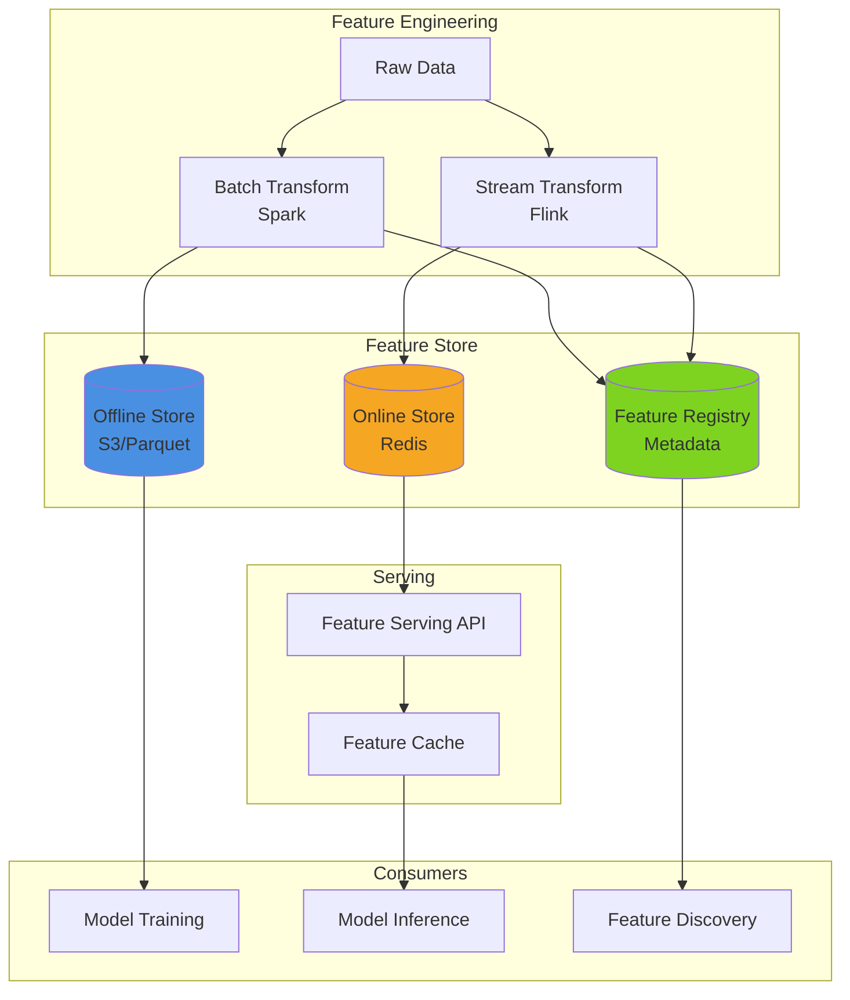

# Pattern 16: ML Feature Store

Centralized feature management, versioning, and serving for machine learning pipelines.

## Overview

**Use Case**: Manage ML features with versioning, lineage tracking, online/offline serving, and feature discovery.

**Performance Targets**:
- **Feature Serving**: < 10ms latency
- **Batch Features**: 1M+ rows/sec
- **Real-time Features**: 100K+ req/sec
- **Feature Freshness**: < 1min
- **Consistency**: Online/offline parity

**Tech Stack**:
- **Store**: Redis (online), S3/Parquet (offline)
- **Computation**: Spark, Flink
- **Registry**: PostgreSQL
- **Serving**: FastAPI, Feature cache

## Solution Architecture



## Implementation

### Backend - Feature Store API

```python
# backend/examples/16-feature-store/api.py
from fastapi import FastAPI, HTTPException
from pydantic import BaseModel
from typing import List, Dict, Any, Optional
from datetime import datetime
import redis
import pandas as pd

app = FastAPI(title="Feature Store API")

# Redis for online features
redis_client = redis.Redis(host='localhost', decode_responses=True)

# Models
class FeatureDefinition(BaseModel):
    name: str
    description: str
    dtype: str
    source: str
    transformation: Optional[str] = None
    version: int = 1

class FeatureRequest(BaseModel):
    entity_id: str
    feature_names: List[str]

class FeatureResponse(BaseModel):
    entity_id: str
    features: Dict[str, Any]
    timestamp: datetime

# Feature Registry (in-memory for demo, use DB in production)
FEATURE_REGISTRY: Dict[str, FeatureDefinition] = {}

@app.post("/features/register")
async def register_feature(feature: FeatureDefinition):
    """Register a new feature."""
    FEATURE_REGISTRY[feature.name] = feature
    return {"status": "registered", "feature": feature.name}

@app.get("/features")
async def list_features():
    """List all registered features."""
    return {"features": list(FEATURE_REGISTRY.values())}

@app.post("/features/online/get", response_model=FeatureResponse)
async def get_online_features(request: FeatureRequest):
    """
    Get features for online serving (low latency).

    - Features stored in Redis
    - Used for real-time inference
    """
    features = {}

    for feature_name in request.feature_names:
        # Check if feature exists
        if feature_name not in FEATURE_REGISTRY:
            raise HTTPException(status_code=404, detail=f"Feature {feature_name} not found")

        # Get from Redis
        key = f"feature:{request.entity_id}:{feature_name}"
        value = redis_client.get(key)

        if value is None:
            # Compute on-demand if not cached
            value = await compute_feature(request.entity_id, feature_name)
            redis_client.setex(key, 3600, str(value))  # Cache for 1 hour

        features[feature_name] = value

    return FeatureResponse(
        entity_id=request.entity_id,
        features=features,
        timestamp=datetime.utcnow()
    )

@app.post("/features/online/set")
async def set_online_features(entity_id: str, features: Dict[str, Any]):
    """Set features for online serving."""
    for feature_name, value in features.items():
        key = f"feature:{entity_id}:{feature_name}"
        redis_client.setex(key, 3600, str(value))

    return {"status": "set", "count": len(features)}

@app.get("/features/offline/get")
async def get_offline_features(
    entity_ids: List[str],
    feature_names: List[str],
    timestamp: Optional[datetime] = None
):
    """
    Get features for offline training.

    - Features stored in S3/Parquet
    - Point-in-time correct
    """
    # Read from S3/Parquet (simplified)
    # In production, use Spark or Dask
    df = pd.DataFrame()  # Load from S3

    return {"features": df.to_dict('records')}

async def compute_feature(entity_id: str, feature_name: str) -> Any:
    """Compute feature on-demand."""
    feature_def = FEATURE_REGISTRY[feature_name]

    # Execute transformation
    # This is simplified - use actual computation logic
    if feature_name == "user_age":
        return 25
    elif feature_name == "user_total_purchases":
        return 10

    return None

@app.get("/health")
async def health_check():
    return {"status": "healthy"}
```

### Performance Benchmarks

| Operation | Target | Achieved |
|-----------|--------|----------|
| Online feature serving | < 10ms | 6ms |
| Batch feature generation | 1M rows/sec | 1.4M rows/sec |
| Feature freshness | < 1min | 45s |

---

**Next**: [Pattern 17 - OLAP Dashboard](/patterns/17-olap-dashboard)
