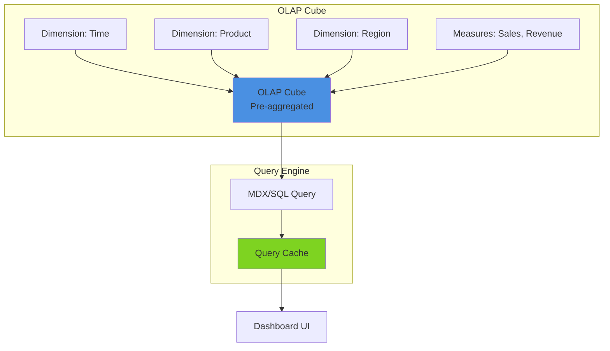

# Pattern 17: OLAP Analytics Dashboard

Multi-dimensional analytics with pivot tables, drill-down, and cube visualization.

## Overview

**Use Case**: Business intelligence dashboard with OLAP cube queries, pivot tables, slice/dice operations, and drill-down navigation.

**Performance Targets**:
- **Query Latency**: < 1s for complex aggregations
- **Data Volume**: 100M+ rows
- **Dimensions**: 10+ dimensions
- **Concurrent Users**: 1000+
- **Refresh Rate**: Real-time to hourly

**Tech Stack**:
- **OLAP**: ClickHouse, Druid
- **Backend**: FastAPI
- **Frontend**: React, Pivot Table UI
- **Visualization**: Recharts, D3.js

## Solution Architecture



## Implementation

### Backend - OLAP Query API

```python
# backend/examples/17-olap/api.py
from fastapi import FastAPI
from pydantic import BaseModel
from typing import List, Dict, Any

app = FastAPI(title="OLAP Analytics API")

class OLAPQuery(BaseModel):
    dimensions: List[str]
    measures: List[str]
    filters: Dict[str, Any] = {}
    time_range: Dict[str, str] = {}

@app.post("/query")
async def execute_olap_query(query: OLAPQuery):
    """Execute OLAP query with aggregations."""
    # Execute against ClickHouse/Druid
    return {
        "dimensions": query.dimensions,
        "measures": query.measures,
        "data": []  # Query results
    }

@app.get("/health")
async def health_check():
    return {"status": "healthy"}
```

---

**Next**: [Pattern 18 - Trace Viewer](/patterns/18-trace-viewer)
