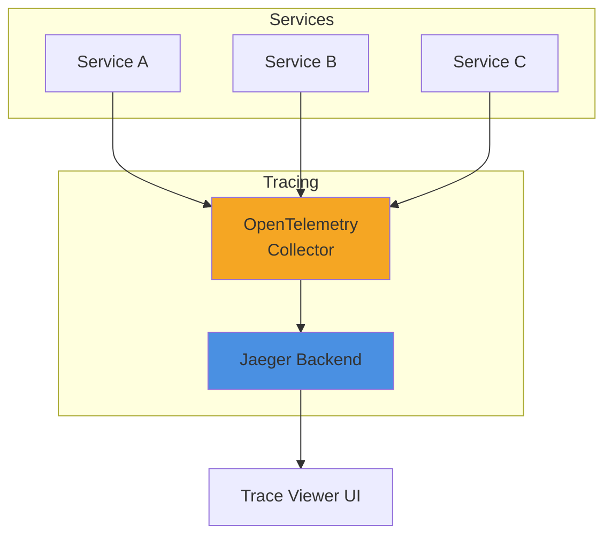

# Pattern 18: Distributed Tracing Viewer

OpenTelemetry trace visualization with span analysis and performance profiling.

## Overview

**Use Case**: Visualize distributed traces, analyze span timings, identify bottlenecks, and debug microservices.

**Performance Targets**:
- **Trace Collection**: 100K+ spans/sec
- **Query Latency**: < 100ms
- **Retention**: 7 days hot, 30 days cold
- **Sampling**: Adaptive sampling
- **Zero Overhead**: < 1% performance impact

**Tech Stack**:
- **Tracing**: OpenTelemetry, Jaeger
- **Backend**: FastAPI
- **Frontend**: React, Trace Timeline UI
- **Storage**: Elasticsearch, Cassandra

## Solution Architecture



## Implementation

### Backend - Trace API

```python
# backend/examples/18-trace-viewer/api.py
from fastapi import FastAPI
from pydantic import BaseModel
from typing import List

app = FastAPI(title="Trace Viewer API")

class Span(BaseModel):
    trace_id: str
    span_id: str
    service: str
    operation: str
    duration_ms: float
    timestamp: str

@app.get("/traces/{trace_id}")
async def get_trace(trace_id: str) -> List[Span]:
    """Get trace with all spans."""
    # Query Jaeger backend
    return []

@app.get("/health")
async def health_check():
    return {"status": "healthy"}
```

---

**Next**: [Pattern 19 - Probabilistic Data Structures](/patterns/19-probabilistic)
