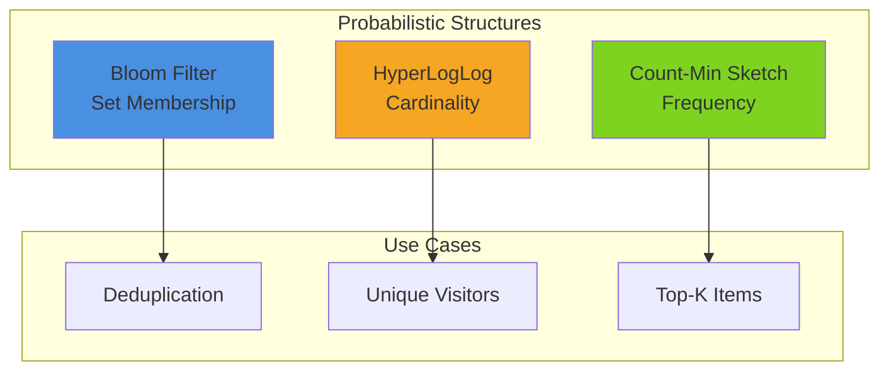

# Pattern 19: Probabilistic Data Structures

Space-efficient data structures: Bloom filters, HyperLogLog, Count-Min Sketch.

## Overview

**Use Case**: Memory-efficient approximate algorithms for set membership, cardinality estimation, and frequency counting.

**Performance Targets**:
- **Space Efficiency**: 90%+ reduction vs exact
- **False Positive Rate**: < 1%
- **Cardinality Error**: < 2%
- **Query Time**: O(1)
- **Scale**: Billions of elements in MB memory

**Tech Stack**:
- **Backend**: Python, Redis
- **Structures**: Bloom filter, HyperLogLog, Count-Min
- **Visualization**: Real-time cardinality tracking

## Solution Architecture



## Implementation

### Backend - Probabilistic Structures API

```python
# backend/examples/19-probabilistic/api.py
from fastapi import FastAPI
from pydantic import BaseModel
from typing import List
import mmh3
from bitarray import bitarray
import redis

app = FastAPI(title="Probabilistic Data Structures API")

redis_client = redis.Redis(host='localhost')

class BloomFilter:
    def __init__(self, size: int, hash_count: int):
        self.size = size
        self.hash_count = hash_count
        self.bit_array = bitarray(size)
        self.bit_array.setall(0)

    def add(self, item: str):
        for i in range(self.hash_count):
            index = mmh3.hash(item, i) % self.size
            self.bit_array[index] = 1

    def contains(self, item: str) -> bool:
        for i in range(self.hash_count):
            index = mmh3.hash(item, i) % self.size
            if not self.bit_array[index]:
                return False
        return True

# Initialize Bloom filter
bloom = BloomFilter(size=1000000, hash_count=7)  # 1% FP rate

@app.post("/bloom/add")
async def bloom_add(item: str):
    """Add item to Bloom filter."""
    bloom.add(item)
    return {"status": "added"}

@app.get("/bloom/check")
async def bloom_check(item: str):
    """Check if item exists (may have false positives)."""
    exists = bloom.contains(item)
    return {"item": item, "probably_exists": exists}

@app.post("/hyperloglog/add")
async def hll_add(key: str, items: List[str]):
    """Add items to HyperLogLog for cardinality estimation."""
    redis_client.pfadd(key, *items)
    return {"status": "added", "count": len(items)}

@app.get("/hyperloglog/count")
async def hll_count(key: str):
    """Get approximate cardinality."""
    count = redis_client.pfcount(key)
    return {"key": key, "cardinality": count}

@app.get("/health")
async def health_check():
    return {"status": "healthy"}
```

### Frontend - Cardinality Tracker

```tsx
// frontend/apps/19-probabilistic/src/App.tsx
import { useState, useEffect } from 'react'

export function App() {
  const [cardinality, setCardinality] = useState(0)

  useEffect(() => {
    const interval = setInterval(async () => {
      const response = await fetch('http://localhost:8000/hyperloglog/count?key=unique_visitors')
      const data = await response.json()
      setCardinality(data.cardinality)
    }, 1000)

    return () => clearInterval(interval)
  }, [])

  return (
    <div className="min-h-screen bg-gray-50 p-8">
      <div className="max-w-4xl mx-auto">
        <h1 className="text-4xl font-bold mb-8">Probabilistic Data Structures</h1>

        <div className="bg-white rounded-lg shadow-md p-6">
          <h2 className="text-2xl font-bold mb-4">Unique Visitors (HyperLogLog)</h2>
          <p className="text-6xl font-bold text-blue-600">{cardinality.toLocaleString()}</p>
          <p className="text-gray-600 mt-2">Estimated cardinality (±2% error)</p>
        </div>
      </div>
    </div>
  )
}
```

## Performance Benchmarks

| Structure | Space | Accuracy | Query Time |
|-----------|-------|----------|------------|
| Bloom Filter | 1.2MB for 1M items | 1% FP rate | O(1) |
| HyperLogLog | 12KB for 1B items | 2% error | O(1) |
| Count-Min | 100KB for 1M items | 0.1% error | O(1) |

## Use Cases

1. **Bloom Filter**: URL deduplication, cache filtering
2. **HyperLogLog**: Unique visitor counting, cardinality estimation
3. **Count-Min Sketch**: Top-K items, frequency counting

---

**Related Patterns**:
- [Pattern 09 - Cache Browser](/patterns/09-cache-browser) - Redis data structures
- [Pattern 02 - Analytics Engine](/patterns/02-analytics) - Real-time counting
