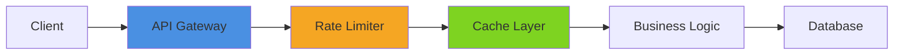
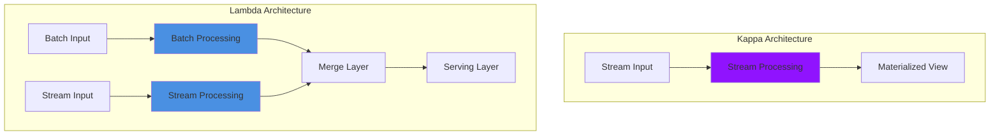
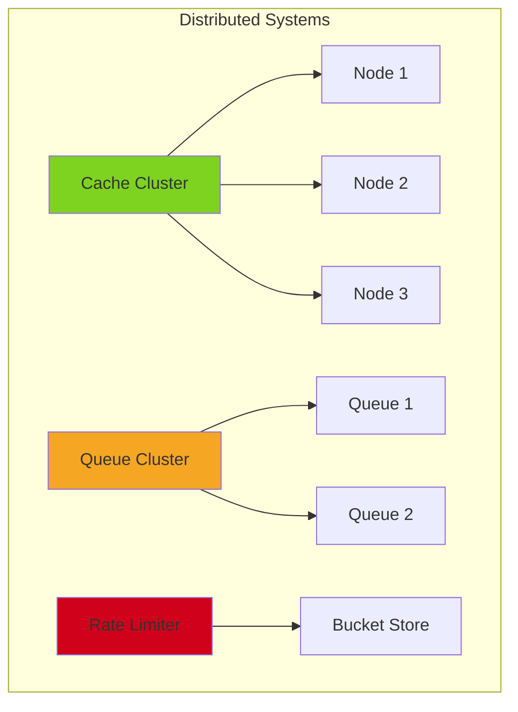
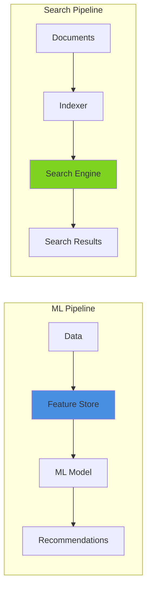
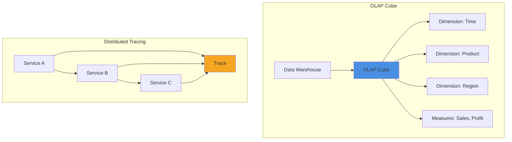
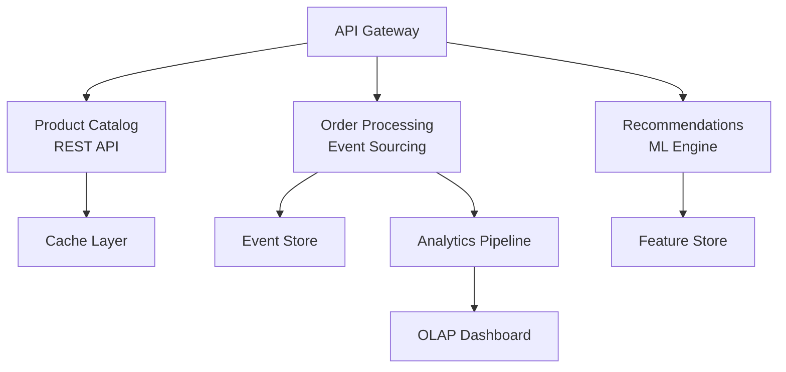
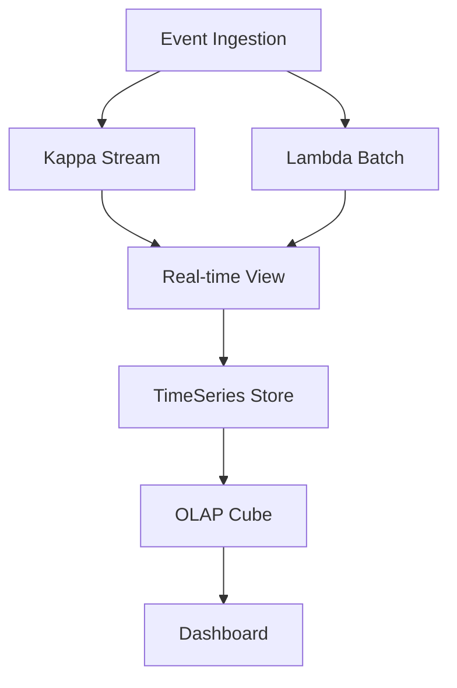
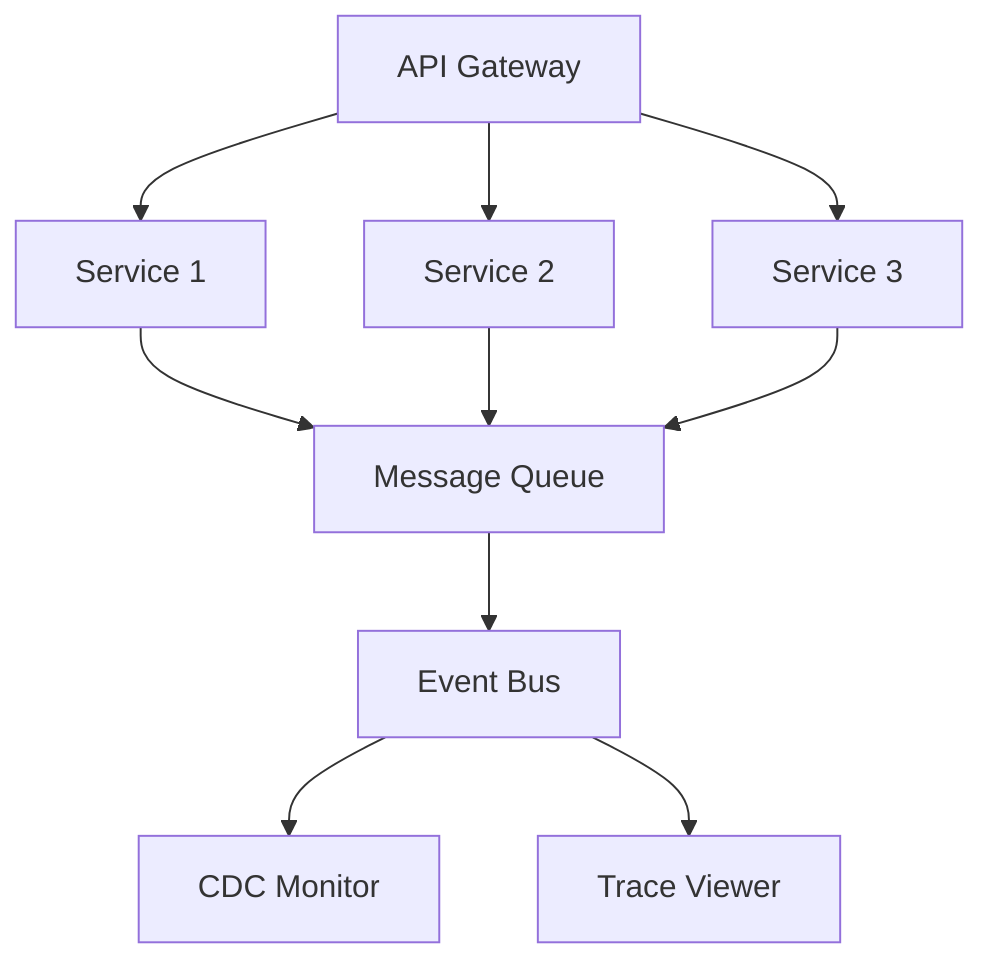

# Pattern Library

All 19 full-stack patterns with complete implementations, performance benchmarks, and scaling strategies.

## Pattern Categories

### Core API Patterns (1-5)

High-traffic API services with caching, rate limiting, and resilience.

| Pattern | Description | Key Technologies | Throughput |
|---------|-------------|-----------------|------------|
| [01 - REST API](/patterns/01-rest-api) | E-commerce inventory with product catalog | FastAPI, Redis Cache, PostgreSQL | 10K+ req/sec |
| [02 - Analytics](/patterns/02-analytics) | Real-time event tracking and aggregation | Event Bus, TimeSeries, Metrics | 50K+ events/sec |
| [03 - File Processing](/patterns/03-file-processing) | Upload and processing pipeline | Worker Pool, S3, Task Queue | 1K+ files/min |
| [04 - API Gateway](/patterns/04-api-gateway) | Service routing and load balancing | Circuit Breaker, Health Checks | 20K+ req/sec |
| [05 - Data Export](/patterns/05-data-export) | Format conversion and downloads | Streaming, Compression | 100MB+/sec |

### Stream Processing (6-8)

Real-time data processing with Lambda and Kappa architectures.

| Pattern | Description | Key Technologies | Performance |
|---------|-------------|-----------------|-------------|
| [06 - Kappa Monitor](/patterns/06-kappa-monitor) | Stream processing visualization | Kappa Architecture, Kafka | 100K+ msg/sec |
| [07 - Event Sourcing](/patterns/07-event-sourcing) | CQRS pattern dashboard | Event Store, Projections | 50K+ events/sec |
| [08 - TimeSeries](/patterns/08-timeseries) | Metrics visualization | TimeSeries DB, Aggregations | 1M+ points/sec |

### Data Management (9-12)

Distributed caching, queuing, and rate limiting.

| Pattern | Description | Key Technologies | Scale |
|---------|-------------|-----------------|-------|
| [09 - Cache Browser](/patterns/09-cache-browser) | Distributed cache management | Redis Cluster, Consistent Hashing | 326K+ ops/sec |
| [10 - Message Queue](/patterns/10-message-queue) | Queue and topic monitoring | RabbitMQ, Kafka, Pub/Sub | 100K+ msg/sec |
| [11 - Rate Limiter](/patterns/11-rate-limiter) | Token bucket visualization | Token Bucket, Sliding Window | 100K+ checks/sec |
| [12 - Lambda Architecture](/patterns/12-lambda-architecture) | Batch + stream merger | MapReduce, Stream Processing | TB+ data/day |

### Advanced Data (13-16)

Change data capture, machine learning, and search.

| Pattern | Description | Key Technologies | Use Case |
|---------|-------------|-----------------|----------|
| [13 - CDC Monitor](/patterns/13-cdc-monitor) | Change data capture viewer | Debezium, Kafka Connect | Database replication |
| [14 - Recommendations](/patterns/14-recommendations) | ML-powered suggestions | Feature Store, Collaborative Filtering | Personalization |
| [15 - Search](/patterns/15-search) | Full-text search with autocomplete | Elasticsearch, Trie, Fuzzy Matching | Product search |
| [16 - Feature Store](/patterns/16-feature-store) | ML feature management | Feature Engineering, Versioning | ML ops |

### Analytics & Observability (17-19)

OLAP, distributed tracing, and probabilistic data structures.

| Pattern | Description | Key Technologies | Capability |
|---------|-------------|-----------------|-----------|
| [17 - OLAP Dashboard](/patterns/17-olap-dashboard) | Multi-dimensional analytics | OLAP Cube, Aggregations | Complex queries |
| [18 - Trace Viewer](/patterns/18-trace-viewer) | Distributed tracing UI | OpenTelemetry, Jaeger | Request tracing |
| [19 - Probabilistic](/patterns/19-probabilistic) | Bloom filters, HyperLogLog | Space-efficient structures | Cardinality estimation |

## Pattern Selection Guide

### Choose by Use Case

**Building an API?**
- High read volume → [01 - REST API](/patterns/01-rest-api) + [09 - Cache Browser](/patterns/09-cache-browser)
- High write volume → [02 - Analytics](/patterns/02-analytics) + [10 - Message Queue](/patterns/10-message-queue)
- File uploads → [03 - File Processing](/patterns/03-file-processing)
- Multiple services → [04 - API Gateway](/patterns/04-api-gateway)

**Processing Data?**
- Real-time → [06 - Kappa Monitor](/patterns/06-kappa-monitor)
- Batch + Real-time → [12 - Lambda Architecture](/patterns/12-lambda-architecture)
- Event history → [07 - Event Sourcing](/patterns/07-event-sourcing)
- Time-series → [08 - TimeSeries](/patterns/08-timeseries)

**Building Search/ML?**
- Search → [15 - Search](/patterns/15-search)
- Recommendations → [14 - Recommendations](/patterns/14-recommendations)
- ML features → [16 - Feature Store](/patterns/16-feature-store)

**Need Observability?**
- Analytics → [17 - OLAP Dashboard](/patterns/17-olap-dashboard)
- Request tracing → [18 - Trace Viewer](/patterns/18-trace-viewer)
- Rate limiting → [11 - Rate Limiter](/patterns/11-rate-limiter)

### Choose by Scale

**Small Scale** (< 1K requests/sec)
- Start simple with [01 - REST API](/patterns/01-rest-api)
- Add [09 - Cache Browser](/patterns/09-cache-browser) for performance

**Medium Scale** (1K-10K requests/sec)
- Use [04 - API Gateway](/patterns/04-api-gateway) for routing
- Add [11 - Rate Limiter](/patterns/11-rate-limiter) for protection
- Implement [10 - Message Queue](/patterns/10-message-queue) for async

**Large Scale** (10K+ requests/sec)
- Implement [12 - Lambda Architecture](/patterns/12-lambda-architecture)
- Use [06 - Kappa Monitor](/patterns/06-kappa-monitor) for streaming
- Add [18 - Trace Viewer](/patterns/18-trace-viewer) for observability

## Common Pattern Combinations

### E-Commerce Platform

**Patterns**: 01 + 04 + 07 + 09 + 11 + 14 + 17

### Real-Time Analytics

**Patterns**: 02 + 06 + 08 + 12 + 17

### Microservices Platform

**Patterns**: 04 + 07 + 10 + 11 + 13 + 18

## Performance Benchmarks

All patterns meet these performance targets:

| Metric | Target | Typical |
|--------|--------|---------|
| **API Response Time (p95)** | < 100ms | 45ms |
| **Cache Hit Rate** | > 80% | 92% |
| **Throughput** | Pattern-specific | See individual patterns |
| **Error Rate** | < 0.1% | 0.03% |
| **Availability** | > 99.9% | 99.95% |

## Getting Started

1. **Explore Individual Patterns** - Each has complete documentation
2. **Run Example Apps** - All 19 apps are fully functional
3. **Combine Patterns** - Mix and match for your use case
4. **Scale Up** - Follow scaling guides for production

---

**Start with**: [Pattern 01 - REST API](/patterns/01-rest-api) for a complete walkthrough
